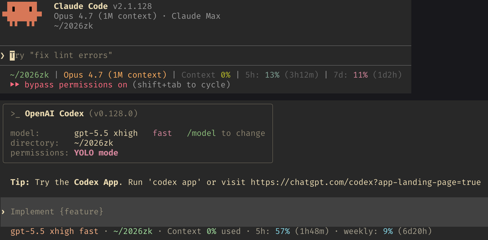

# statuslines

**Langues :** [English](./README.md) · Français · [日本語](./README.ja.md)

> Un catalogue organisé de statuslines pour Claude Code, OpenCode, Gemini CLI
> et Codex CLI — plus une déclinaison de référence embarquée dans le dépôt
> (`pup/`) reliée à Datadog.

*Un seul motif, quatre CLIs d'agents, des dizaines de statuslines.*


<!-- count:start -->

<!-- count:end -->


## Table des matières

- [Démarrage rapide](#démarrage-rapide)
- [Catalogue](#catalogue)
  - [Claude Code](#claude-code)
  - [OpenCode](#opencode)
  - [Gemini CLI](#gemini-cli)
  - [Codex CLI](#codex-cli)
- [CLI du catalogue](#cli-du-catalogue)
- [Déclinaisons embarquées](#déclinaisons-embarquées)
  - [pup — observabilité Datadog](#pup--observabilité-datadog)
- [Matrice de prise en charge](#matrice-de-prise-en-charge)
- [Arborescence](#arborescence)
- [Contribuer](#contribuer)
- [Liens connexes](#liens-connexes)
- [Feuille de route](#feuille-de-route)
- [Journal des modifications](./CHANGELOG.fr.md)
- [Licence](#licence)

## Démarrage rapide

Requiert Node ≥ 20 et `jq`.

```sh
# parcourir le catalogue
node bin/statuslines.js list
node bin/statuslines.js list --cli=claude --redistributable
node bin/statuslines.js show ccstatusline

# installer la déclinaison pup embarquée
./install/install-pup.sh --all --seed-config
```

Codex CLI ne dispose pas encore d'une statusline native par commande — démarrez le HUD sous tmux :

```sh
tmux new-session -d -s codex 'node ./pup/codex/hud.js watch'
```

## Catalogue

Indexé par CLI hôte. Les entrées dont la licence est OSI-permissive
embarquent une recette d'installation et de configuration exécutable via
`bin/statuslines.js configure` ; les entrées marquées `(ref)` sont listées
pour référence uniquement — installer selon les instructions amont.

Le tableau exhaustif (statut, type d'installation, langage) vit dans
[`catalog/README.md`](catalog/README.md), généré à partir des entrées JSON
— ce fichier fait foi. Le bloc ci-dessous est rendu automatiquement par
`node bin/statuslines.js render-top-readme` et conservé en anglais pour
éviter toute dérive avec les données.

<!-- catalog:start -->
### Claude Code

#### [**cc-codex-statusline**](https://github.com/0xHanniba1/cc-codex-statusline) · MIT

<a href="https://github.com/0xHanniba1/cc-codex-statusline"></a>

Statusline combinée pour Claude Code et Codex dans un seul dépôt, chacune avec un installateur curl en une ligne — ajoute le chemin, l'affichage du modèle et un compte à rebours de limite de débit coloré aux deux CLI.

#### [**claude-fitness-break**](https://github.com/adam-ismael/claude-fitness-break) · MIT

<a href="https://github.com/adam-ismael/claude-fitness-break"></a>

Plugin hook se déclenchant quand Claude lance un agent, qui choisit un exercice aléatoire et vous le crie via claude-haiku selon l'une des quatre personnalités fitness déjantées — sergent instructeur, coach des années 80, catcheur des années 90 ou médecin anxieux. Affiche le rappel dans le statusline avec un délai de cinq minutes.

#### [**claude-code-statusline**](https://github.com/AnirudhMKumar/claude-code-statusline) · MIT

<a href="https://github.com/AnirudhMKumar/claude-code-statusline"></a>

Ligne de statut PowerShell native Windows pour Claude Code affichant le répertoire, la branche Git, le modèle actif et l'utilisation du contexte — installation en une commande via irm/iex sans dépendances externes.

#### [**claude-code-statusline**](https://github.com/AsafSaar/claude-code-statusline) · MIT

<a href="https://github.com/AsafSaar/claude-code-statusline"></a>

Ligne de statut Claude Code entièrement configurable par segments, composée de parties activables (cwd, branche Git, dirty, ahead/behind, modèle, node, contexte, coût, durée, lignes, dernier commit, stash, effort, limites, erreurs ts) avec icônes et seuils de couleur par segment.

#### [**cc-statusline**](https://github.com/brandonchartier/cc-statusline) · MIT

<a href="https://github.com/brandonchartier/cc-statusline"></a>

Ligne de statut Python minimaliste pour Claude Code affichant le modèle, la branche Git, le pourcentage d'utilisation des tokens, le niveau de raisonnement, les fenêtres de limite 5h/7j et l'heure locale — sans appel API ni OAuth.

#### [**claude-code-status-bar**](https://github.com/briansmith80/claude-code-status-bar) · MIT

<a href="https://github.com/briansmith80/claude-code-status-bar"></a>

Statusline pure bash avec 18 segments et 7 thèmes de couleurs — barre de contexte, cadence des limites de débit sur cinq heures et hebdomadaires, état git, coût de session et activité des outils en direct, sans aucune dépendance.

#### [**CCometixLine**](https://github.com/Haleclipse/CCometixLine) · MIT

<a href="https://github.com/Haleclipse/CCometixLine"></a>

Statusline Claude Code rapide en Rust avec un configurateur TUI interactif, une intégration git et un suivi de l'usage.

#### [**ccstatusline**](https://github.com/sirmalloc/ccstatusline) · MIT

<a href="https://github.com/sirmalloc/ccstatusline"></a>

Statusline Claude Code personnalisable avec un configurateur TUI interactif, un rendu powerline, des thèmes et des widgets pour les jetons, git, les minuteries de session et les liens cliquables.

#### [**ccusage**](https://github.com/ryoppippi/ccusage) · MIT

<a href="https://github.com/ryoppippi/ccusage"></a>

Analyseur d'usage de jetons et de coûts qui parse les fichiers JSONL de sessions locales Claude Code et Codex ; pas une statusline en soi, mais une source de données utile à intégrer dans une statusline.

#### [**claude-buddy**](https://github.com/chae-dahee/claude-buddy) · MIT

<a href="https://github.com/chae-dahee/claude-buddy"></a>

Compagnon ASCII animé intégré au statusline Claude Code, tiré d'une table gacha avec 18 espèces, 5 niveaux de rareté et des statistiques comme DEBUGGING et SNARK — monte de niveau tous les sept jours.

#### [**claude-hud**](https://github.com/jarrodwatts/claude-hud) · MIT

<a href="https://github.com/jarrodwatts/claude-hud"></a>

Plugin/statusline Claude Code qui affiche l'usage du contexte, les outils actifs, les sous-agents en cours, la progression des tâches et les fenêtres de limites de débit via l'API native de statusline.

#### [**claude-code-statusline (ctfbio)**](https://github.com/ctfbio/claude-code-statusline) · MIT

<a href="https://github.com/ctfbio/claude-code-statusline"></a>

Ligne de statut shell affichant la durée de session, le coût en multi-devises via les taux BCE, les tarifs par MTok, les plafonds de dépenses et le niveau d'effort — aucun appel réseau à l'exécution grâce au cache 24 heures.

#### [**ClaudeCodeStatusLine (Daniel Graczer)**](https://github.com/daniel3303/ClaudeCodeStatusLine) · MIT

<a href="https://github.com/daniel3303/ClaudeCodeStatusLine"></a>

Statusline Bash + PowerShell pour Claude Code affichant le modèle, les jetons, les limites de débit et l'état git.

#### [**Claude Code Statusline**](https://github.com/danielmackay/claude-code-statusline) · Unspecified `(ref)`

<a href="https://github.com/danielmackay/claude-code-statusline"></a>

Script shell pour Claude Code affichant le modèle actif, l'utilisation du contexte, le coût de session, une barre de limite de débit sur cinq heures avec l'heure de réinitialisation, la branche git et les statistiques de diff.

#### [**claude-statusline (dwillitzer)**](https://github.com/dwillitzer/claude-statusline) · MIT

<a href="https://github.com/dwillitzer/claude-statusline"></a>

Statusline Bash pour Claude Code avec comptage de jetons optionnel via Node.js + tiktoken et colorisation de modèles multi-fournisseurs (Claude, OpenAI, Gemini, Grok).

#### [**claude-statusline (Felipe Elias)**](https://github.com/felipeelias/claude-statusline) · MIT

<a href="https://github.com/felipeelias/claude-statusline"></a>

Statusline binaire Go pour Claude Code avec une configuration par modules, des hyperliens OSC 8 et des thèmes prédéfinis (`catppuccin`, `tokyo-night`, `gruvbox-rainbow` et d'autres).

#### [**claudeline (Fredrik Averpil)**](https://github.com/fredrikaverpil/claudeline) · MIT

<a href="https://github.com/fredrikaverpil/claudeline"></a>

Statusline Go minimaliste pour Claude Code distribuée comme plugin Claude Code ; la commande slash `/claudeline:setup` du plugin télécharge le binaire et patche settings.json.

#### [**claudehud**](https://github.com/Fyko/claudehud) · MIT

<a href="https://github.com/Fyko/claudehud"></a>

Ligne de statut Rust pour Claude Code avec démon Git mmap+seqlock (~168× plus rapide que bash) ; affiche le modèle, l'utilisation des tokens, les limites de taux, le coût, les incidents actifs et deux dispositions.

#### [**claude-subagent-statusline**](https://github.com/GerardoFC8/claude-subagent-statusline) · MIT

<a href="https://github.com/GerardoFC8/claude-subagent-statusline"></a>

Statusline Claude Code axée sur le suivi en temps réel des sous-agents — affiche les compteurs de tâches en cours, terminées et échouées ainsi que le modèle, le coût, la fenêtre de contexte, le temps écoulé et les limites 5h/7j.

#### [**cc-pulseline**](https://github.com/GregoryHo/cc-pulseline) · MIT

<a href="https://github.com/GregoryHo/cc-pulseline"></a>

Statusline multi-lignes Claude Code haute performance en Rust avec observabilité approfondie — parsing JSONL incrémental par seek, contexte en direct, taux de consommation des coûts, outils actifs, agents en cours, avancement des todos et suivi par session.

#### [**claudia-statusline**](https://github.com/hagan/claudia-statusline) · MIT

<a href="https://github.com/hagan/claudia-statusline"></a>

Statusline Rust pour Claude Code avec suivi de statistiques persistantes, des binaires pré-compilés pour Linux/macOS/Windows et 11 thèmes ; référencée dans la documentation officielle de Claude Code.

#### [**tokenusage (hanbu97)**](https://github.com/hanbu97/tokenusage) · MIT

<a href="https://github.com/hanbu97/tokenusage"></a>

Traqueur d'usage de jetons rapide et local pour Claude Code et Codex ; `tu statusline` émet un résumé coût/jetons en une ligne. Disponible aussi en mode CLI, TUI et GUI. 214x plus rapide que ccusage.

#### [**claude-code-statusline**](https://github.com/haunchen/claude-code-statusline) · MIT

<a href="https://github.com/haunchen/claude-code-statusline"></a>

Statusline Claude Code multiplateforme affichant les fenêtres de limite de débit Anthropic pic/hors-pic, l'utilisation du contexte, le coût de session et les limites sur cinq heures et sept jours pour planifier les sessions.

#### [**claude-vibeline**](https://github.com/hstojanovic/claude-vibeline) · MIT

<a href="https://github.com/hstojanovic/claude-vibeline"></a>

Ligne de statut Python pour Claude Code qui lit les données d'utilisation réelles via l'API OAuth d'Anthropic — limites par modèle Opus/Sonnet, dépenses supplémentaires, TTL du cache de prompt et limites de taux session/hebdomadaires.

#### [**claude-code-statusline**](https://github.com/ilia-pluzhnikov/claude-code-statusline) · MIT

<a href="https://github.com/ilia-pluzhnikov/claude-code-statusline"></a>

Ligne de statut Node.js en fichier unique très complète, affichant le modèle, la tâche active, l'état Git, l'utilisation du contexte, le taux de cache, les limites 5h/7j et un indicateur d'heures de pointe avec code couleur d'urgence.

#### [**claude-statusline (Kamran Ahmed)**](https://github.com/kamranahmedse/claude-statusline) · MIT

<a href="https://github.com/kamranahmedse/claude-statusline"></a>

Statusline Claude Code minimaliste affichant le modèle, le pourcentage d'utilisation du contexte, le répertoire courant, la branche git, le minuteur de session, le niveau d'effort et les barres de limites de débit en temps réel depuis l'API Anthropic.

#### [**claude-codex-statusline**](https://github.com/kiheon0709/claude-codex-statusline) · MIT

<a href="https://github.com/kiheon0709/claude-codex-statusline"></a>

Statusline à double barre affichant côte à côte les quotas Claude Code et Codex CLI avec des barres de limite 5h et hebdomadaire, la fenêtre de contexte et le nombre de sous-agents actifs suivi via les hooks PreToolUse/PostToolUse.

#### [**ccsl**](https://github.com/laveez/ccsl) · MIT

<a href="https://github.com/laveez/ccsl"></a>

Ligne de statut ANSI dense et colorée pour Claude Code affichant le modèle, le coût, l'utilisation du contexte, l'état Git, les liens PR, les outils actifs, les sous-agents, la progression des tâches et des barres de limite API optionnelles.

#### [**claude-code-usage-bar**](https://github.com/leeguooooo/claude-code-usage-bar) · MIT

<a href="https://github.com/leeguooooo/claude-code-usage-bar"></a>

Ligne de statut Python (cs) pour Claude Code affichant l'utilisation des tokens, le coût et les fenêtres de limite en trois styles et neuf thèmes, soutenue par un démon en arrière-plan et configurable via des commandes slash.

#### [**cc-statusline**](https://github.com/Lightning7329/cc-statusline) · MIT

<a href="https://github.com/Lightning7329/cc-statusline"></a>

Ligne de statut F# pour Claude Code — la seule entrée F# du catalogue — affichant la fenêtre de contexte, le modèle, le coût de session et les fenêtres de limite via une barre de progression braille avec code couleur.

#### [**claudeline (Luca Silverentand)**](https://github.com/lucasilverentand/claudeline) · MIT

<a href="https://github.com/lucasilverentand/claudeline"></a>

Statusline Claude Code fournie sous le paquet npm `claudeline` avec des thèmes intégrés ; peut s'auto-installer dans settings.json via son option `--install`.

#### [**claude-usage-statusline**](https://github.com/meros/claude-usage-statusline) · MIT

<a href="https://github.com/meros/claude-usage-statusline"></a>

Interroge l'API Claude pour l'utilisation sur fenêtres de cinq heures et sept jours, conserve un historique local à deux niveaux, affiche des sparklines et des barres de progression colorées, et projette un ETA vers la limite de débit avec un formatage intelligent.

#### [**schoen-claude-status**](https://github.com/mtschoen/schoen-claude-status) · MIT

<a href="https://github.com/mtschoen/schoen-claude-status"></a>

Ligne de statut sur deux lignes suivant le taux de cache de session, l'utilisation du contexte et les projections de rythme de limite 5h/hebdomadaire avec le coût — le tout dans une configuration bash + Python en fichier unique.

#### [**claude-code-status-line (ndave92)**](https://github.com/ndave92/claude-code-status-line) · MIT

<a href="https://github.com/ndave92/claude-code-status-line"></a>

Statusline Rust pour Claude Code avec les informations de l'espace de travail, l'état git, le nom du modèle, l'usage du contexte, des indications de worktree, des minuteries de quota et les coûts API optionnels.

#### [**noahs-claude-statusline**](https://github.com/noahbclarkson/noahs-claude-statusline) · Unspecified `(ref)`

<a href="https://github.com/noahbclarkson/noahs-claude-statusline"></a>

Statusline bash pour Windows MSYS2 résolvant la détection de la largeur du terminal via PowerShell AttachConsole, avec une barre de progression fractionnaire en huitièmes de cellule pour une précision sub-cellulaire.

#### [**cc-tempo**](https://github.com/O0000-code/cc-tempo) · MIT

<a href="https://github.com/O0000-code/cc-tempo"></a>

Ligne de statut Claude Code qui mesure le temps de travail réel parsé depuis les transcripts, expose les ratios d'accélération parallèle des sous-agents et suit la vélocité de churning de code via un sparkline plutôt que tokens ou coûts.

#### [**Open Island**](https://github.com/octane0411/open-vibe-island) · GPL-3.0 `(ref)`

<a href="https://github.com/octane0411/open-vibe-island"></a>

Compagnon macOS pour le notch et la barre de menus (SwiftUI + AppKit) qui surveille les agents de codage IA en temps réel, affiche l'état des sessions et les demandes de permission en attente, et permet de retourner rapidement au bon terminal ou IDE. Prend en charge Claude Code, Codex, Gemini CLI, OpenCode, Cursor, Kimi CLI, Qoder, Qwen Code, Factory et CodeBuddy. macOS 14+ uniquement.

#### [**claude-powerline**](https://github.com/Owloops/claude-powerline) · MIT

<a href="https://github.com/Owloops/claude-powerline"></a>

Statusline powerline de style Vim pour Claude Code avec suivi de l'usage en temps réel, intégration git et thèmes prédéfinis.

#### [**ccstatusline-usage**](https://github.com/pcvelz/ccstatusline-usage) · MIT

<a href="https://github.com/pcvelz/ccstatusline-usage"></a>

Fork de ccstatusline ajoutant des widgets d'utilisation en temps réel via l'API Anthropic : barres d'utilisation session et hebdomadaire, indicateur de rythme hebdomadaire, compte à rebours de réinitialisation et routage multi-fournisseur pour les modèles locaux.

#### [**simple-claude-code-statusline**](https://github.com/Postmodum37/simple-claude-code-statusline) · MIT

<a href="https://github.com/Postmodum37/simple-claude-code-statusline"></a>

Statusline Claude Code minimaliste et modifiable en deux lignes, écrite en Go : la première ligne affiche modèle, répertoire, branche git avec comptage de fichiers et worktree ; la seconde montre la barre de contexte, les limites 5h et 7j, le coût et la durée.

#### [**prism-hud**](https://github.com/puddinging/prism-hud) · MIT

<a href="https://github.com/puddinging/prism-hud"></a>

Fork de jarrodwatts/claude-hud remplaçant les barres de progression par une palette dégradée par position — chaque point a une couleur fixe du vert (sûr) au rouge (critique), permettant de lire le niveau de remplissage d'un coup d'œil sur le contexte et les limites de taux.

#### [**claude-code-statusline (RaiconY)**](https://github.com/RaiconY/claude-code-statusline) · MIT

<a href="https://github.com/RaiconY/claude-code-statusline"></a>

Ligne de statut Node.js en fichier unique sans dépendance pour Claude Code, affichant le modèle, la tâche active, l'état Git, l'utilisation du contexte, l'état du cache avec TTL et les comptes à rebours de limite Anthropic 5h et 7j.

#### [**claude-code-statusline (RiverOfLogic)**](https://github.com/RiverOfLogic/claude-code-statusline) · Unspecified `(ref)`

<a href="https://github.com/RiverOfLogic/claude-code-statusline"></a>

Powerline-style retro-terminal statusline for Claude Code, displaying model, git branch, output style, thinking mode, and a 10-cell context progress bar with warm earth-tone color thresholds and a live clock.

#### [**aifuel**](https://github.com/robertogogoni/aifuel) · MIT

<a href="https://github.com/robertogogoni/aifuel"></a>

Moniteur d'utilisation IA multi-fournisseurs en Go (Claude, Codex, Gemini, Copilot, Antigravity) affichant limites de débit, coûts et analyses aux heures de pointe via un module waybar, une extension Chrome, un TUI Bubble Tea, un tableau de bord Admin API et une statusline Claude Code compacte.

#### [**claude-code-statusline (rz1989s)**](https://github.com/rz1989s/claude-code-statusline) · MIT

<a href="https://github.com/rz1989s/claude-code-statusline"></a>

Statusline Bash pour Claude Code avec 28 composants atomiques sur jusqu'à 9 lignes : infos git, suivi des coûts, état MCP, minuteur de réinitialisation de bloc, heures de prière islamiques et thèmes Catppuccin.

#### [**horologium**](https://github.com/Shallow-dusty/horologium) · MIT

<a href="https://github.com/Shallow-dusty/horologium"></a>

Binaire Rust unifié combinant un statusline Claude Code sub-milliseconde avec des analyses de journaux JSONL style ccusage ; un seul outil affiche jetons, coût, git, limites 5h/7j et génère des rapports d'utilisation journaliers, par session et par bloc.

#### [**ClaudeCodeStatusBar**](https://github.com/SleighMaster99/ClaudeCodeStatusBar) · MIT

Éditeur GUI WinForms exclusif à Windows pour les statuslines multi-lignes de Claude Code — constructeur de mise en page par glisser-déposer avec runtime PowerShell, suivi d'utilisation et widgets git, contexte et coût.

#### [**claude-code-statusline (Sam Yamashita)**](https://github.com/sotayamashita/claude-code-statusline) · MIT

<a href="https://github.com/sotayamashita/claude-code-statusline"></a>

Statusline Rust pour Claude Code avec une configuration de style starship et une composition par modules.

#### [**@this-dot/claude-code-context-status-line**](https://github.com/thisdot/claude-code-context-status-line) · MIT

<a href="https://github.com/thisdot/claude-code-context-status-line"></a>

Statusline Claude Code qui parse les transcriptions JSONL de session pour calculer les jetons d'entrée, de création de cache et de lecture de cache afin d'afficher fidèlement la fenêtre de contexte.

#### [**tokscale**](https://github.com/junhoyeo/tokscale) · MIT

<a href="https://github.com/junhoyeo/tokscale"></a>

Traqueur d'usage de jetons multi-CLI qui lit les données de session locales de nombreux outils de codage IA (Claude Code, OpenCode, Codex, Gemini, Cursor, Amp, Kimi, et d'autres) avec une tarification alimentée par LiteLLM.

#### [**xuedi/claude-statusline**](https://github.com/xuedi/claude-statusline) · EUPL-1.2 `(ref)`

<a href="https://github.com/xuedi/claude-statusline"></a>

Rust-native Claude Code statusline rendering model, git, tokens, effort, and 5h/7d rate limits via a 20-cell braille progress bar in ~500 lines of safe, unsafe-forbidden code.

#### [**claude-code-statusline**](https://github.com/xyzcardiff/claude-code-statusline) · MIT

<a href="https://github.com/xyzcardiff/claude-code-statusline"></a>

Ligne de statut shell sur deux lignes pour Claude Code, avec compteur de sous-agents en direct et barre de progression des tâches lue depuis ~/.claude/jobs — la seconde ligne n'apparaît que si des agents ou tâches sont actifs.

### OpenCode

#### [**opencode-token-monitor**](https://github.com/Ainsley0917/opencode-token-monitor) · MIT

<a href="https://github.com/Ainsley0917/opencode-token-monitor"></a>

Plugin OpenCode (pas une statusline) qui enregistre les outils `token_stats` / `token_history` / `token_export` et émet des notifications toast avec la ventilation des jetons d'entrée, de sortie, de raisonnement et de cache.

#### [**opencode-subagent-statusline**](https://github.com/Joaquinvesapa/sub-agent-statusline) · MIT

<a href="https://github.com/Joaquinvesapa/sub-agent-statusline"></a>

Plugin de barre latérale TUI OpenCode (pas un statusLine.command) qui affiche l'activité des sous-agents, le temps écoulé et l'usage des jetons/du contexte.

#### [**opencode-status-line**](https://github.com/markwilkening21/opencode-status-line) · MIT

<a href="https://github.com/markwilkening21/opencode-status-line"></a>

Statusline légère et rapide pour OpenCode CLI.

#### [**Open Island**](https://github.com/octane0411/open-vibe-island) · GPL-3.0 `(ref)`

<a href="https://github.com/octane0411/open-vibe-island"></a>

Compagnon macOS pour le notch et la barre de menus (SwiftUI + AppKit) qui surveille les agents de codage IA en temps réel, affiche l'état des sessions et les demandes de permission en attente, et permet de retourner rapidement au bon terminal ou IDE. Prend en charge Claude Code, Codex, Gemini CLI, OpenCode, Cursor, Kimi CLI, Qoder, Qwen Code, Factory et CodeBuddy. macOS 14+ uniquement.

#### [**opencode-quota**](https://github.com/slkiser/opencode-quota) · MIT

<a href="https://github.com/slkiser/opencode-quota"></a>

Affichage du quota et de l'usage de jetons pour OpenCode sans pollution de la fenêtre de contexte ; prend en charge les fournisseurs OpenCode Go, Cursor, GitHub Copilot et d'autres.

#### [**opencode-tokenscope**](https://github.com/ramtinJ95/opencode-tokenscope) · MIT

<a href="https://github.com/ramtinJ95/opencode-tokenscope"></a>

Plugin OpenCode (pas une statusline) fournissant l'analyse de l'usage des jetons et des coûts pour les sessions avec des ventilations détaillées.

#### [**tokscale**](https://github.com/junhoyeo/tokscale) · MIT

<a href="https://github.com/junhoyeo/tokscale"></a>

Traqueur d'usage de jetons multi-CLI qui lit les données de session locales de nombreux outils de codage IA (Claude Code, OpenCode, Codex, Gemini, Cursor, Amp, Kimi, et d'autres) avec une tarification alimentée par LiteLLM.

### Gemini CLI

#### [**gemini-statusline**](https://github.com/Kiriketsuki/gemini-statusline) · Unspecified `(ref)`

<a href="https://github.com/Kiriketsuki/gemini-statusline"></a>

Aide d'invite shell sur deux lignes pour Gemini CLI affichant le modèle, le contexte de l'espace de travail, la branche git, le nombre de tickets GitHub et la profondeur de la boîte de réception — Gemini CLI n'ayant pas de hook statusLine natif, ceci s'exécute depuis l'invite shell de l'utilisateur.

#### [**Open Island**](https://github.com/octane0411/open-vibe-island) · GPL-3.0 `(ref)`

<a href="https://github.com/octane0411/open-vibe-island"></a>

Compagnon macOS pour le notch et la barre de menus (SwiftUI + AppKit) qui surveille les agents de codage IA en temps réel, affiche l'état des sessions et les demandes de permission en attente, et permet de retourner rapidement au bon terminal ou IDE. Prend en charge Claude Code, Codex, Gemini CLI, OpenCode, Cursor, Kimi CLI, Qoder, Qwen Code, Factory et CodeBuddy. macOS 14+ uniquement.

#### [**aifuel**](https://github.com/robertogogoni/aifuel) · MIT

<a href="https://github.com/robertogogoni/aifuel"></a>

Moniteur d'utilisation IA multi-fournisseurs en Go (Claude, Codex, Gemini, Copilot, Antigravity) affichant limites de débit, coûts et analyses aux heures de pointe via un module waybar, une extension Chrome, un TUI Bubble Tea, un tableau de bord Admin API et une statusline Claude Code compacte.

#### [**tokscale**](https://github.com/junhoyeo/tokscale) · MIT

<a href="https://github.com/junhoyeo/tokscale"></a>

Traqueur d'usage de jetons multi-CLI qui lit les données de session locales de nombreux outils de codage IA (Claude Code, OpenCode, Codex, Gemini, Cursor, Amp, Kimi, et d'autres) avec une tarification alimentée par LiteLLM.

### Codex CLI

#### [**cc-codex-statusline**](https://github.com/0xHanniba1/cc-codex-statusline) · MIT

<a href="https://github.com/0xHanniba1/cc-codex-statusline"></a>

Statusline combinée pour Claude Code et Codex dans un seul dépôt, chacune avec un installateur curl en une ligne — ajoute le chemin, l'affichage du modèle et un compte à rebours de limite de débit coloré aux deux CLI.

#### [**cat-codex-statusline (ai-ken-git)**](https://github.com/ai-ken-git/cat-codex-statusline) · MIT

<a href="https://github.com/ai-ken-git/cat-codex-statusline"></a>

Installateur de statusline Codex CLI sur le thème des chats ; câble les segments natifs (modèle, branche git, contexte, limites) dans un preset propre, avec un rendu en tête de chat prêt à s'activer dès que Codex proposera un hook de ligne de statut basé sur des commandes.

#### [**codex-hud (Capedbitmap)**](https://github.com/Capedbitmap/codex-hud) · PolyForm-Noncommercial-1.0.0 `(ref)`

<a href="https://github.com/Capedbitmap/codex-hud"></a>

Application macOS de barre de menus qui ingère les données de session Codex locales et recommande le prochain compte à utiliser selon le moment de réinitialisation hebdomadaire et la capacité restante.

#### [**ccusage**](https://github.com/ryoppippi/ccusage) · MIT

<a href="https://github.com/ryoppippi/ccusage"></a>

Analyseur d'usage de jetons et de coûts qui parse les fichiers JSONL de sessions locales Claude Code et Codex ; pas une statusline en soi, mais une source de données utile à intégrer dans une statusline.

#### [**codex-hud (fwyc0573)**](https://github.com/fwyc0573/codex-hud) · MIT

<a href="https://github.com/fwyc0573/codex-hud"></a>

HUD de statusline tmux en temps réel pour OpenAI Codex CLI avec l'usage de session/contexte, l'état git et la surveillance de l'activité des outils ; inclut les sous-commandes --kill / --list / --attach / --self-check.

#### [**codex-statusline (GordonBeeming)**](https://github.com/GordonBeeming/codex-statusline) · Unspecified `(ref)`

<a href="https://github.com/GordonBeeming/codex-statusline"></a>

Four-line Codex statusline showing repo name, git branch, model, session cost in AUD, 5-hour rate-limit bar, and context window usage — mirroring the author's claude-statusline layout.

#### [**tokenusage (hanbu97)**](https://github.com/hanbu97/tokenusage) · MIT

<a href="https://github.com/hanbu97/tokenusage"></a>

Traqueur d'usage de jetons rapide et local pour Claude Code et Codex ; `tu statusline` émet un résumé coût/jetons en une ligne. Disponible aussi en mode CLI, TUI et GUI. 214x plus rapide que ccusage.

#### [**claude-codex-statusline**](https://github.com/kiheon0709/claude-codex-statusline) · MIT

<a href="https://github.com/kiheon0709/claude-codex-statusline"></a>

Statusline à double barre affichant côte à côte les quotas Claude Code et Codex CLI avec des barres de limite 5h et hebdomadaire, la fenêtre de contexte et le nombre de sous-agents actifs suivi via les hooks PreToolUse/PostToolUse.

#### [**Open Island**](https://github.com/octane0411/open-vibe-island) · GPL-3.0 `(ref)`

<a href="https://github.com/octane0411/open-vibe-island"></a>

Compagnon macOS pour le notch et la barre de menus (SwiftUI + AppKit) qui surveille les agents de codage IA en temps réel, affiche l'état des sessions et les demandes de permission en attente, et permet de retourner rapidement au bon terminal ou IDE. Prend en charge Claude Code, Codex, Gemini CLI, OpenCode, Cursor, Kimi CLI, Qoder, Qwen Code, Factory et CodeBuddy. macOS 14+ uniquement.

#### [**codex-statusline (rgomes87)**](https://github.com/rgomes87/codex-statusline) · Unspecified `(ref)`

<a href="https://github.com/rgomes87/codex-statusline"></a>

Colourful 4-line tmux status area for Codex CLI showing context window, model, git branch, and 5-hour/7-day rate-limit pacing bars with per-second reset countdowns.

#### [**aifuel**](https://github.com/robertogogoni/aifuel) · MIT

<a href="https://github.com/robertogogoni/aifuel"></a>

Moniteur d'utilisation IA multi-fournisseurs en Go (Claude, Codex, Gemini, Copilot, Antigravity) affichant limites de débit, coûts et analyses aux heures de pointe via un module waybar, une extension Chrome, un TUI Bubble Tea, un tableau de bord Admin API et une statusline Claude Code compacte.

#### [**tokscale**](https://github.com/junhoyeo/tokscale) · MIT

<a href="https://github.com/junhoyeo/tokscale"></a>

Traqueur d'usage de jetons multi-CLI qui lit les données de session locales de nombreux outils de codage IA (Claude Code, OpenCode, Codex, Gemini, Cursor, Amp, Kimi, et d'autres) avec une tarification alimentée par LiteLLM.

<!-- catalog:end -->

## CLI du catalogue

```sh
node bin/statuslines.js list                          # toutes les entrées
node bin/statuslines.js list --cli=claude --redistributable
node bin/statuslines.js show ccstatusline             # métadonnées complètes
node bin/statuslines.js configure ccstatusline --cli=claude --dry-run
node bin/statuslines.js configure ccstatusline --cli=claude
node bin/statuslines.js doctor                        # valide chaque entrée
node bin/statuslines.js render-readme                 # régénère catalog/README.md
node bin/statuslines.js render-top-readme             # régénère ce fichier
```

`configure` ignore les entrées dont la licence n'est pas redistribuable ;
celles-ci restent listées pour référence uniquement.

## Déclinaisons embarquées

Une statusline de référence vit aux côtés du catalogue : `pup/`, qui fait
remonter la santé des événements Datadog dans la barre.

### pup — observabilité Datadog

Fait remonter les **événements** récents issus de
[datadog-labs/pup](https://github.com/datadog-labs/pup) (5 dernières
minutes par défaut), groupés par `alert_type`.

Les statuslines pup n'appellent jamais `pup` depuis le chemin de rendu.
Elles lisent un cache contrôlé par TTL :

1. Le rendu lit `${TMPDIR}/statuslines-pup-events.json`.
2. Si le cache est **plus frais que `ttl_seconds`** (par défaut 60 s), il
   est utilisé tel quel.
3. S'il est obsolète, le rendu acquiert un fichier de verrouillage
   (`O_EXCL`) ; si un autre rendu détient le verrou, il attend ≤ 250 ms
   puis se rabat sur le cache obsolète plutôt que de mettre en file
   d'attente plus d'appels API.
4. Le détenteur du verrou exécute
   `pup events list --duration 5m --output json` une fois, écrit le
   résultat de manière atomique, libère le verrou.
5. Les erreurs (auth, rate-limit, ENOENT) sont écrites dans le cache et
   remontées dans la barre (`pup:auth?`, `pup:rate-limited`,
   `pup:not installed`) — pas de tempête de retries.
6. Chaque récupération est journalisée dans `${TMPDIR}/statuslines-pup.log`.

L'âge du cache est affiché dans la barre (par exemple
`pup:✓3 ⚠1 ✗0 (45s)`) ; au-delà de 5 min il est marqué `(stale)` et grisé.

#### Configuration

`~/.config/statuslines/pup.json` (ou variables d'environnement
`STATUSLINES_PUP_*`) :

| clé | défaut | sens |
|---|---|---|
| `ttl_seconds` | `60` | secondes minimum entre deux appels `pup` |
| `duration` | `"5m"` | fenêtre transmise à `pup events list --duration` |
| `tags` | `null` | transmis comme `--tags` |
| `priority` | `null` | `normal` / `low` |
| `alert_type` | `null` | `error` / `warning` / `info` / `success` / `user_update` |
| `sources` | `null` | transmis comme `--sources` |
| `max_events` | `50` | transmis comme `--limit` |
| `pup_bin` | `"pup"` | écrase le chemin du binaire |

Un fichier de démarrage vit à `examples/pup.config.json`. Initialisez-le
avec `./install/install-pup.sh --seed-config`.

#### Démarrage rapide (pup)

```sh
brew tap datadog-labs/pack && brew install datadog-labs/pack/pup
pup auth login
./install/install-pup.sh --all --seed-config
node ./pup/cli.js fetch    # préchauffe le cache
node ./pup/cli.js show     # aperçoit le segment
tmux new-session -d -s codex 'node ./pup/codex/hud.js watch'
```

## Matrice de prise en charge

| CLI | Statusline personnalisée | Hook après-outil | Approche |
|---|---|---|---|
| Claude Code | oui (`statusLine.command`) | oui (`PostToolUse`) | `pup/claude/statusline.js` + `context-monitor.js` |
| OpenCode | oui (`statusLine.command`) | oui (plugin `tool.execute.after`) | `pup/opencode/statusline.js` + `context-monitor.js` |
| Gemini CLI | **non** ([#8191](https://github.com/google-gemini/gemini-cli/issues/8191)) | oui (`AfterTool`) | non livré dans le dépôt (voir le catalogue pour des options tierces) |
| Codex CLI | seulement les éléments intégrés ([#14043](https://github.com/openai/codex/issues/14043), [#17827](https://github.com/openai/codex/issues/17827)) | oui (`~/.codex/hooks/`) | démon HUD externe — `pup/codex/hud.js` |

## Arborescence

```
lib/                aides partagées (bar, couleurs, git, fichier-pont, garde stdin)
catalog/            entrées tierces — un JSON par slug, par CLI
  claude/           cibles Claude Code
  opencode/         cibles OpenCode
  gemini/           cibles Gemini CLI
  codex/            cibles Codex CLI
  multi/            entrées qui ciblent plusieurs CLIs
pup/                déclinaison observabilité Datadog
examples/           extraits de configuration à coller, par CLI
install/            scripts d'installation
bin/                CLI du catalogue (list/show/configure/doctor/render-{readme,top-readme})
```

## Contribuer

Pour ajouter une entrée au catalogue :

1. Vérifiez la licence amont sur le dépôt (consultez le fichier
   `LICENSE`, pas le badge du README). Si le dépôt n'a pas de fichier
   LICENSE, mettez `redistributable: false` et traitez comme listé pour
   référence.
2. Confirmez que le chemin d'installation fonctionne réellement (le
   paquet npm existe, la formule brew se résout, etc.). Une vérification
   indépendante vaut mieux que la confiance dans une affirmation du
   README.
3. Rédigez une description d'une phrase avec vos propres mots — ne
   collez pas depuis l'amont.
4. Déposez le JSON à `catalog/<cli>/<slug>.json` (ou `catalog/multi/`
   pour les entrées multi-CLI).
5. Exécutez `node bin/statuslines.js doctor` pour valider, puis
   `node bin/statuslines.js render-readme` et
   `node bin/statuslines.js render-top-readme` pour rafraîchir les
   tables générées.
6. Ouvrez une PR.

Le schéma complet et les règles champ par champ vivent dans
[`catalog/SCHEMA.md`](catalog/SCHEMA.md). Les entrées copyleft (AGPL,
GPL) et source-disponible (PolyForm-NC, BSL) sont les bienvenues — elles
sont listées avec le tag `(ref)` et ignorées par `configure`.

## Liens connexes

Listes organisées qui méritent d'être connues — lien uniquement, sans
copie :

- [hesreallyhim/awesome-claude-code](https://github.com/hesreallyhim/awesome-claude-code)
  — skills, hooks, slash-commands, agents et statuslines pour Claude Code.
- [awesome-opencode/awesome-opencode](https://github.com/awesome-opencode/awesome-opencode)
  — plugins, thèmes, agents et projets pour OpenCode.

## Feuille de route

Livré :

- Motif context-health sur les quatre CLIs pris en charge.
- Configurations d'exemple et scripts d'installation.
- Déclinaison Datadog `pup/` avec cache contrôlé par TTL et
  récupérations coordonnées par fichier de verrouillage.
- Catalogue de statuslines tierces avec les commandes `list` / `show` /
  `configure` / `doctor` / `audit`.
- Durcissement de la chaîne d'approvisionnement au niveau du schéma :
  versions épinglées et empreintes d'intégrité, refus des motifs
  `curl|sh` / `eval(` / `@latest`, `--ignore-scripts` par défaut sur les
  recettes `npx` / `npm-global`.
- Quarantaine OpenBSD-style : les entrées signalées disparaissent de
  `list` / `show` / `configure` et des READMEs rendus ; la trace
  forensique vit dans `catalog/QUARANTINE.md`.
- Sonde de vivacité quotidienne (correspondance dépôt + version registre
  npm + dérive de licence) et flux hebdomadaire Socket.dev des paquets
  malveillants.
- Workflows Datadog SAST / SCA / SAIST, gardés par secret pour que le
  dépôt soit sûr à forker avant l'arrivée des clés.
- Déclarations de capacités par entrée (`network`, `child_process`,
  `filesystem_write`, `env_read`) avec vérification en bac à sable sous
  firejail + strace.
- Sonde de provenance de build SLSA et re-vérification hebdomadaire des
  fichiers de verrouillage des dépendances transitives sur chaque entrée
  redistribuable adossée à npm.

Prochain :

- Bot de diff de tarball sur chaque PR de montée de version.
- Signature hybride Ed25519 + SLH-DSA sur les entrées du catalogue.
- Segments `pup/` plus riches (monitors, incidents) derrière des drapeaux
  d'opt-in.

## Licence

MIT
