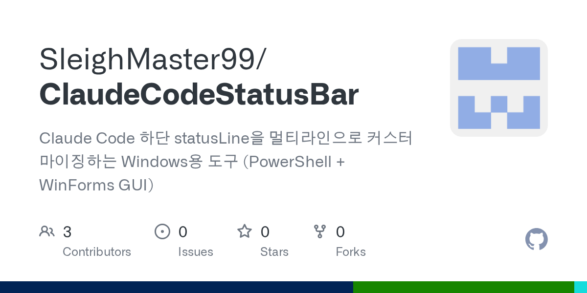

# statuslines

**Languages:** English · [Français](./README.fr.md) · [日本語](./README.ja.md)

> A curated catalog of statuslines for Claude Code, OpenCode, Gemini CLI,
> and Codex CLI — plus an in-repo reference flavor (`pup/`) wired to
> Datadog.

*One pattern, four agent CLIs, dozens of statuslines.*


<!-- count:start -->

<!-- count:end -->


## Table of contents

- [Quick start](#quick-start)
- [Catalog](#catalog)
  - [Claude Code](#claude-code)
  - [OpenCode](#opencode)
  - [Gemini CLI](#gemini-cli)
  - [Codex CLI](#codex-cli)
- [Catalog CLI](#catalog-cli)
- [In-repo flavors](#in-repo-flavors)
  - [pup — Datadog observability](#pup--datadog-observability)
- [Support matrix](#support-matrix)
- [Layout](#layout)
- [Contributing](#contributing)
- [Related](#related)
- [Roadmap](#roadmap)
- [Changelog](./CHANGELOG.md)
- [License](#license)

## Quick start

Requires Node ≥ 20 and `jq`.

```sh
# browse the catalog
node bin/statuslines.js list
node bin/statuslines.js list --cli=claude --redistributable
node bin/statuslines.js show ccstatusline

# install the in-repo pup flavor
./install/install-pup.sh --all --seed-config
```

Codex CLI has no native command-statusline yet — start the HUD under tmux:

```sh
tmux new-session -d -s codex 'node ./pup/codex/hud.js watch'
```

## Catalog

Indexed by host CLI. Entries with OSI-permissive licenses ship a
runnable install/configure recipe via `bin/statuslines.js configure`;
entries marked `(ref)` are listed for reference only — install per
upstream.

The exhaustive table (status, install type, language) lives in
[`catalog/README.md`](catalog/README.md), generated from the JSON
entries — that file is the source of truth. The block below is
auto-rendered by `node bin/statuslines.js render-top-readme`.

<!-- catalog:start -->
### Claude Code

| Preview | Name | License | Description |
|---|---|---|---|
| <a href="https://github.com/Haleclipse/CCometixLine"></a> | [**CCometixLine**](https://github.com/Haleclipse/CCometixLine) | MIT | Fast Rust-based Claude Code statusline with an interactive TUI configurator, git integration, and usage tracking. |
| <a href="https://github.com/sirmalloc/ccstatusline"></a> | [**ccstatusline**](https://github.com/sirmalloc/ccstatusline) | MIT | Customizable Claude Code statusline with an interactive TUI configurator, powerline rendering, themes, and widgets for tokens, git, session timers, and clickable links. |
| <a href="https://github.com/ryoppippi/ccusage"></a> | [**ccusage**](https://github.com/ryoppippi/ccusage) | MIT | Token-usage and cost analyzer that parses local Claude Code and Codex session JSONL files; not a statusline itself, but a useful data source to compose into one. |
| <a href="https://github.com/jarrodwatts/claude-hud"></a> | [**claude-hud**](https://github.com/jarrodwatts/claude-hud) | MIT | Claude Code plugin/statusline that surfaces context usage, active tools, running subagents, todo progress, and rate-limit windows using the native statusline API. |
| <a href="https://github.com/daniel3303/ClaudeCodeStatusLine"></a> | [**ClaudeCodeStatusLine (Daniel Graczer)**](https://github.com/daniel3303/ClaudeCodeStatusLine) | MIT `(ref)` | Bash + PowerShell statusline for Claude Code showing model, tokens, rate limits, and git status. |
| <a href="https://github.com/dwillitzer/claude-statusline"></a> | [**claude-statusline (dwillitzer)**](https://github.com/dwillitzer/claude-statusline) | MIT `(ref)` | Bash statusline for Claude Code with optional Node.js + tiktoken token counting and multi-provider model coloring (Claude, OpenAI, Gemini, Grok). |
| <a href="https://github.com/felipeelias/claude-statusline"></a> | [**claude-statusline (Felipe Elias)**](https://github.com/felipeelias/claude-statusline) | MIT | Go binary statusline for Claude Code with module-based config, OSC 8 hyperlinks, and theme presets (catppuccin, tokyo-night, gruvbox-rainbow, and others). |
| <a href="https://github.com/fredrikaverpil/claudeline"></a> | [**claudeline (Fredrik Averpil)**](https://github.com/fredrikaverpil/claudeline) | MIT | Minimalistic Go statusline for Claude Code distributed as a Claude Code plugin; the plugin's `/claudeline:setup` slash command downloads the binary and patches settings.json. |
| <a href="https://github.com/hagan/claudia-statusline"></a> | [**claudia-statusline**](https://github.com/hagan/claudia-statusline) | MIT | Rust statusline for Claude Code with persistent stats tracking, prebuilt binaries for Linux/macOS/Windows, and 11 themes; referenced by the official Claude Code docs. |
| <a href="https://github.com/lucasilverentand/claudeline"></a> | [**claudeline (Luca Silverentand)**](https://github.com/lucasilverentand/claudeline) | MIT | Claude Code statusline shipped as the npm package `claudeline` with built-in themes; can self-install into settings.json via its `--install` flag. |
| <a href="https://github.com/ndave92/claude-code-status-line"></a> | [**claude-code-status-line (ndave92)**](https://github.com/ndave92/claude-code-status-line) | MIT | Rust statusline for Claude Code with workspace info, git status, model name, context usage, worktree hints, quota timers, and optional API costs. |
| <a href="https://github.com/Owloops/claude-powerline"></a> | [**claude-powerline**](https://github.com/Owloops/claude-powerline) | MIT | Vim-style powerline statusline for Claude Code with real-time usage tracking, git integration, and theme presets. |
| <a href="https://github.com/sotayamashita/claude-code-statusline"></a> | [**claude-code-statusline (Sam Yamashita)**](https://github.com/sotayamashita/claude-code-statusline) | MIT | Rust statusline for Claude Code with starship-like configuration and module-based composition. |
| <a href="https://github.com/thisdot/claude-code-context-status-line"></a> | [**@this-dot/claude-code-context-status-line**](https://github.com/thisdot/claude-code-context-status-line) | MIT | Claude Code statusline that parses session JSONL transcripts to compute input + cache-creation + cache-read tokens for an accurate context-window display. |
| <a href="https://github.com/AsafSaar/claude-code-statusline"></a> | [**claude-code-statusline (AsafSaar)**](https://github.com/AsafSaar/claude-code-statusline) | MIT | Segment-based, fully configurable Claude Code statusline composed from toggleable parts (cwd, git branch, dirty, ahead/behind, model, node, context, cost, duration, lines, last commit, stash, effort, rate limits, ts errors) with per-segment icons and color thresholds. |
| <a href="https://github.com/GregoryHo/cc-pulseline"></a> | [**cc-pulseline**](https://github.com/GregoryHo/cc-pulseline) | MIT | High-performance multi-line Claude Code statusline written in Rust with deep observability — incremental seek-based JSONL parsing, live context, cost burn rate, active tools with targets, running agents, todo progress, and per-session tracking. |
| <a href="https://github.com/RaiconY/claude-code-statusline"></a> | [**claude-code-statusline (RaiconY)**](https://github.com/RaiconY/claude-code-statusline) | MIT | Feature-rich, dependency-free single-file Node.js statusline for Claude Code showing model, active task, git state, context usage, prompt-cache state with TTL, and 5h + 7d Anthropic rate-limit countdowns. |
| <a href="https://github.com/Postmodum37/simple-claude-code-statusline"></a> | [**simple-claude-code-statusline**](https://github.com/Postmodum37/simple-claude-code-statusline) | MIT | Minimal, hackable two-line Claude Code statusline written in Go: row one shows model, directory, git branch with file counts and worktree, plus session lines changed; row two shows context bar, 5h/7d rate limits, cost, and duration. |
| <a href="https://github.com/puddinging/prism-hud"></a> | [**prism-hud**](https://github.com/puddinging/prism-hud) | MIT | Fork of [claude-hud](https://github.com/jarrodwatts/claude-hud) that swaps the progress bars for a per-position gradient palette — each dot has a fixed color from green through yellow to red, so fill level reads at a glance across context and rate-limit windows. |
| <a href="https://github.com/laveez/ccsl"></a> | [**ccsl**](https://github.com/laveez/ccsl) | MIT | Dense, color-coded ANSI statusline for Claude Code — shipped as `ccsl` npm package with animated GIF demo, showing model, cost, context usage, git, and rate limits in a compact single line. |
| <a href="https://github.com/RiverOfLogic/claude-code-statusline"></a> | [**claude-code-statusline (RiverOfLogic)**](https://github.com/RiverOfLogic/claude-code-statusline) | Unspecified `(ref)` | Powerline-style retro-terminal statusline for Claude Code displaying model, git branch/status, context bar, output style, and thinking mode in a warm color scheme; **no LICENSE file — listed for reference only**. |
| <a href="https://github.com/mtschoen/schoen-claude-status"></a> | [**schoen-claude-status**](https://github.com/mtschoen/schoen-claude-status) | MIT | Two-line Claude Code statusline (bash + Python) that tracks session-wide cache hit rate alongside context usage, cost, and 5h/weekly rate-limit pace projection with a pace-cache for efficiency. |
| <a href="https://github.com/noahbclarkson/noahs-claude-statusline"></a> | [**noahs-claude-statusline**](https://github.com/noahbclarkson/noahs-claude-statusline) | Unspecified `(ref)` | Windows MSYS2 bash statusline that solves terminal-width detection via PowerShell `AttachConsole` probe and renders a smooth fractional progress bar; **no LICENSE file — listed for reference only**. |
| <a href="https://github.com/chae-dahee/claude-buddy"></a> | [**claude-buddy**](https://github.com/chae-dahee/claude-buddy) | MIT | Animated ASCII companion that lives in the Claude Code statusline, rolled from a gacha table with 18 species, 5 rarity tiers, and stats like DEBUGGING and SNARK — levels up every 7 days. |
| <a href="https://github.com/danielmackay/claude-code-statusline"></a> | [**Claude Code Statusline (danielmackay)**](https://github.com/danielmackay/claude-code-statusline) | Unspecified `(ref)` | Shell script statusline for Claude Code displaying active model, context usage, session cost, 5-hour rate-limit bar with reset time, git branch, and diff stats; **no LICENSE file — listed for reference only**. |
| <a href="https://github.com/Fyko/claudehud"></a> | [**claudehud (Fyko)**](https://github.com/Fyko/claudehud) | MIT | Rust statusline for Claude Code with mmap+seqlock git daemon (~168× faster than bash); shows model, token usage, rate limits, cost, active incidents, and dual compact/extended layouts. |
| <a href="https://github.com/ilia-pluzhnikov/claude-code-statusline"></a> | [**claude-code-statusline (ilia-pluzhnikov)**](https://github.com/ilia-pluzhnikov/claude-code-statusline) | MIT | Feature-rich single-file Node.js statusline showing model, active task, git state, context usage, prompt-cache hit rate, 5h/7d rate limits, and peak-hours indicator with color-coded urgency. |
| <a href="https://github.com/meros/claude-usage-statusline"></a> | [**claude-usage-statusline**](https://github.com/meros/claude-usage-statusline) | MIT | Polls the Claude API for 5h/7d window usage, persists dual-tier history locally, renders sparklines and color-coded progress bars, and projects an ETA to rate-limit with smart date/duration formatting. |
| <a href="https://github.com/AnirudhMKumar/claude-code-statusline"></a> | [**claude-code-statusline (AnirudhMKumar)**](https://github.com/AnirudhMKumar/claude-code-statusline) | MIT | Windows-native PowerShell statusline for Claude Code showing directory, git branch, active model, context usage, and rate limits; installs via a single PowerShell `irm \| iex` command. |
| <a href="https://github.com/brandonchartier/cc-statusline"></a> | [**cc-statusline**](https://github.com/brandonchartier/cc-statusline) | MIT | Minimal Python statusline for Claude Code showing model, git branch, token usage, **reasoning effort level**, and rate limits — one of the few statuslines that surfaces the `reasoning_effort` field. |
| <a href="https://github.com/SleighMaster99/ClaudeCodeStatusBar"></a> | [**ClaudeCodeStatusBar**](https://github.com/SleighMaster99/ClaudeCodeStatusBar) | MIT | Windows-only WinForms GUI editor for Claude Code multi-line statuslines — drag-and-drop layout, live preview, writes `settings.json` directly; only GUI-configurator entry in the catalog. |
| <a href="https://github.com/xyzcardiff/claude-code-statusline"></a> | [**claude-code-statusline (xyzcardiff)**](https://github.com/xyzcardiff/claude-code-statusline) | MIT | Two-line shell statusline with live subagent count (parsed from session transcript) and background-task progress bar (polls `~/.claude/jobs/`), suppressed when idle. |
| <a href="https://github.com/xuedi/claude-statusline"></a> | [**claude-statusline (xuedi)**](https://github.com/xuedi/claude-statusline) | EUPL-1.2 `(ref)` | Rust-native statusline with a 20-cell braille token-usage bar, model/git/effort/rate-limit segments, and OAuth usage API fallback; **EUPL-1.2 is copyleft — listed for reference only**. |
| <a href="https://github.com/junhoyeo/tokscale"></a> | [**tokscale**](https://github.com/junhoyeo/tokscale) | MIT | Cross-CLI token-usage tracker that reads local session data from many AI coding tools (Claude Code, OpenCode, Codex, Gemini, Cursor, Amp, Kimi, and more) with LiteLLM-fed pricing. |

### OpenCode

| Preview | Name | License | Description |
|---|---|---|---|
| <a href="https://github.com/Ainsley0917/opencode-token-monitor"></a> | [**opencode-token-monitor**](https://github.com/Ainsley0917/opencode-token-monitor) | MIT | OpenCode plugin (not a statusline) that registers `token_stats` / `token_history` / `token_export` tools and emits toast notifications with input, output, reasoning, and cache token breakdowns. |
| <a href="https://github.com/Joaquinvesapa/sub-agent-statusline"></a> | [**opencode-subagent-statusline**](https://github.com/Joaquinvesapa/sub-agent-statusline) | MIT | OpenCode TUI sidebar plugin (not a statusLine.command line) that shows subagent activity, elapsed time, and token/context usage. |
| <a href="https://github.com/markwilkening21/opencode-status-line"></a> | [**opencode-status-line**](https://github.com/markwilkening21/opencode-status-line) | MIT | Lightweight, fast status line for OpenCode CLI. |
| <a href="https://github.com/slkiser/opencode-quota"></a> | [**opencode-quota**](https://github.com/slkiser/opencode-quota) | MIT | OpenCode quota and token-usage display with zero context-window pollution; supports providers including OpenCode Go, Cursor, GitHub Copilot, and others. |
| <a href="https://github.com/ramtinJ95/opencode-tokenscope"></a> | [**opencode-tokenscope**](https://github.com/ramtinJ95/opencode-tokenscope) | MIT | OpenCode plugin (not a statusline) providing token usage and cost analysis for sessions with detailed breakdowns. |
| <a href="https://github.com/junhoyeo/tokscale"></a> | [**tokscale**](https://github.com/junhoyeo/tokscale) | MIT | Cross-CLI token-usage tracker that reads local session data from many AI coding tools (Claude Code, OpenCode, Codex, Gemini, Cursor, Amp, Kimi, and more) with LiteLLM-fed pricing. |

### Gemini CLI

| Preview | Name | License | Description |
|---|---|---|---|
| <a href="https://github.com/Kiriketsuki/gemini-statusline"></a> | [**gemini-statusline**](https://github.com/Kiriketsuki/gemini-statusline) | Unspecified `(ref)` | Two-line shell-prompt helper for Gemini CLI showing model, workspace context, git branch, GitHub issue counts, and inbox depth — Gemini CLI has no native statusLine hook so this runs from the user's shell prompt. |
| <a href="https://github.com/junhoyeo/tokscale"></a> | [**tokscale**](https://github.com/junhoyeo/tokscale) | MIT | Cross-CLI token-usage tracker that reads local session data from many AI coding tools (Claude Code, OpenCode, Codex, Gemini, Cursor, Amp, Kimi, and more) with LiteLLM-fed pricing. |

### Codex CLI

| Preview | Name | License | Description |
|---|---|---|---|
| <a href="https://github.com/Capedbitmap/codex-hud"></a> | [**codex-hud (Capedbitmap)**](https://github.com/Capedbitmap/codex-hud) | PolyForm-Noncommercial-1.0.0 `(ref)` | macOS menu-bar app that ingests local Codex session data and recommends the next account to use based on weekly reset timing and remaining capacity. |
| <a href="https://github.com/ryoppippi/ccusage"></a> | [**ccusage**](https://github.com/ryoppippi/ccusage) | MIT | Token-usage and cost analyzer that parses local Claude Code and Codex session JSONL files; not a statusline itself, but a useful data source to compose into one. |
| <a href="https://github.com/fwyc0573/codex-hud"></a> | [**codex-hud (fwyc0573)**](https://github.com/fwyc0573/codex-hud) | MIT | Real-time tmux statusline HUD for OpenAI Codex CLI with session/context usage, git status, and tool-activity monitoring; includes --kill / --list / --attach / --self-check subcommands. |
| <a href="https://github.com/ai-ken-git/cat-codex-statusline"></a> | [**cat-codex-statusline**](https://github.com/ai-ken-git/cat-codex-statusline) | MIT | Cat-themed Codex CLI statusline installer; wires built-in segments (model, git, context) today — cat-face renderer ships but awaits Codex command-backed statusline hook support to activate. |
| <a href="https://github.com/junhoyeo/tokscale"></a> | [**tokscale**](https://github.com/junhoyeo/tokscale) | MIT | Cross-CLI token-usage tracker that reads local session data from many AI coding tools (Claude Code, OpenCode, Codex, Gemini, Cursor, Amp, Kimi, and more) with LiteLLM-fed pricing. |

<!-- catalog:end -->

## Catalog CLI

```sh
node bin/statuslines.js list                          # all entries
node bin/statuslines.js list --cli=claude --redistributable
node bin/statuslines.js show ccstatusline             # full metadata
node bin/statuslines.js configure ccstatusline --cli=claude --dry-run
node bin/statuslines.js configure ccstatusline --cli=claude
node bin/statuslines.js doctor                        # validate every entry
node bin/statuslines.js render-readme                 # refresh catalog/README.md
node bin/statuslines.js render-top-readme             # refresh this file
```

`configure` skips entries whose license isn't redistributable; those
remain listed for reference only.

## In-repo flavors

One reference statusline lives alongside the catalog: `pup/`, which
surfaces Datadog event health into the bar.

### pup — Datadog observability

Surfaces recent **events** from
[datadog-labs/pup](https://github.com/datadog-labs/pup) (last 5 min by
default), grouped by `alert_type`.

The pup statuslines never call `pup` from the render path. They read a
TTL-gated cache:

1. Render reads `${TMPDIR}/statuslines-pup-events.json`.
2. If the cache is **fresher than `ttl_seconds`** (default 60s), it's
   used as-is.
3. If stale, the render acquires a lockfile (`O_EXCL`); if another
   render holds the lock, it waits ≤250ms, then falls back to the
   stale cache rather than queueing more API calls.
4. The lock holder shells out to
   `pup events list --duration 5m --output json` once, atomically
   writes the result, releases the lock.
5. Errors (auth, rate-limit, ENOENT) are written into the cache and
   surfaced in the bar (`pup:auth?`, `pup:rate-limited`,
   `pup:not installed`) — no retry storms.
6. Every fetch is logged to `${TMPDIR}/statuslines-pup.log`.

Cache age is shown in the bar (e.g. `pup:✓3 ⚠1 ✗0 (45s)`); past 5min
it's marked `(stale)` and dimmed.

#### Config

`~/.config/statuslines/pup.json` (or `STATUSLINES_PUP_*` env vars):

| key | default | meaning |
|---|---|---|
| `ttl_seconds` | `60` | min seconds between `pup` calls |
| `duration` | `"5m"` | window passed to `pup events list --duration` |
| `tags` | `null` | passed as `--tags` |
| `priority` | `null` | `normal` / `low` |
| `alert_type` | `null` | `error` / `warning` / `info` / `success` / `user_update` |
| `sources` | `null` | passed as `--sources` |
| `max_events` | `50` | passed as `--limit` |
| `pup_bin` | `"pup"` | override binary path |

A starter file lives at `examples/pup.config.json`. Seed it with
`./install/install-pup.sh --seed-config`.

#### Quick start (pup)

```sh
brew tap datadog-labs/pack && brew install datadog-labs/pack/pup
pup auth login
./install/install-pup.sh --all --seed-config
node ./pup/cli.js fetch    # warm cache
node ./pup/cli.js show     # preview segment
tmux new-session -d -s codex 'node ./pup/codex/hud.js watch'
```

## Support matrix

| CLI | Custom statusline | After-tool hook | Approach |
|---|---|---|---|
| Claude Code | yes (`statusLine.command`) | yes (`PostToolUse`) | `pup/claude/statusline.js` + `context-monitor.js` |
| OpenCode | yes (`statusLine.command`) | yes (plugin `tool.execute.after`) | `pup/opencode/statusline.js` + `context-monitor.js` |
| Gemini CLI | **no** ([#8191](https://github.com/google-gemini/gemini-cli/issues/8191)) | yes (`AfterTool`) | not shipped in-repo (see catalog for third-party options) |
| Codex CLI | only built-in items ([#14043](https://github.com/openai/codex/issues/14043), [#17827](https://github.com/openai/codex/issues/17827)) | yes (`~/.codex/hooks/`) | external HUD daemon — `pup/codex/hud.js` |

## Layout

```
lib/                shared helpers (bar, colors, git, bridge file, stdin guard)
catalog/            third-party entries — one JSON per slug, per CLI
  claude/           Claude Code targets
  opencode/         OpenCode targets
  gemini/           Gemini CLI targets
  codex/            Codex CLI targets
  multi/            entries that target more than one CLI
pup/                Datadog observability flavor
examples/           paste-in config snippets per CLI
install/            installer scripts
bin/                catalog CLI (list/show/configure/doctor/render-{readme,top-readme})
```

## Contributing

To add an entry to the catalog:

1. Verify the upstream license at the repo (look at `LICENSE`, not the
   README badge). If the repo has no LICENSE file, set
   `redistributable: false` and treat as listed-for-reference.
2. Confirm the install path actually works (npm package exists, brew
   formula resolves, etc.). Independent verification beats trusting a
   README's claim.
3. Write a one-sentence description in your own words — don't paste
   from upstream.
4. Drop the JSON at `catalog/<cli>/<slug>.json` (or `catalog/multi/`
   for multi-CLI entries).
5. Run `node bin/statuslines.js doctor` to validate, then
   `node bin/statuslines.js render-readme` and
   `node bin/statuslines.js render-top-readme` to refresh the
   generated tables.
6. Run the test suite — `node --test tests/statuslines.test.js` (or `sh tests/run.sh`) — and confirm it passes. The CI job runs these automatically and blocks merging on failure.
7. Open a PR.

The full schema and field-by-field rules are in
[`catalog/SCHEMA.md`](catalog/SCHEMA.md). Copyleft (AGPL, GPL) and
source-available (PolyForm-NC, BSL) entries are welcome — they're
listed with the `(ref)` tag and skipped by `configure`.

## Related

Curated lists worth knowing about — link only, no copying:

- [hesreallyhim/awesome-claude-code](https://github.com/hesreallyhim/awesome-claude-code)
  — skills, hooks, slash-commands, agents, and statuslines for Claude Code.
- [awesome-opencode/awesome-opencode](https://github.com/awesome-opencode/awesome-opencode)
  — plugins, themes, agents, and projects for OpenCode.

## Roadmap

Shipped:

- Context-health pattern across all four supported CLIs.
- Example configs and installer scripts.
- `pup/` Datadog flavor with TTL-gated cache and lockfile-coordinated fetches.
- Catalog of third-party statuslines with `list` / `show` / `configure` /
  `doctor` / `audit` commands.
- Schema-level supply-chain hardening: pinned versions and integrity hashes,
  refusal of `curl|sh` / `eval(` / `@latest` patterns, `--ignore-scripts`
  by default on `npx` / `npm-global` recipes.
- OpenBSD-style quarantine: flagged entries vanish from `list` / `show` /
  `configure` and the rendered READMEs; the forensic record lives in
  `catalog/QUARANTINE.md`.
- Daily liveness probe (repo + npm registry version match + license drift)
  and weekly Socket.dev malicious-package feed.
- Datadog SAST / SCA / SAIST workflows, secret-gated so the repo is safe
  to fork before keys land.
- Per-entry capability declarations (`network`, `child_process`,
  `filesystem_write`, `env_read`) with sandbox verification under
  firejail + strace.
- SLSA build-provenance probe and weekly transitive-dependency lockfile
  re-verification on every redistributable npm-backed entry.

Next:

- Tarball diff bot on every version-bump PR.
- Hybrid Ed25519 + SLH-DSA signing on catalog entries.
- Richer `pup/` segments (monitors, incidents) behind opt-in flags.

## License

| <a href="https://github.com/robertogogoni/aifuel"></a> | [**aifuel**](https://github.com/robertogogoni/aifuel) | MIT | Go-based multi-provider AI usage monitor (Claude, Codex, Gemini, Copilot, Antigravity) that surfaces rate limits, cost, and peak-hour analytics across a waybar module, Chrome extension, Bubble Tea TUI, Admin API dashboard, and a compact Claude Code statusline. |
| <a href="https://github.com/DarkRonny23/statusmon"></a> | [**statusmon**](https://github.com/DarkRonny23/statusmon) | MIT `(quarantined)` | Pokemon companion statusline for Claude Code that displays a sprite which gains experience and levels up as you complete coding sessions; **bundled Pokémon sprite/font assets are likely Nintendo IP — listed for reference, not redistributed**. |
| <a href="https://github.com/Shallow-dusty/horologium"></a> | [**horologium**](https://github.com/Shallow-dusty/horologium) | MIT | Unified Rust binary that combines a sub-millisecond Claude Code statusline with ccusage-style JSONL log analytics; one tool renders tokens, cost, git, and 5h/7d rate limits while also producing daily/session/block usage reports. |
| <a href="https://github.com/GerardoFC8/claude-subagent-statusline"></a> | [**claude-subagent-statusline**](https://github.com/GerardoFC8/claude-subagent-statusline) | MIT | Claude Code statusline focused on real-time sub-agent delegation tracking — surfaces running, completed, and failed Task counters alongside model, cost, context window, elapsed time, and 5h/7d rate limits. |
| <a href="https://github.com/leeguooooo/claude-code-usage-bar"></a> | [**claude-code-usage-bar**](https://github.com/leeguooooo/claude-code-usage-bar) | MIT | Python statusline (cs) for Claude Code that renders token usage, cost, and rate-limit windows across three styles and nine themes, backed by a background daemon and configurable via slash commands. |
| <a href="https://github.com/haunchen/claude-code-statusline"></a> | [**claude-code-statusline (haunchen)**](https://github.com/haunchen/claude-code-statusline) | MIT | Cross-platform Claude Code statusline that surfaces Anthropic peak/off-peak rate-limit windows alongside context usage, session cost, and 5h/7d rate limits, so you can plan sessions around faster-burning peak hours. |
| <a href="https://github.com/O0000-code/cc-tempo"></a> | [**cc-tempo**](https://github.com/O0000-code/cc-tempo) | MIT | Claude Code statusline that measures real wall-clock work time parsed from transcripts, surfaces SubAgent parallel-speedup ratios, and tracks code-churn velocity via a sparkline rather than tokens or cost. |
| <a href="https://github.com/robertogogoni/aifuel"></a> | [**aifuel**](https://github.com/robertogogoni/aifuel) | MIT | Go-based multi-provider AI usage monitor (Claude, Codex, Gemini, Copilot, Antigravity) that surfaces rate limits, cost, and peak-hour analytics across a waybar module, Chrome extension, Bubble Tea TUI, Admin API dashboard, and a compact Claude Code statusline. |
| <a href="https://github.com/robertogogoni/aifuel"></a> | [**aifuel**](https://github.com/robertogogoni/aifuel) | MIT | Go-based multi-provider AI usage monitor (Claude, Codex, Gemini, Copilot, Antigravity) that surfaces rate limits, cost, and peak-hour analytics across a waybar module, Chrome extension, Bubble Tea TUI, Admin API dashboard, and a compact Claude Code statusline. |
MIT
