# カタログ

**言語：** [English](./README.md) · [Français](./README.fr.md) · 日本語

Claude Code、OpenCode、Gemini CLI、Codex CLI 向けのサードパーティ statusline と関連ツール。`catalog/<cli>/<slug>.json` から生成されます — 手で編集しないでください。

凡例：**ok** = OSI 互換ライセンス、インストール／設定レシピ同梱。**ref** = 参照のみ。上流の手順でインストールしてください。

| Slug | 名称 | 対象 | ライセンス | 言語 | 状況 | インストール |
|---|---|---|---|---|---|---|
| `ainsley-opencode-token-monitor` | [opencode-token-monitor](https://github.com/Ainsley0917/opencode-token-monitor) | opencode | MIT | typescript | ok | opencode-plugin |
| `capedbitmap-codex-hud` | [codex-hud (Capedbitmap)](https://github.com/Capedbitmap/codex-hud) | codex | PolyForm-Noncommercial-1.0.0 | swift | ref | manual |
| `ccometixline` | [CCometixLine](https://github.com/Haleclipse/CCometixLine) | claude | MIT | rust | ok | manual |
| `ccstatusline` | [ccstatusline](https://github.com/sirmalloc/ccstatusline) | claude | MIT | typescript | ok | npx |
| `ccusage` | [ccusage](https://github.com/ryoppippi/ccusage) | claude, codex | MIT | typescript | ok | npx |
| `claude-hud` | [claude-hud](https://github.com/jarrodwatts/claude-hud) | claude | MIT | typescript | ok | manual |
| `daniel3303-claude-statusline` | [ClaudeCodeStatusLine (Daniel Graczer)](https://github.com/daniel3303/ClaudeCodeStatusLine) | claude | MIT | shell | ref | manual |
| `dwillitzer-claude-statusline` | [claude-statusline (dwillitzer)](https://github.com/dwillitzer/claude-statusline) | claude | MIT | shell | ref | manual |
| `felipeelias-claude-statusline` | [claude-statusline (Felipe Elias)](https://github.com/felipeelias/claude-statusline) | claude | MIT | go | ok | brew |
| `fredrikaverpil-claudeline` | [claudeline (Fredrik Averpil)](https://github.com/fredrikaverpil/claudeline) | claude | MIT | go | ok | manual |
| `fwyc-codex-hud` | [codex-hud (fwyc0573)](https://github.com/fwyc0573/codex-hud) | codex | MIT | typescript | ok | manual |
| `hagan-claudia-statusline` | [claudia-statusline](https://github.com/hagan/claudia-statusline) | claude | MIT | rust | ok | manual |
| `joaquinvesapa-sub-agent-statusline` | [opencode-subagent-statusline](https://github.com/Joaquinvesapa/sub-agent-statusline) | opencode | MIT | typescript | ok | opencode-plugin |
| `kiriketsuki-gemini-statusline` | [gemini-statusline](https://github.com/Kiriketsuki/gemini-statusline) | gemini | Unspecified | shell | ref | manual |
| `lucasilverentand-claudeline` | [claudeline (Luca Silverentand)](https://github.com/lucasilverentand/claudeline) | claude | MIT | typescript | ok | npx |
| `markwilkening-opencode-status-line` | [opencode-status-line](https://github.com/markwilkening21/opencode-status-line) | opencode | MIT | shell | ok | git |
| `ndave92-claude-code-status-line` | [claude-code-status-line (ndave92)](https://github.com/ndave92/claude-code-status-line) | claude | MIT | rust | ok | manual |
| `opencode-quota` | [opencode-quota](https://github.com/slkiser/opencode-quota) | opencode | MIT | typescript | ok | manual |
| `owloops-claude-powerline` | [claude-powerline](https://github.com/Owloops/claude-powerline) | claude | MIT | typescript | ok | npx |
| `ramtinj95-opencode-tokenscope` | [opencode-tokenscope](https://github.com/ramtinJ95/opencode-tokenscope) | opencode | MIT | typescript | ok | opencode-plugin |
| `sotayamashita-claude-code-statusline` | [claude-code-statusline (Sam Yamashita)](https://github.com/sotayamashita/claude-code-statusline) | claude | MIT | rust | ok | manual |
| `thisdot-context-statusline` | [@this-dot/claude-code-context-status-line](https://github.com/thisdot/claude-code-context-status-line) | claude | MIT | typescript | ok | npx |
| `tokscale` | [tokscale](https://github.com/junhoyeo/tokscale) | claude, opencode, gemini, codex | MIT | typescript | ok | npx |

## エントリ別詳細

### `ainsley-opencode-token-monitor` — [opencode-token-monitor](https://github.com/Ainsley0917/opencode-token-monitor)

<a href="https://github.com/Ainsley0917/opencode-token-monitor">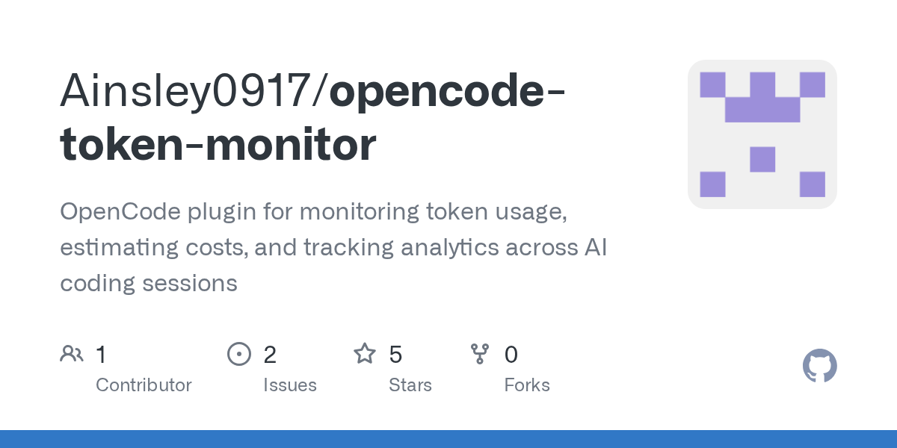</a>

- **ライセンス:** MIT
- **対象:** opencode
- **説明:** OpenCode プラグイン（statusline ではない）で、`token_stats` / `token_history` / `token_export` ツールを登録し、入力・出力・推論・キャッシュのトークン内訳をトースト通知で表示します。
- **備考:** Listed in the catalog because it complements an OpenCode statusline rather than replacing one — its output is tool results and toasts, not a `statusLine.command` line. OpenCode loads it from npm at session start once the `plugin` array is configured.
- **インストール:** OpenCode がセッション開始時に `opencode-token-monitor@0.5.0` を npm からロードします（`opencode.json` の `plugin` 配列に追加）
- **設定:** `node bin/statuslines.js configure ainsley-opencode-token-monitor --cli=<opencode>`

### `capedbitmap-codex-hud` — [codex-hud (Capedbitmap)](https://github.com/Capedbitmap/codex-hud)

- **ライセンス:** PolyForm-Noncommercial-1.0.0（再配布不可。参照のみ）
- **対象:** codex
- **説明:** ローカルの Codex セッションデータを取り込み、週次リセットのタイミングと残余容量に基づいて次に使用するアカウントを推薦する macOS メニューバーアプリ。
- **備考:** Source-available, not OSI-open-source. Listed for reference; we don't ship install recipes for non-redistributable entries.
- **インストール:** 上流を参照

### `ccometixline` — [CCometixLine](https://github.com/Haleclipse/CCometixLine)

<a href="https://github.com/Haleclipse/CCometixLine">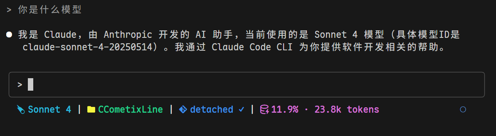</a>

- **ライセンス:** MIT
- **対象:** claude
- **説明:** インタラクティブな TUI 設定ツール、git 連携、使用量追跡を備えた Rust 製の高速 Claude Code statusline。
- **備考:** No verified package-manager install; follow upstream build/release instructions.
- **インストール:** 上流を参照

### `ccstatusline` — [ccstatusline](https://github.com/sirmalloc/ccstatusline)

<a href="https://github.com/sirmalloc/ccstatusline">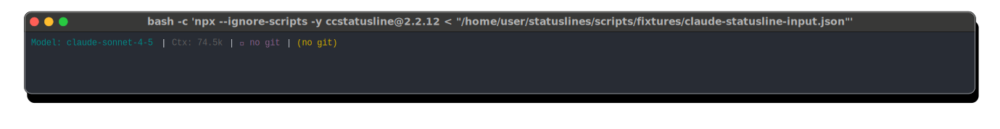</a>

- **ライセンス:** MIT
- **対象:** claude
- **説明:** インタラクティブな TUI 設定ツール、powerline レンダリング、テーマ、トークン・git・セッションタイマー・クリッカブルリンクのウィジェットを備えたカスタマイズ可能な Claude Code statusline。
- **インストール:** `npx --ignore-scripts -y ccstatusline@2.2.12`
- **設定:** `node bin/statuslines.js configure ccstatusline --cli=<claude>`

### `ccusage` — [ccusage](https://github.com/ryoppippi/ccusage)

<a href="https://github.com/ryoppippi/ccusage">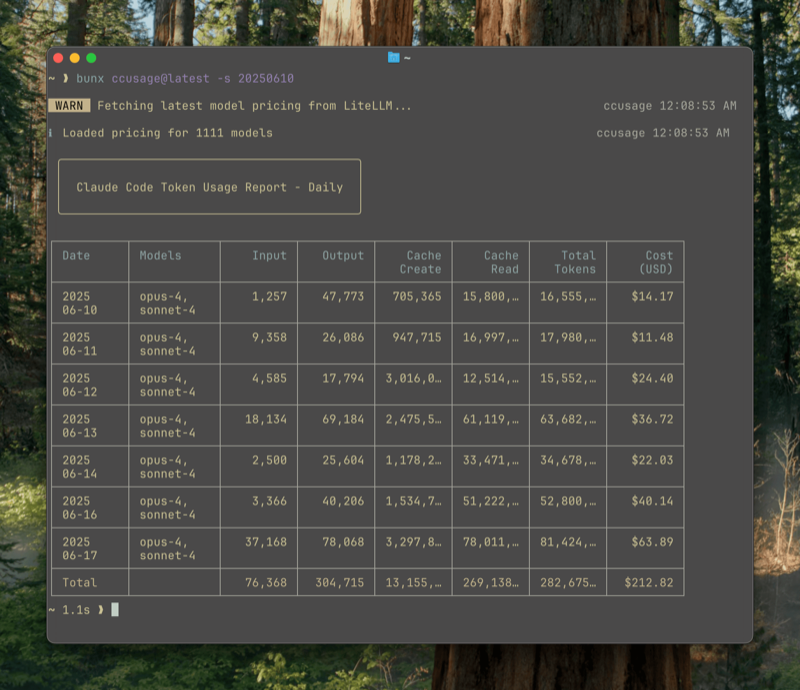</a>

- **ライセンス:** MIT
- **対象:** claude, codex
- **説明:** ローカルの Claude Code および Codex セッション JSONL ファイルを解析するトークン使用量・コスト分析ツール。statusline 自体ではないが、statusline 構築に有用なデータソースとして活用できます。
- **備考:** Run `npx -y ccusage@latest` for daily/monthly/session reports; pipe into a custom statusline for richer cost segments.
- **インストール:** `npx --ignore-scripts -y ccusage@18.0.11`

### `claude-hud` — [claude-hud](https://github.com/jarrodwatts/claude-hud)

- **ライセンス:** MIT
- **対象:** claude
- **説明:** コンテキスト使用量・アクティブツール・実行中サブエージェント・Todo 進捗・レート制限ウィンドウをネイティブ statusline API で表示する Claude Code プラグイン／statusline。
- **備考:** Distributed as a Claude Code plugin; see upstream README for the current install command.
- **インストール:** 上流を参照

### `daniel3303-claude-statusline` — [ClaudeCodeStatusLine (Daniel Graczer)](https://github.com/daniel3303/ClaudeCodeStatusLine)

<a href="https://github.com/daniel3303/ClaudeCodeStatusLine">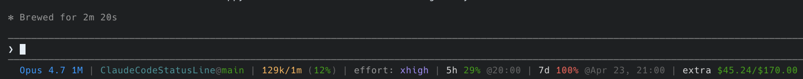</a>

- **ライセンス:** MIT（再配布不可。参照のみ）
- **対象:** claude
- **説明:** モデル・トークン・レート制限・git ステータスを表示する Bash + PowerShell 製の Claude Code statusline。
- **備考:** README declares MIT but the repo has no LICENSE file at the canonical paths as of catalog verification on 2026-04-30, so we treat it as license-unverified and don't ship an automated install. Upstream install: clone into ~/.claude/statusline/ and point statusLine.command at statusline.sh — see upstream INSTALL.md.
- **インストール:** 上流を参照

### `dwillitzer-claude-statusline` — [claude-statusline (dwillitzer)](https://github.com/dwillitzer/claude-statusline)

<a href="https://github.com/dwillitzer/claude-statusline">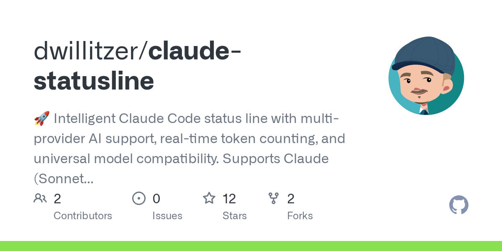</a>

- **ライセンス:** MIT（再配布不可。参照のみ）
- **対象:** claude
- **説明:** オプションの Node.js + tiktoken トークンカウントと、Claude・OpenAI・Gemini・Grok のマルチプロバイダーモデルカラーリングに対応した Bash 製 Claude Code statusline。
- **備考:** README claims MIT but no LICENSE file is present at catalog verification on 2026-04-30. README's clone command also uses a literal `<repository-url>` placeholder rather than this repo's URL — substitute manually.
- **インストール:** 上流を参照

### `felipeelias-claude-statusline` — [claude-statusline (Felipe Elias)](https://github.com/felipeelias/claude-statusline)

<a href="https://github.com/felipeelias/claude-statusline">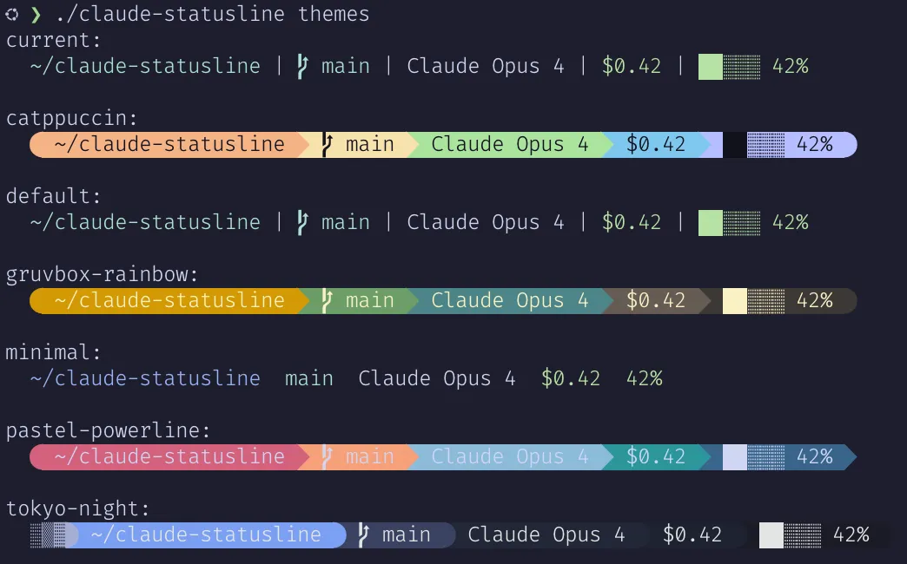</a>

- **ライセンス:** MIT
- **対象:** claude
- **説明:** モジュールベースの設定、OSC 8 ハイパーリンク、テーマプリセット（`catppuccin`、`tokyo-night`、`gruvbox-rainbow` など）を備えた Go バイナリ製 Claude Code statusline。
- **備考:** Brew install drops a `claude-statusline` binary on PATH. Alternative install: `go install github.com/felipeelias/claude-statusline@latest`. Customize via `~/.config/claude-statusline/config.toml` (see upstream).
- **インストール:** `brew install claude-statusline` (tap: `felipeelias/tap`)
- **設定:** `node bin/statuslines.js configure felipeelias-claude-statusline --cli=<claude>`

### `fredrikaverpil-claudeline` — [claudeline (Fredrik Averpil)](https://github.com/fredrikaverpil/claudeline)

<a href="https://github.com/fredrikaverpil/claudeline">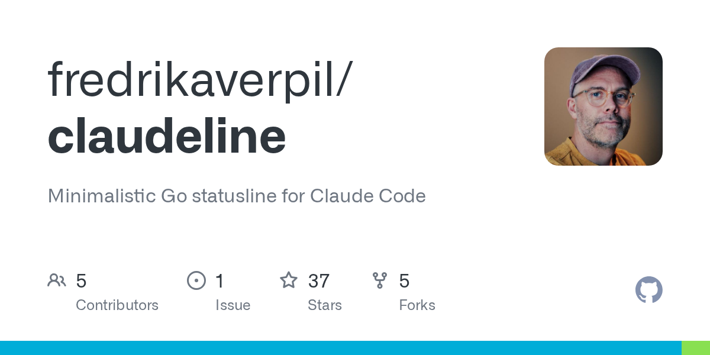</a>

- **ライセンス:** MIT
- **対象:** claude
- **説明:** Claude Code プラグインとして配布されるミニマリスト Go 製 Claude Code statusline。プラグインの `/claudeline:setup` スラッシュコマンドがバイナリをダウンロードして settings.json にパッチを当てます。
- **備考:** Install flow runs entirely inside Claude Code: `/plugin marketplace add fredrikaverpil/claudeline` → `/plugin install claudeline@claudeline` → `/claudeline:setup`. The setup command writes `{"statusLine":{"type":"command","command":"claudeline"}}` itself, so we don't ship a `configs.claude` patch. Manual fallback: `go install github.com/fredrikaverpil/claudeline@latest`, then add the same snippet by hand.
- **インストール:** 上流を参照

### `fwyc-codex-hud` — [codex-hud (fwyc0573)](https://github.com/fwyc0573/codex-hud)

- **ライセンス:** MIT
- **対象:** codex
- **説明:** セッション／コンテキスト使用量・git ステータス・ツールアクティビティ監視を備えた OpenAI Codex CLI 向けリアルタイム tmux statusline HUD。`--kill` / `--list` / `--attach` / `--self-check` サブコマンドも含みます。
- **備考:** Codex CLI has no native command-statusline yet, so this runs as an external HUD — start it under tmux per upstream docs.
- **インストール:** 上流を参照

### `hagan-claudia-statusline` — [claudia-statusline](https://github.com/hagan/claudia-statusline)

- **ライセンス:** MIT
- **対象:** claude
- **説明:** 永続的な統計追跡、Linux・macOS・Windows 向けビルド済みバイナリ、11 テーマを備えた Rust 製 Claude Code statusline。公式 Claude Code ドキュメントでも参照されています。
- **備考:** Upstream install is a `curl | bash` quick-install script that auto-configures settings.json. We don't auto-run remote scripts from `bin/statuslines.js configure` — invoke it directly per upstream README. Distinct from the inactive `taskx6004/claudia-statusline` fork.
- **インストール:** 上流を参照

### `joaquinvesapa-sub-agent-statusline` — [opencode-subagent-statusline](https://github.com/Joaquinvesapa/sub-agent-statusline)

- **ライセンス:** MIT
- **対象:** opencode
- **説明:** サブエージェントのアクティビティ・経過時間・トークン／コンテキスト使用量を表示する OpenCode TUI サイドバープラグイン（statusLine.command ではない）。
- **備考:** Configures via OpenCode's TUI config (~/.config/opencode/tui.json), not opencode.json. Add manually: {"$schema":"https://opencode.ai/tui.json","plugin":["opencode-subagent-statusline"]}. We don't auto-merge because that target file isn't supported by `bin/statuslines.js configure` yet.
- **インストール:** OpenCode がセッション開始時に `opencode-subagent-statusline@0.5.4` を npm からロードします（`opencode.json` の `plugin` 配列に追加）

### `kiriketsuki-gemini-statusline` — [gemini-statusline](https://github.com/Kiriketsuki/gemini-statusline)

<a href="https://github.com/Kiriketsuki/gemini-statusline">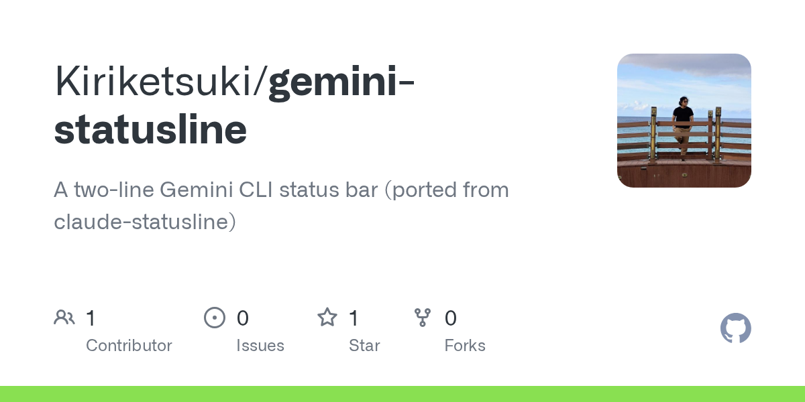</a>

- **ライセンス:** Unspecified（再配布不可。参照のみ）
- **対象:** gemini
- **説明:** モデル・ワークスペースコンテキスト・git ブランチ・GitHub Issue 件数・受信トレイ件数を表示する Gemini CLI 向け 2 行シェルプロンプトヘルパー。Gemini CLI にはネイティブ statusLine フックがないため、ユーザーのシェルプロンプトから実行します。
- **備考:** No LICENSE file at the canonical paths as of catalog verification on 2026-04-30; default copyright is all-rights-reserved, so we don't ship install recipes. Worth tracking as the first Gemini-targeted statusline-style helper. Upstream README acknowledges Gemini CLI lacks a native statusLine hook.
- **インストール:** 上流を参照

### `lucasilverentand-claudeline` — [claudeline (Luca Silverentand)](https://github.com/lucasilverentand/claudeline)

<a href="https://github.com/lucasilverentand/claudeline">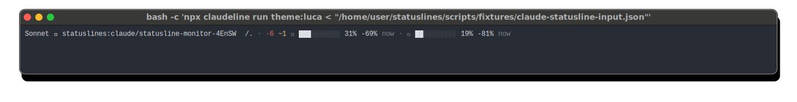</a>

- **ライセンス:** MIT
- **対象:** claude
- **説明:** npm パッケージ `claudeline` として配布され、組み込みテーマと `--install` フラグによる settings.json への自動インストールに対応した Claude Code statusline。
- **備考:** Distinct from fredrikaverpil/claudeline (Go binary) despite the shared name. The package's `--install` flag patches settings.json automatically; the configs.claude here is the same snippet that flag would write.
- **インストール:** `npx --ignore-scripts -y claudeline@1.11.0`
- **設定:** `node bin/statuslines.js configure lucasilverentand-claudeline --cli=<claude>`

### `markwilkening-opencode-status-line` — [opencode-status-line](https://github.com/markwilkening21/opencode-status-line)

<a href="https://github.com/markwilkening21/opencode-status-line">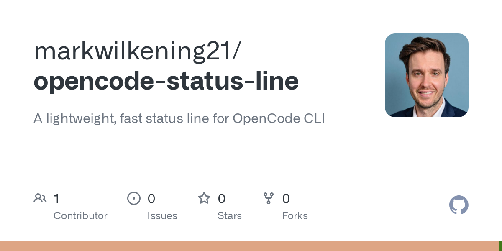</a>

- **ライセンス:** MIT
- **対象:** opencode
- **説明:** OpenCode CLI 向けの軽量・高速な statusline。
- **備考:** Verify the entry script name in the upstream repo before relying on the configured command.
- **インストール:** `git clone`（`bin/statuslines.js configure` で処理）
- **設定:** `node bin/statuslines.js configure markwilkening-opencode-status-line --cli=<opencode>`

### `ndave92-claude-code-status-line` — [claude-code-status-line (ndave92)](https://github.com/ndave92/claude-code-status-line)

<a href="https://github.com/ndave92/claude-code-status-line">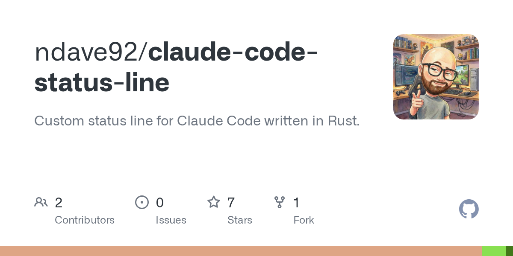</a>

- **ライセンス:** MIT
- **対象:** claude
- **説明:** ワークスペース情報・git ステータス・モデル名・コンテキスト使用量・worktree ヒント・クォータタイマー・オプションの API コストを表示する Rust 製 Claude Code statusline。
- **備考:** Recommended install is a self-installing slash command: download `.claude/commands/install-statusline.md` from the upstream repo, restart Claude Code, and run `/install-statusline`. The crate `claude-code-status-line` is not published on crates.io as of catalog verification on 2026-04-30.
- **インストール:** 上流を参照

### `opencode-quota` — [opencode-quota](https://github.com/slkiser/opencode-quota)

<a href="https://github.com/slkiser/opencode-quota">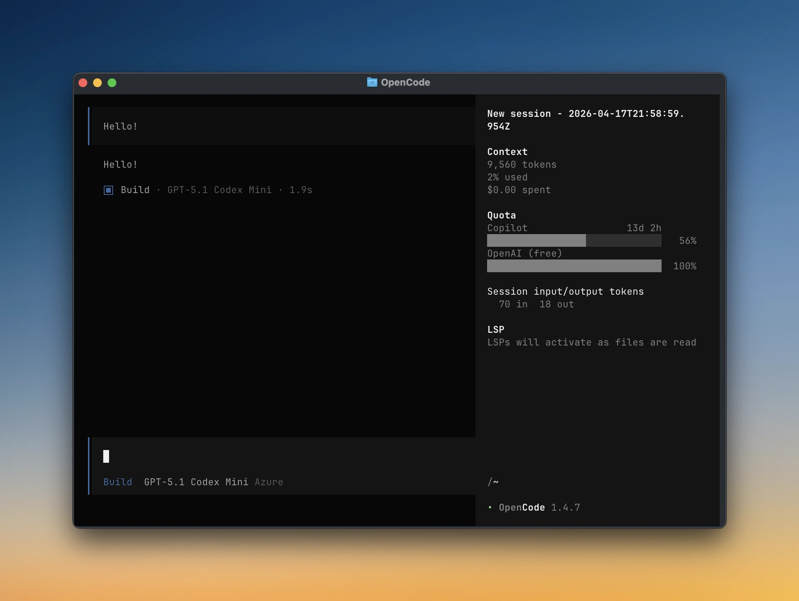</a>

- **ライセンス:** MIT
- **対象:** opencode
- **説明:** コンテキストウィンドウを汚染しない OpenCode のクォータおよびトークン使用量表示ツール。OpenCode Go・Cursor・GitHub Copilot などのプロバイダーをサポートします。
- **備考:** Follow upstream README for the current install path; project surface evolves quickly.
- **インストール:** 上流を参照

### `owloops-claude-powerline` — [claude-powerline](https://github.com/Owloops/claude-powerline)

<a href="https://github.com/Owloops/claude-powerline">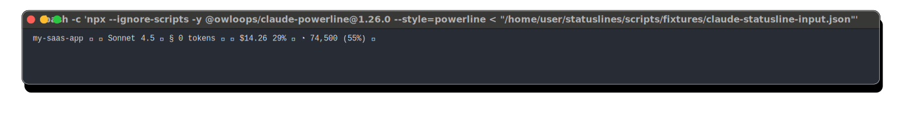</a>

- **ライセンス:** MIT
- **対象:** claude
- **説明:** リアルタイム使用量追跡・git 連携・テーマプリセットを備えた Vim スタイルの powerline Claude Code statusline。
- **インストール:** `npx --ignore-scripts -y @owloops/claude-powerline@1.26.0`
- **設定:** `node bin/statuslines.js configure owloops-claude-powerline --cli=<claude>`

### `ramtinj95-opencode-tokenscope` — [opencode-tokenscope](https://github.com/ramtinJ95/opencode-tokenscope)

<a href="https://github.com/ramtinJ95/opencode-tokenscope">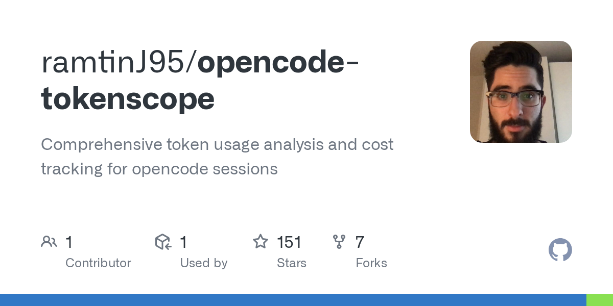</a>

- **ライセンス:** MIT
- **対象:** opencode
- **説明:** セッションのトークン使用量とコストを詳細な内訳とともに分析する OpenCode プラグイン（statusline ではない）。
- **備考:** Upstream is ramtinJ95/opencode-tokenscope; pantheon-org/opencode-tokenscope-plugin is a downstream fork that uses the same npm package.
- **インストール:** OpenCode がセッション開始時に `@ramtinj95/opencode-tokenscope@1.6.3` を npm からロードします（`opencode.json` の `plugin` 配列に追加）
- **設定:** `node bin/statuslines.js configure ramtinj95-opencode-tokenscope --cli=<opencode>`

### `sotayamashita-claude-code-statusline` — [claude-code-statusline (Sam Yamashita)](https://github.com/sotayamashita/claude-code-statusline)

<a href="https://github.com/sotayamashita/claude-code-statusline">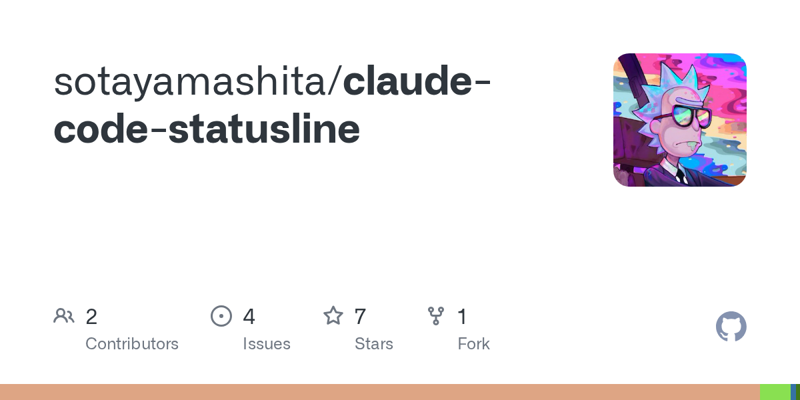</a>

- **ライセンス:** MIT
- **対象:** claude
- **説明:** starship ライクな設定とモジュールベースの構成に対応した Rust 製 Claude Code statusline。
- **備考:** Upstream README references `cargo install claude-code-statusline-cli`, but that crate is not published on crates.io as of catalog verification on 2026-04-30. Build from source meanwhile: clone the repo, run `cargo build --release`, point statusLine.command at the resulting binary.
- **インストール:** 上流を参照

### `thisdot-context-statusline` — [@this-dot/claude-code-context-status-line](https://github.com/thisdot/claude-code-context-status-line)

<a href="https://github.com/thisdot/claude-code-context-status-line">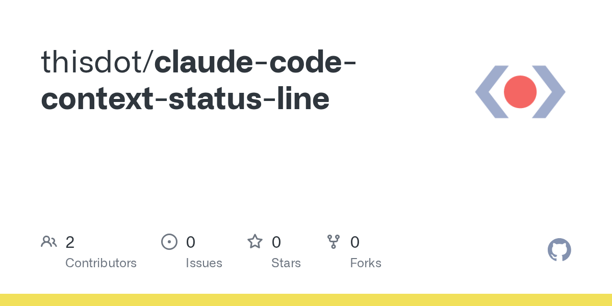</a>

- **ライセンス:** MIT
- **対象:** claude
- **説明:** セッション JSONL トランスクリプトを解析して入力・キャッシュ作成・キャッシュ読み取りトークンを集計し、正確なコンテキストウィンドウを表示する Claude Code statusline。
- **備考:** Last published 2025-09-27 (v0.2.2); originally tuned for AWS Bedrock-hosted models but works for any Claude Code session.
- **インストール:** `npx --ignore-scripts -y @this-dot/claude-code-context-status-line@0.2.2`
- **設定:** `node bin/statuslines.js configure thisdot-context-statusline --cli=<claude>`

### `tokscale` — [tokscale](https://github.com/junhoyeo/tokscale)

<a href="https://github.com/junhoyeo/tokscale">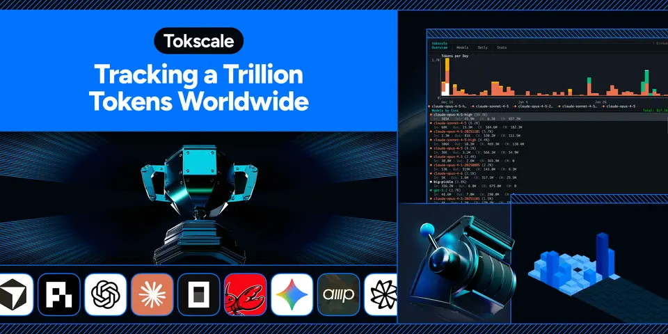</a>

- **ライセンス:** MIT
- **対象:** claude, opencode, gemini, codex
- **説明:** Claude Code・OpenCode・Codex・Gemini・Cursor・Amp・Kimi など多数の AI コーディングツールのローカルセッションデータを読み取り、LiteLLM の価格情報に基づいてトークン使用量を追跡するクロス CLI 対応ツール。
- **備考:** Use as a data source for a custom statusline (e.g. `npx -y tokscale@latest --json`) rather than as the statusline itself.
- **インストール:** `npx --ignore-scripts -y tokscale@2.0.27`
