# カタログ

**言語：** [English](./README.md) · [Français](./README.fr.md) · 日本語

Claude Code、OpenCode、Gemini CLI、Codex CLI 向けのサードパーティ statusline と関連ツール。`catalog/<cli>/<slug>.json` から生成されます — 手で編集しないでください。

凡例：**ok** = OSI 互換ライセンス、インストール／設定レシピ同梱。**ref** = 参照のみ。上流の手順でインストールしてください。

| Slug | 名称 | 対象 | ライセンス | 言語 | 状況 | インストール |
|---|---|---|---|---|---|---|
| `adam-ismael-claude-fitness-break` | [claude-fitness-break](https://github.com/adam-ismael/claude-fitness-break) | claude | MIT | bash | ok | plugin |
| `ai-ken-git-cat-codex-statusline` | [cat-codex-statusline (ai-ken-git)](https://github.com/ai-ken-git/cat-codex-statusline) | codex | MIT | python | ok | manual |
| `akkaz-ccstatusline-gradient` | [ccstatusline-gradient](https://github.com/akkaz/ccstatusline-gradient) | claude | MIT | TypeScript | ok | manual |
| `alequip-ccstatusline-tokyonight` | [ccstatusline Tokyo Night Theme](https://github.com/Alequip/ccstatusline-tokyonight) | claude | MIT | JSON | ok | manual |
| `amirlehmam-ocstatusline` | [ocstatusline](https://github.com/amirlehmam/ocstatusline) | opencode | MIT | typescript | ok | npx |
| `aneeshtigga-ministats` | [ministats](https://github.com/aneeshtigga/ministats) | claude | MIT | JavaScript | ok | manual |
| `anirudhmkumar-claude-code-statusline` | [claude-code-statusline](https://github.com/AnirudhMKumar/claude-code-statusline) | claude | MIT | powershell | ok | manual |
| `anthonybaldwin-claude-statusline` | [claude-statusline](https://github.com/anthonybaldwin/claude-statusline) | claude | MIT | JavaScript | ok | manual |
| `asaberui1-ccstatusline4deepseek` | [CCStatusline4DeepSeek](https://github.com/asaberui1/CCStatusline4DeepSeek) | claude | MIT | Shell | ok | manual |
| `asafsaar-claude-code-statusline` | [claude-code-statusline](https://github.com/AsafSaar/claude-code-statusline) | claude | MIT | shell | ok | manual |
| `assenav-gnuj-cc-petline` | [cc-petline](https://github.com/Assenav-Gnuj/cc-petline) | claude | MIT | Rust | ok | cargo |
| `assenav-gnuj-ccstatusline-charm` | [ccstatusline-charm](https://github.com/Assenav-Gnuj/ccstatusline-charm) | claude | MIT | PowerShell | ok | manual |
| `awesomejun-cc-statusline` | [Awesome Statusline (CC-statusline)](https://github.com/AwesomeJun/CC-statusline) | claude | MIT | shell | ref | curl |
| `bawstosai-fun-fact` | [fun-fact-bawstos](https://github.com/BawstosAI/fun-fact-bawstos) | claude | MIT | JavaScript | ok | manual |
| `blazemalan-claude-plan-statusline` | [claude-code-plan-statusline](https://github.com/blazemalan/claude-code-plan-statusline) | claude | MIT | Shell | ok | manual |
| `brandonchartier-cc-statusline` | [cc-statusline](https://github.com/brandonchartier/cc-statusline) | claude | MIT | python | ok | manual |
| `briansmith80-claude-code-status-bar` | [claude-code-status-bar](https://github.com/briansmith80/claude-code-status-bar) | claude | MIT | shell | ok | manual |
| `callmemorgan-claude-statusline` | [claude-statusline](https://github.com/callmemorgan/claude-statusline) | claude, codex, gemini | MIT | Go | ok | brew |
| `capedbitmap-codex-hud` | [codex-hud (Capedbitmap)](https://github.com/Capedbitmap/codex-hud) | codex | PolyForm-Noncommercial-1.0.0 | swift | ref | manual |
| `ccometixline` | [CCometixLine](https://github.com/Haleclipse/CCometixLine) | claude | MIT | rust | ok | manual |
| `ccstatusline` | [ccstatusline](https://github.com/sirmalloc/ccstatusline) | claude | MIT | typescript | ok | npx |
| `chae-dahee-claude-buddy` | [claude-buddy](https://github.com/chae-dahee/claude-buddy) | claude | MIT | typescript | ok | npm-global |
| `claude-hud` | [claude-hud](https://github.com/jarrodwatts/claude-hud) | claude | MIT | typescript | ok | plugin |
| `codyslater-ccstatusline-retro-hud` | [ccstatusline retro-hud](https://github.com/codyslater/ccstatusline_retro-hud) | claude | MIT | Python | ok | manual |
| `ctfbio-claude-code-statusline` | [claude-code-statusline (ctfbio)](https://github.com/ctfbio/claude-code-statusline) | claude | MIT | shell | ok | manual |
| `daniel3303-claude-statusline` | [ClaudeCodeStatusLine (Daniel Graczer)](https://github.com/daniel3303/ClaudeCodeStatusLine) | claude | MIT | shell | ok | manual |
| `danielmackay-claude-code-statusline` | [Claude Code Statusline](https://github.com/danielmackay/claude-code-statusline) | claude | Unspecified | shell | ref | manual |
| `deluo-glm-quota-line` | [glm-quota-line](https://github.com/deluo/glm-quota-line) | claude | MIT | JavaScript | ok | manual |
| `dpc00-ccstatusline-editor` | [ccstatusline-editor](https://github.com/dpc00/ccstatusline-editor) | claude | MIT | Python | ok | manual |
| `dwillitzer-claude-statusline` | [claude-statusline (dwillitzer)](https://github.com/dwillitzer/claude-statusline) | claude | MIT | shell | ok | manual |
| `entrolution-quotaline` | [quotaline](https://github.com/Entrolution/quotaline) | claude | MIT | Rust | ok | curl |
| `entrolution-vastline` | [vastline](https://github.com/Entrolution/vastline) | claude | MIT | Rust | ok | curl |
| `felipeelias-claude-statusline` | [claude-statusline (Felipe Elias)](https://github.com/felipeelias/claude-statusline) | claude | MIT | go | ok | brew |
| `ffontenit-claude-usage-statusline` | [claude-usage-statusline](https://github.com/ffontenit/claude-usage-statusline) | claude | MIT | Shell | ok | manual |
| `fmondora-co2-claude` | [co2-claude](https://github.com/fmondora/co2-claude) | claude | unknown | Shell | ref | curl |
| `fredrikaverpil-claudeline` | [claudeline (Fredrik Averpil)](https://github.com/fredrikaverpil/claudeline) | claude | MIT | go | ok | manual |
| `fwyc-codex-hud` | [codex-hud (fwyc0573)](https://github.com/fwyc0573/codex-hud) | codex | MIT | typescript | ok | manual |
| `fyko-claudehud` | [claudehud](https://github.com/Fyko/claudehud) | claude | MIT | rust | ok | manual |
| `gerardofc8-claude-subagent-statusline` | [claude-subagent-statusline](https://github.com/GerardoFC8/claude-subagent-statusline) | claude | MIT | javascript | ok | manual |
| `gordonbeeming-codex-statusline` | [codex-statusline (GordonBeeming)](https://github.com/GordonBeeming/codex-statusline) | codex | Unspecified | shell | ref | manual |
| `gregoryho-cc-pulseline` | [cc-pulseline](https://github.com/GregoryHo/cc-pulseline) | claude | MIT | rust | ok | manual |
| `hagan-claudia-statusline` | [claudia-statusline](https://github.com/hagan/claudia-statusline) | claude | MIT | rust | ok | manual |
| `haigle0127-ccstatusline-kimi` | [ccstatusline-kimi](https://github.com/haigle0127/ccstatusline-kimi) | kimi | MIT | TypeScript | ok | plugin |
| `hanbu97-tokenusage` | [tokenusage (hanbu97)](https://github.com/hanbu97/tokenusage) | claude, codex | MIT | rust | ok | npx |
| `haunchen-claude-code-statusline` | [claude-code-statusline](https://github.com/haunchen/claude-code-statusline) | claude | MIT | javascript | ok | manual |
| `hstojanovic-claude-vibeline` | [claude-vibeline](https://github.com/hstojanovic/claude-vibeline) | claude | MIT | python | ok | manual |
| `ilia-pluzhnikov-claude-code-statusline` | [claude-code-statusline](https://github.com/ilia-pluzhnikov/claude-code-statusline) | claude | MIT | javascript | ok | git |
| `intertechinc-claude-code-context-meter` | [claude-code-context-meter](https://github.com/IntertechInc/claude-code-context-meter) | claude | unknown | Shell | ref | manual |
| `jacsuper-codex-statusline-vscode` | [codex-statusline-vscode](https://github.com/jacsuper/codex-statusline-vscode) | vscode | MIT | typescript | ok | manual |
| `joaquinvesapa-sub-agent-statusline` | [opencode-subagent-statusline](https://github.com/Joaquinvesapa/sub-agent-statusline) | opencode | MIT | typescript | ok | opencode-plugin |
| `kamranahmedse-claude-statusline` | [claude-statusline (Kamran Ahmed)](https://github.com/kamranahmedse/claude-statusline) | claude | MIT | shell | ok | npx |
| `kenanbalija-islamic-statuses` | [Islamic Statuses for Claude Code](https://github.com/kenanbalija/claude-islamic-statuses) | claude | MIT | Shell | ok | manual |
| `kiheon0709-claude-codex-statusline` | [claude-codex-statusline](https://github.com/kiheon0709/claude-codex-statusline) | claude, codex | MIT | javascript | ref | curl |
| `kiriketsuki-gemini-statusline` | [gemini-statusline](https://github.com/Kiriketsuki/gemini-statusline) | gemini | Unspecified | shell | ref | manual |
| `laveez-ccsl` | [ccsl](https://github.com/laveez/ccsl) | claude | MIT | typescript | ok | npm-global |
| `leeguooooo-claude-code-usage-bar` | [claude-code-usage-bar](https://github.com/leeguooooo/claude-code-usage-bar) | claude | MIT | python | ok | manual |
| `lightning7329-cc-statusline` | [cc-statusline](https://github.com/Lightning7329/cc-statusline) | claude | MIT | fsharp | ok | manual |
| `lucasilverentand-claudeline` | [claudeline (Luca Silverentand)](https://github.com/lucasilverentand/claudeline) | claude | MIT | typescript | ok | npx |
| `markwilkening-opencode-status-line` | [opencode-status-line](https://github.com/markwilkening21/opencode-status-line) | opencode | MIT | shell | ok | git |
| `maximocorrea1-dumbometer` | [Dumbometer](https://github.com/MaximoCorrea1/dumbometer) | claude | MIT | JavaScript | ok | manual |
| `mengfanlu1-opendoor-statusline` | [OpenDoor StatusLine](https://github.com/MengFanLu1/opendoor-statusline) | claude, codex, gemini | MIT | Rust | ok | manual |
| `meros-claude-usage-statusline` | [claude-usage-statusline](https://github.com/meros/claude-usage-statusline) | claude | MIT | shell | ok | manual |
| `mtschoen-schoen-claude-status` | [schoen-claude-status](https://github.com/mtschoen/schoen-claude-status) | claude | MIT | shell | ok | manual |
| `navifra-sally-sysmon-plugin` | [sysmon](https://github.com/Navifra-Sally/sysmon-plugin) | claude | MIT | Shell | ok | plugin |
| `ndave92-claude-code-status-line` | [claude-code-status-line (ndave92)](https://github.com/ndave92/claude-code-status-line) | claude | MIT | rust | ok | manual |
| `noahbclarkson-noahs-claude-statusline` | [noahs-claude-statusline](https://github.com/noahbclarkson/noahs-claude-statusline) | claude | Unspecified | shell | ref | manual |
| `o0000-cc-tempo` | [cc-tempo](https://github.com/O0000-code/cc-tempo) | claude | MIT | shell | ok | manual |
| `octane0411-open-vibe-island` | [Open Island](https://github.com/octane0411/open-vibe-island) | claude, codex, gemini, opencode | GPL-3.0 | swift | ref | manual |
| `opencode-quota` | [opencode-quota](https://github.com/slkiser/opencode-quota) | opencode | MIT | typescript | ok | manual |
| `owloops-claude-powerline` | [claude-powerline](https://github.com/Owloops/claude-powerline) | claude | MIT | typescript | ok | npx |
| `padenot-foxtail` | [foxtail](https://github.com/padenot/foxtail) | claude | Apache-2.0 | Rust | ok | cargo |
| `pcvelz-ccstatusline-usage` | [ccstatusline-usage](https://github.com/pcvelz/ccstatusline-usage) | claude | MIT | typescript | ok | npx |
| `postmodum37-simple-claude-code-statusline` | [simple-claude-code-statusline](https://github.com/Postmodum37/simple-claude-code-statusline) | claude | MIT | go | ok | manual |
| `puddinging-prism-hud` | [prism-hud](https://github.com/puddinging/prism-hud) | claude | MIT | typescript | ok | plugin |
| `raicony-claude-code-statusline` | [claude-code-statusline (RaiconY)](https://github.com/RaiconY/claude-code-statusline) | claude | MIT | javascript | ok | manual |
| `ramtinj95-opencode-tokenscope` | [opencode-tokenscope](https://github.com/ramtinJ95/opencode-tokenscope) | opencode | MIT | typescript | ok | opencode-plugin |
| `ratelworks-token-horse` | [Token Horse](https://github.com/ratelworks/token-horse) | claude | MIT | JavaScript | ok | manual |
| `rgomes87-codex-statusline` | [codex-statusline (rgomes87)](https://github.com/rgomes87/codex-statusline) | codex | Unspecified | shell | ref | manual |
| `riveroflogic-claude-code-statusline` | [claude-code-statusline (RiverOfLogic)](https://github.com/RiverOfLogic/claude-code-statusline) | claude | Unspecified | shell | ref | manual |
| `robertogogoni-aifuel` | [aifuel](https://github.com/robertogogoni/aifuel) | claude, codex, gemini | MIT | go | ok | manual |
| `ryukenshin546-a11y-claude-prompt-meter` | [Claude Prompt Meter](https://github.com/ryukenshin546-a11y/claude-prompt-meter) | claude | MIT | JavaScript | ok | plugin |
| `rz1989s-claude-code-statusline` | [claude-code-statusline (rz1989s)](https://github.com/rz1989s/claude-code-statusline) | claude | MIT | bash | ok | manual |
| `shallow-dusty-horologium` | [horologium](https://github.com/Shallow-dusty/horologium) | claude | MIT | rust | ok | manual |
| `sirmalloc-ccstatusline` | [ccstatusline](https://github.com/sirmalloc/ccstatusline) | claude | MIT | TypeScript | ok | manual |
| `siropkin-budi-jetbrains` | [budi — JetBrains plugin](https://github.com/siropkin/budi-jetbrains) | jetbrains | MIT | kotlin | ok | plugin |
| `sleighmaster99-claudecodestatusbar` | [ClaudeCodeStatusBar](https://github.com/SleighMaster99/ClaudeCodeStatusBar) | claude | MIT | powershell | ok | git |
| `snackdriven-claude-statusline` | [claude-statusline](https://github.com/snackdriven/claude-statusline) | claude | unknown | Shell | ref | manual |
| `sotayamashita-claude-code-statusline` | [claude-code-statusline (Sam Yamashita)](https://github.com/sotayamashita/claude-code-statusline) | claude | MIT | rust | ok | manual |
| `soulagent-claude-duck` | [claude-duck](https://github.com/soulagent/claude-duck) | claude | MIT | JavaScript | ok | manual |
| `spences10-claude-statusline-powerline` | [claude-statusline-powerline](https://github.com/spences10/claude-statusline-powerline) | claude | MIT | typescript | ok | npx |
| `squanchymnonm-claudecode-statusbar` | [ClaudeCodeStatusBar](https://github.com/squanchymnonm/ClaudeCodeStatusBar) | claude | MIT | Shell | ok | manual |
| `srdarf-xclaudeusage` | [XClaudeUsage](https://github.com/SrDarf/XClaudeUsage) | claude | MIT | JavaScript | ok | curl |
| `tendo33-cursor-usage-tracker` | [Cursor Usage Tracker](https://github.com/Tendo33/cursor-usage-tracker) | cursor | MIT | typescript | ok | manual |
| `theobrigitte-claude-statusline` | [claude-statusline (TheoBrigitte)](https://github.com/TheoBrigitte/claude-statusline) | claude | MIT | go | ok | manual |
| `thisdot-context-statusline` | [@this-dot/claude-code-context-status-line](https://github.com/thisdot/claude-code-context-status-line) | claude | MIT | typescript | ok | npx |
| `tokscale` | [tokscale](https://github.com/junhoyeo/tokscale) | claude, opencode, gemini, codex, amp, cursor, kimi | MIT | typescript | ok | npx |
| `victory-c-fitpet` | [FitPet](https://github.com/victory-c/fitpet) | claude | MIT | TypeScript | ok | manual |
| `xicv-codexbar-hub` | [codexbar-hub](https://github.com/xicv/codexbar-hub) | claude, codex, gemini | MIT | TypeScript | ok | manual |
| `xuedi-claude-statusline` | [xuedi/claude-statusline](https://github.com/xuedi/claude-statusline) | claude | EUPL-1.2 | rust | ref | manual |
| `xyzcardiff-claude-code-statusline` | [claude-code-statusline](https://github.com/xyzcardiff/claude-code-statusline) | claude | MIT | shell | ok | manual |
| `young1lin-claude-token-monitor` | [claude-token-monitor](https://github.com/young1lin/claude-token-monitor) | claude | MIT | Go | ok | manual |
| `zrawday-bmad-statusline` | [bmad-statusline](https://github.com/zRawday/bmad-statusline) | claude | MIT | JavaScript | ok | manual |
| `zyx1121-claude-statusline` | [claude-statusline](https://github.com/zyx1121/claude-statusline) | claude | MIT | TypeScript | ok | manual |

## エントリ別詳細

### `adam-ismael-claude-fitness-break` — [claude-fitness-break](https://github.com/adam-ismael/claude-fitness-break)

<a href="https://github.com/adam-ismael/claude-fitness-break">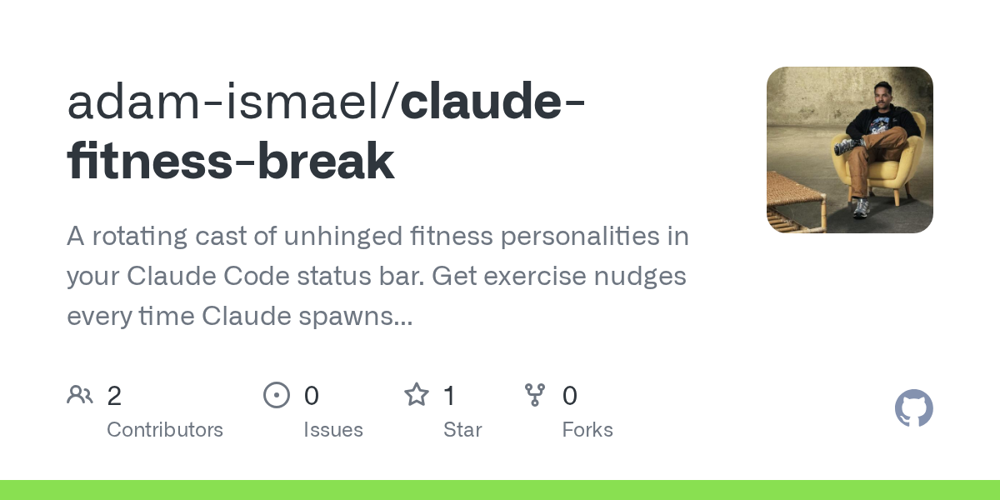</a>

- **ライセンス:** MIT
- **対象:** claude
- **説明:** Claudeがエージェントを生成するたびに発火するフックプラグイン。ランダムなエクササイズを選び、鬼教官・80年代コーチ・90年代レスラー・神経質な医師の4つの個性のいずれかでclaude-haikuを通じて叫びかける。5分のクールダウン付きでステータスラインに表示する。
- **備考:** Install via `claude plugin marketplace add adam-ismael/claude-fitness-break && claude plugin install claude-fitness-break@claude-fitness-break`, then run `/claude-fitness-break:fitness-setup` to wire the statusline (idempotent, backs up existing config). Requires `jq` and `claude` on PATH. Hooks fire on SubagentStart with PreToolUse fallback for Task/Agent tools on older builds.
- **インストール:** 上流を参照

### `ai-ken-git-cat-codex-statusline` — [cat-codex-statusline (ai-ken-git)](https://github.com/ai-ken-git/cat-codex-statusline)

<a href="https://github.com/ai-ken-git/cat-codex-statusline">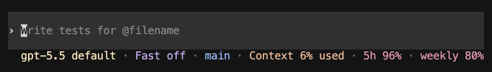</a>

- **ライセンス:** MIT
- **対象:** codex
- **説明:** 猫テーマの Codex CLI ステータスライン インストーラー。ビルトインセグメント（モデル、gitブランチ、コンテキスト、制限）をクリーンなプリセットに配線し、Codex がコマンドベースのステータスラインフックを提供した時点で猫顔レンダラーが自動的に有効になります。
- **備考:** Codex CLI does not yet expose a command-backed status line hook (unlike Claude Code, which runs an arbitrary command). The cat-face renderer (statusline.py) is included but not wired in; the installer currently configures only Codex's native built-in segments via [tui].status_line in ~/.codex/config.toml. Cat faces will activate automatically once Codex adds hook support.
- **インストール:** 上流を参照

### `akkaz-ccstatusline-gradient` — [ccstatusline-gradient](https://github.com/akkaz/ccstatusline-gradient)

- **ライセンス:** MIT
- **対象:** claude
- **説明:** ccstatuslineのフォークで、Claude Codeのステータスラインテキストに文字ごとにグラデーションカラーをスイープ表示する機能と、ウィジェット値に基づく動的な色変化を追加します。7つの組み込みプリセットと、単一のnpxコマンドによるインタラクティブなオンボーディングUIを提供します。
- **インストール:** 上流を参照

### `alequip-ccstatusline-tokyonight` — [ccstatusline Tokyo Night Theme](https://github.com/Alequip/ccstatusline-tokyonight)

- **ライセンス:** MIT
- **対象:** claude
- **説明:** ccstatusline向けのTokyo Nightカラーテーマプリセット。Claude Code用に4行のパワーライン形式ステータスラインを提供し、セッション・週次・コンテキストのトークン使用量をプログレスバーで表示する。ベースツールはnpxでインストールが必要。
- **インストール:** 上流を参照

### `amirlehmam-ocstatusline` — [ocstatusline](https://github.com/amirlehmam/ocstatusline)

<a href="https://github.com/amirlehmam/ocstatusline">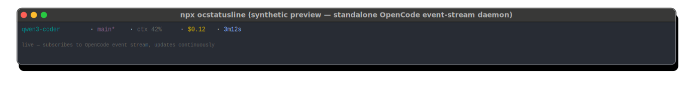</a>

- **ライセンス:** MIT
- **対象:** opencode
- **説明:** OpenCode サーバーのイベントストリームを購読し、専用のターミナルペインでライブ更新され続けるステータスラインを描画するスタンドアロンの OpenCode statusline デーモン。セグメントを設定できる Ink ベースのインタラクティブ TUI を備える。
- **備考:** Not an opencode.json integration — runs as a separate long-lived process (`ocstatusline start`) in its own terminal pane alongside an OpenCode session, subscribing to the local OpenCode event stream (default http://127.0.0.1:4096). Can spawn its own `opencode serve` process or attach to an existing one with --server. Config TUI: `npx ocstatusline` (no subcommand) opens the Ink-based editor.
- **インストール:** `npx --ignore-scripts -y ocstatusline@0.1.0`

### `aneeshtigga-ministats` — [ministats](https://github.com/aneeshtigga/ministats)

- **ライセンス:** MIT
- **対象:** claude
- **説明:** モデル名、推論努力レベル、トークン数付きのコンテキスト使用バー、セッションの累積コストを表示するClaude Code用のコンパクトなステータスラインで、オプションのcavemanバッジにも対応しています。
- **インストール:** 上流を参照

### `anirudhmkumar-claude-code-statusline` — [claude-code-statusline](https://github.com/AnirudhMKumar/claude-code-statusline)

- **ライセンス:** MIT
- **対象:** claude
- **説明:** ディレクトリ、Gitブランチ、アクティブモデル、コンテキスト使用量を表示するWindows向けPowerShellステータスライン — 外部依存なしでirm/iexコマンド1行でインストール可能。
- **備考:** Requires Windows with PowerShell (pwsh). One-command install: `powershell -ExecutionPolicy Bypass -c "irm https://raw.githubusercontent.com/AnirudhMKumar/claude-code-statusline/main/install.ps1 | iex"`. Nerd Font required for icons.
- **インストール:** 上流を参照
- **設定:** `node bin/statuslines.js configure anirudhmkumar-claude-code-statusline --cli=<claude>`

### `anthonybaldwin-claude-statusline` — [claude-statusline](https://github.com/anthonybaldwin/claude-statusline)

- **ライセンス:** MIT
- **対象:** claude
- **説明:** Claude Code 向けのゼロ依存 Bun 製ステータスラインで、コンテキスト使用量・API コスト（消費率付き）・レートリミットウィンドウ・git/PR 状態・アクティブなサブエージェントを多行ターミナルダッシュボードとして表示します。リポジトリをクローンして bun install.js を実行するだけで ~/.claude/settings.json が自動設定されます。
- **インストール:** 上流を参照

### `asaberui1-ccstatusline4deepseek` — [CCStatusline4DeepSeek](https://github.com/asaberui1/CCStatusline4DeepSeek)

- **ライセンス:** MIT
- **対象:** claude
- **説明:** 16ブロックのコンテキストウィンドウ進捗バー、セッション累積コスト（CNY/¥）、トークン使用量メトリクス、APIで取得したDeepSeekリアルタイム残高を表示する、Claude Code用2行ステータスラインスクリプト。
- **インストール:** 上流を参照

### `asafsaar-claude-code-statusline` — [claude-code-statusline](https://github.com/AsafSaar/claude-code-statusline)

<a href="https://github.com/AsafSaar/claude-code-statusline">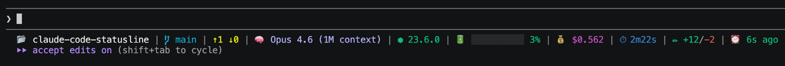</a>

- **ライセンス:** MIT
- **対象:** claude
- **説明:** トグル可能なセグメント（cwd、Gitブランチ、dirty、ahead/behind、モデル、node、コンテキスト、コスト、時間、行数、最終コミット、スタッシュ、エフォート、レート制限、tsエラー）をセグメントごとのアイコンとカラー閾値で組み合わせた完全設定可能なステータスライン。
- **備考:** Bash/PowerShell script edited in place to toggle segments via the ENABLED_SEGMENTS array; see upstream README for the install command.
- **インストール:** 上流を参照

### `assenav-gnuj-cc-petline` — [cc-petline](https://github.com/Assenav-Gnuj/cc-petline)

- **ライセンス:** MIT
- **対象:** claude
- **説明:** Rustで書かれたClaude Code用のアニメーションスプライトマスコット（キツネ）で、フックイベント（思考中、作業中、休眠中など）に反応し、モデル・git状態・トークン使用量・コスト/予算追跡を表示するCharmbracelet風ステータスラインと組み合わせて動作します。~3fpsのステータスラインカラムモードと25fpsのスムーズなratatuiTUIペインモードの両方をサポートします。
- **インストール:** `cargo install undefined`

### `assenav-gnuj-ccstatusline-charm` — [ccstatusline-charm](https://github.com/Assenav-Gnuj/ccstatusline-charm)

- **ライセンス:** MIT
- **対象:** claude
- **説明:** Charm/lipglossカラーパレットでスタイリングされたClaude Code向けccstatusline設定で、モデル情報・コンテキスト使用量・セッションコスト・トークン制限をコンパクトなステータスラインに表示します。
- **インストール:** 上流を参照

### `awesomejun-cc-statusline` — [Awesome Statusline (CC-statusline)](https://github.com/AwesomeJun/CC-statusline)

<a href="https://github.com/AwesomeJun/CC-statusline">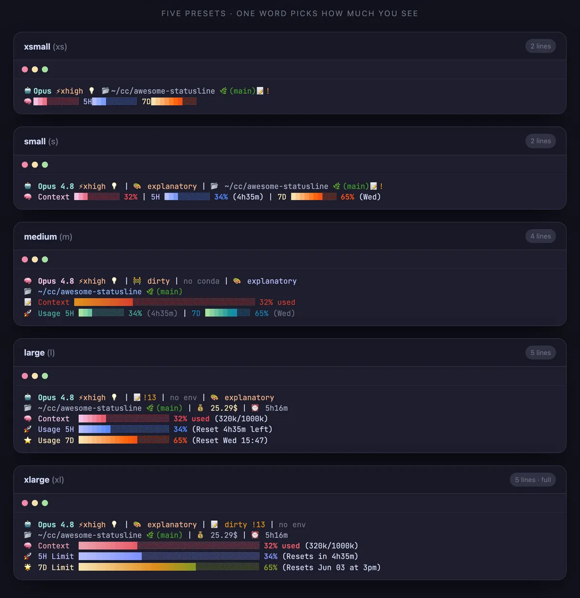</a>

- **ライセンス:** MIT（再配布不可。参照のみ）
- **対象:** claude
- **説明:** macOS/Linux では Bash、Windows ではネイティブ PowerShell で動作するクロスプラットフォームな Claude Code statusline。コンテキスト、5時間/7日の利用制限、コスト、reasoning effort・拡張思考インジケーターを表示し、5段階のサイズプリセットと Catppuccin テーマを備える。Node も Nerd Font も不要。
- **備考:** Listed as redistributable=false / install.type=curl despite the permissive MIT license: the only supported install path is a one-line `curl ... | bash` (macOS/Linux) or `irm ... | iex` (Windows) remote script executor. Our `configure` command already refuses any redistributable=false entry outright, so this never runs automatically — it is reference-only; run the installer yourself from https://github.com/AwesomeJun/CC-statusline after reviewing install.sh/install.ps1. A Git-clone-and-run-locally alternative is documented upstream (`git clone ... && ./install.sh`) but is not wired up here.
- **インストール:** 上流を参照
- **注意:** パッケージはライフサイクルスクリプト（preinstall／postinstall／prepare）を宣言しています。`configure` は `--ignore-scripts` 付きで実行されます。

### `bawstosai-fun-fact` — [fun-fact-bawstos](https://github.com/BawstosAI/fun-fact-bawstos)

- **ライセンス:** MIT
- **対象:** claude
- **説明:** Claude Codeのステータスラインに400以上のトピック別ランダムなトリビアを自動でローテーション表示します。npxでインストールし、~/.claude/settings.jsonにstatusLineエントリを追加して統合されます。
- **インストール:** 上流を参照

### `blazemalan-claude-plan-statusline` — [claude-code-plan-statusline](https://github.com/blazemalan/claude-code-plan-statusline)

- **ライセンス:** MIT
- **対象:** claude
- **説明:** Claude Codeのステータスラインフックで、プランのレート制限使用率（5時間および週次のローリングウィンドウ）とセッション指標（コンテキスト充填率、キャッシュの鮮度、コスト）をテーマ付きANSI出力で表示し、ネットワーク呼び出しや認証を必要としません。
- **インストール:** 上流を参照

### `brandonchartier-cc-statusline` — [cc-statusline](https://github.com/brandonchartier/cc-statusline)

<a href="https://github.com/brandonchartier/cc-statusline">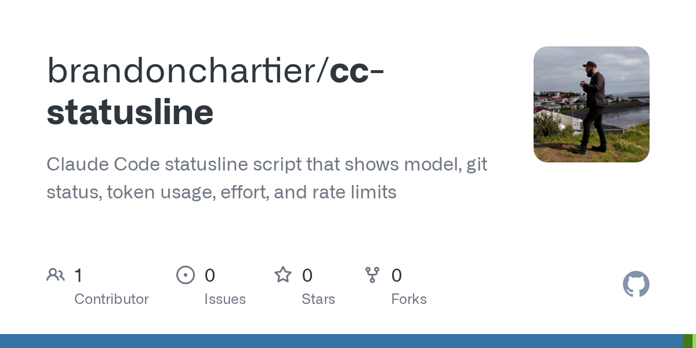</a>

- **ライセンス:** MIT
- **対象:** claude
- **説明:** モデル、Gitブランチ、トークン使用率、推論エフォートレベル、5時間/7日レート制限ウィンドウ、ローカル時刻を表示するミニマルなPythonステータスライン — APIコールもOAuthも不要。
- **備考:** No external dependencies beyond Python 3.10+ and git. Reads directly from the JSON Claude Code passes via stdin.
- **インストール:** 上流を参照
- **設定:** `node bin/statuslines.js configure brandonchartier-cc-statusline --cli=<claude>`

### `briansmith80-claude-code-status-bar` — [claude-code-status-bar](https://github.com/briansmith80/claude-code-status-bar)

<a href="https://github.com/briansmith80/claude-code-status-bar">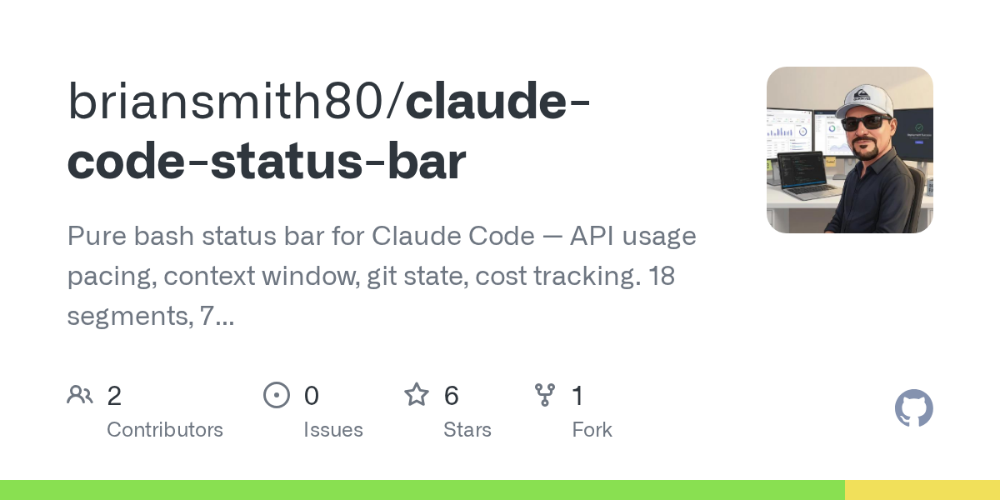</a>

- **ライセンス:** MIT
- **対象:** claude
- **説明:** 18セグメント・7カラーテーマ対応のピュアbashステータスライン。コンテキストバー、5時間・週次レート制限のペーシング、Git状態、セッションコスト、ライブツールアクティビティを依存関係ゼロで提供する。
- **インストール:** 上流を参照
- **設定:** `node bin/statuslines.js configure briansmith80-claude-code-status-bar --cli=<claude>`

### `callmemorgan-claude-statusline` — [claude-statusline](https://github.com/callmemorgan/claude-statusline)

- **ライセンス:** MIT
- **対象:** claude, codex, gemini
- **説明:** Claude Code、Antigravity CLI、Pi向けの高速でテーマ対応のターミナルステータスラインレンダラーで、コスト追跡、コンテキストウィンドウ使用量、レート制限の予測、git情報などのセッションメトリクスをコンパクトな色分け形式で表示します。
- **インストール:** `brew install undefined`

### `capedbitmap-codex-hud` — [codex-hud (Capedbitmap)](https://github.com/Capedbitmap/codex-hud)

<a href="https://github.com/Capedbitmap/codex-hud">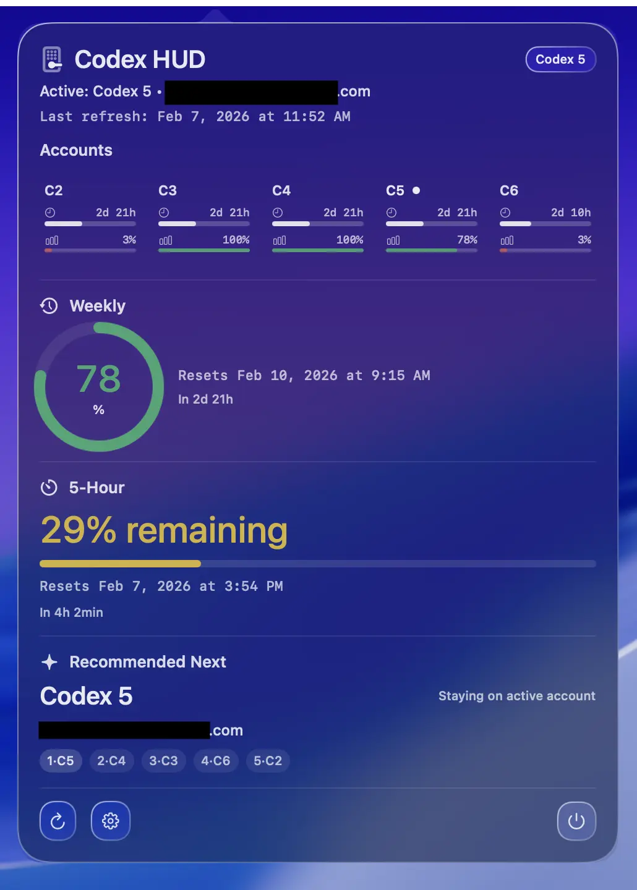</a>

- **ライセンス:** PolyForm-Noncommercial-1.0.0（再配布不可。参照のみ）
- **対象:** codex
- **説明:** ローカルの Codex セッションデータを取り込み、週次リセットのタイミングと残余容量に基づいて次に使用するアカウントを推薦する macOS メニューバーアプリ。
- **備考:** Source-available, not OSI-open-source. Listed for reference; we don't ship install recipes for non-redistributable entries.
- **インストール:** 上流を参照

### `ccometixline` — [CCometixLine](https://github.com/Haleclipse/CCometixLine)

- **ライセンス:** MIT
- **対象:** claude
- **説明:** インタラクティブな TUI 設定ツール、git 連携、使用量追跡を備えた Rust 製の高速 Claude Code statusline。
- **備考:** No verified package-manager install; follow upstream build/release instructions.
- **インストール:** 上流を参照

### `ccstatusline` — [ccstatusline](https://github.com/sirmalloc/ccstatusline)

- **ライセンス:** MIT
- **対象:** claude
- **説明:** インタラクティブな TUI 設定ツール、powerline レンダリング、テーマ、トークン・git・セッションタイマー・クリッカブルリンクのウィジェットを備えたカスタマイズ可能な Claude Code statusline。
- **インストール:** `npx --ignore-scripts -y ccstatusline@2.2.23`
- **設定:** `node bin/statuslines.js configure ccstatusline --cli=<claude>`

### `chae-dahee-claude-buddy` — [claude-buddy](https://github.com/chae-dahee/claude-buddy)

<a href="https://github.com/chae-dahee/claude-buddy">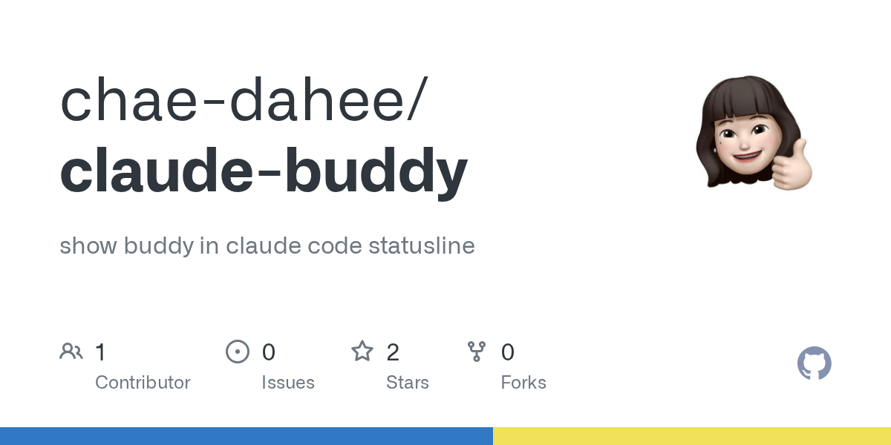</a>

- **ライセンス:** MIT
- **対象:** claude
- **説明:** Claude Codeステータスラインに住むアニメーションASCIIコンパニオン。18種・5レアリティのガチャテーブルからロールされ、DEBUGGINGやSNARKなどのステータスを持ち、7日ごとにレベルアップする。
- **インストール:** `npm i -g --ignore-scripts claude-buddy-statusline@0.2.9`
- **設定:** `node bin/statuslines.js configure chae-dahee-claude-buddy --cli=<claude>`

### `claude-hud` — [claude-hud](https://github.com/jarrodwatts/claude-hud)

- **ライセンス:** MIT
- **対象:** claude
- **説明:** コンテキスト使用量・アクティブツール・実行中サブエージェント・Todo 進捗・レート制限ウィンドウをネイティブ statusline API で表示する Claude Code プラグイン／statusline。
- **備考:** Distributed as a Claude Code plugin; see upstream README for the current install command.
- **インストール:** 上流を参照

### `codyslater-ccstatusline-retro-hud` — [ccstatusline retro-hud](https://github.com/codyslater/ccstatusline_retro-hud)

- **ライセンス:** MIT
- **対象:** claude
- **説明:** Claude Code向けのレトロSF風HUDステータスラインテーマで、モデル名、作業ディレクトリ、gitブランチ、コンテキスト使用率、トークンI/O比率、レート制限、セッション時間、コストをネオンワイヤーフレーム風の美観と分数ブロック進捗バーで2行表示します。
- **インストール:** 上流を参照

### `ctfbio-claude-code-statusline` — [claude-code-statusline (ctfbio)](https://github.com/ctfbio/claude-code-statusline)

<a href="https://github.com/ctfbio/claude-code-statusline">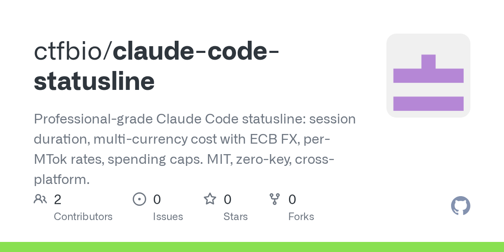</a>

- **ライセンス:** MIT
- **対象:** claude
- **説明:** セッション時間、ECBレートによる多通貨コスト表示、MTok単価、支出上限、エフォートレベルを表示するシェルステータスライン — 24時間キャッシュにより実行時のネットワーク呼び出しはゼロ。
- **インストール:** 上流を参照
- **設定:** `node bin/statuslines.js configure ctfbio-claude-code-statusline --cli=<claude>`

### `daniel3303-claude-statusline` — [ClaudeCodeStatusLine (Daniel Graczer)](https://github.com/daniel3303/ClaudeCodeStatusLine)

- **ライセンス:** MIT
- **対象:** claude
- **説明:** モデル・トークン・レート制限・git ステータスを表示する Bash + PowerShell 製の Claude Code statusline。
- **備考:** README declares MIT but the repo has no LICENSE file at the canonical paths as of catalog verification on 2026-04-30, so we treat it as license-unverified and don't ship an automated install. Upstream install: clone into ~/.claude/statusline/ and point statusLine.command at statusline.sh — see upstream INSTALL.md.
- **インストール:** 上流を参照

### `danielmackay-claude-code-statusline` — [Claude Code Statusline](https://github.com/danielmackay/claude-code-statusline)

<a href="https://github.com/danielmackay/claude-code-statusline">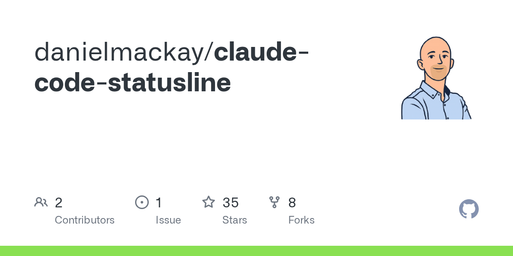</a>

- **ライセンス:** Unspecified（再配布不可。参照のみ）
- **対象:** claude
- **説明:** Claude Code 向けシェルスクリプト製ステータスライン。アクティブモデル、コンテキスト使用量、セッションコスト、リセット時刻付き5時間レート制限バー、Gitブランチ、差分統計を表示する。
- **備考:** Copy statusline-command.sh to ~/.claude/ and add the statusLine config to ~/.claude/settings.json. No license file present in repo.
- **インストール:** 上流を参照

### `deluo-glm-quota-line` — [glm-quota-line](https://github.com/deluo/glm-quota-line)

- **ライセンス:** MIT
- **対象:** claude
- **説明:** Zhipu GLM Coding PlanのAPIクォータ使用状況（残高、週次消費量、コンテキストウィンドウ使用率、リセットまでの時間）をClaude Codeのステータスラインに直接表示します。
- **インストール:** 上流を参照

### `dpc00-ccstatusline-editor` — [ccstatusline-editor](https://github.com/dpc00/ccstatusline-editor)

- **ライセンス:** MIT
- **対象:** claude
- **説明:** ccstatuslineの設定ファイルをブラウザのビジュアルなドラッグ＆ドロップUIで編集できるWebベースのエディタ。JSONを手動編集せずにClaude Codeのステータスラインを構築・カスタマイズでき、83種類以上のウィジェット、30のプリセット、56のカラーテーマをサポートし、Ctrl+Sでccstatuslineの設定ファイルに直接保存できる。
- **インストール:** 上流を参照

### `dwillitzer-claude-statusline` — [claude-statusline (dwillitzer)](https://github.com/dwillitzer/claude-statusline)

- **ライセンス:** MIT
- **対象:** claude
- **説明:** オプションの Node.js + tiktoken トークンカウントと、Claude・OpenAI・Gemini・Grok のマルチプロバイダーモデルカラーリングに対応した Bash 製 Claude Code statusline。
- **備考:** README claims MIT but no LICENSE file is present at catalog verification on 2026-04-30. README's clone command also uses a literal `<repository-url>` placeholder rather than this repo's URL — substitute manually.
- **インストール:** 上流を参照

### `entrolution-quotaline` — [quotaline](https://github.com/Entrolution/quotaline)

- **ライセンス:** MIT
- **対象:** claude
- **説明:** Claude Codeのステータスラインプラグインで、APIコールや認証情報不要でClaude Codeのstdinから直接データを読み取り、アカウント全体の5時間・週次使用制限をリアルタイムの消費レートと上限警告とともに表示します。
- **インストール:** 上流を参照

### `entrolution-vastline` — [vastline](https://github.com/Entrolution/vastline)

- **ライセンス:** MIT
- **対象:** claude
- **説明:** Claude CodeのステータスラインプラグインでVast.aiのGPUインスタンス数、計算燃焼率、停止インスタンスのストレージコスト、アカウント残高、資金枯渇までの推定滑走路を表示します。APIスナップショットのキャッシュを使用してレンダーパス外で動作し、プロンプトの操作を高速に保ちます。
- **インストール:** 上流を参照

### `felipeelias-claude-statusline` — [claude-statusline (Felipe Elias)](https://github.com/felipeelias/claude-statusline)

- **ライセンス:** MIT
- **対象:** claude
- **説明:** モジュールベースの設定、OSC 8 ハイパーリンク、テーマプリセット（`catppuccin`、`tokyo-night`、`gruvbox-rainbow` など）を備えた Go バイナリ製 Claude Code statusline。
- **備考:** Brew install drops a `claude-statusline` binary on PATH. Alternative install: `go install github.com/felipeelias/claude-statusline@latest`. Customize via `~/.config/claude-statusline/config.toml` (see upstream).
- **インストール:** `brew install claude-statusline` (tap: `felipeelias/tap`)
- **設定:** `node bin/statuslines.js configure felipeelias-claude-statusline --cli=<claude>`

### `ffontenit-claude-usage-statusline` — [claude-usage-statusline](https://github.com/ffontenit/claude-usage-statusline)

- **ライセンス:** MIT
- **対象:** claude
- **説明:** APIトークンやネットワーク呼び出し不要で、Claude Codeの実際の/usage制限（5時間・7日間ウィンドウ）の使用率をステータスラインに直接表示し、コンテキストウィンドウ使用量と現在のモデル情報も確認できます。
- **インストール:** 上流を参照

### `fmondora-co2-claude` — [co2-claude](https://github.com/fmondora/co2-claude)

- **ライセンス:** unknown（再配布不可。参照のみ）
- **対象:** claude
- **説明:** 各AIツール呼び出しの環境フットプリントを追跡するClaude Codeフックで、CO2排出量・水消費量・エネルギー使用量をステータスバーにリアルタイム表示します。curlスクリプトでインストールし、Claude CodeのPostToolUseフックとステータスラインフックを自動設定します。
- **インストール:** 上流を参照

### `fredrikaverpil-claudeline` — [claudeline (Fredrik Averpil)](https://github.com/fredrikaverpil/claudeline)

- **ライセンス:** MIT
- **対象:** claude
- **説明:** Claude Code プラグインとして配布されるミニマリスト Go 製 Claude Code statusline。プラグインの `/claudeline:setup` スラッシュコマンドがバイナリをダウンロードして settings.json にパッチを当てます。
- **備考:** Install flow runs entirely inside Claude Code: `/plugin marketplace add fredrikaverpil/claudeline` → `/plugin install claudeline@claudeline` → `/claudeline:setup`. The setup command writes `{"statusLine":{"type":"command","command":"claudeline"}}` itself, so we don't ship a `configs.claude` patch. Manual fallback: `go install github.com/fredrikaverpil/claudeline@latest`, then add the same snippet by hand.
- **インストール:** 上流を参照

### `fwyc-codex-hud` — [codex-hud (fwyc0573)](https://github.com/fwyc0573/codex-hud)

- **ライセンス:** MIT
- **対象:** codex
- **説明:** セッション／コンテキスト使用量・git ステータス・ツールアクティビティ監視を備えた OpenAI Codex CLI 向けリアルタイム tmux statusline HUD。`--kill` / `--list` / `--attach` / `--self-check` サブコマンドも含みます。
- **備考:** Codex CLI has no native command-statusline yet, so this runs as an external HUD — start it under tmux per upstream docs.
- **インストール:** 上流を参照

### `fyko-claudehud` — [claudehud](https://github.com/Fyko/claudehud)

<a href="https://github.com/Fyko/claudehud">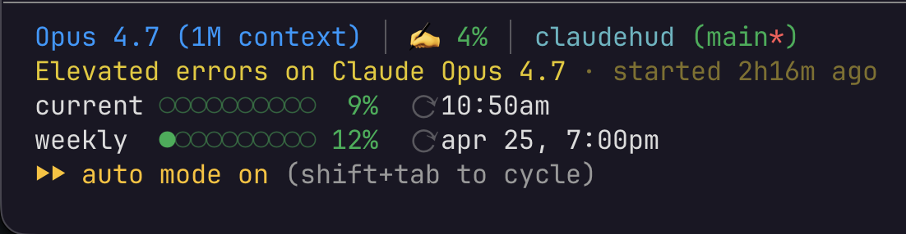</a>

- **ライセンス:** MIT
- **対象:** claude
- **説明:** mmap+seqlockを使ったGitデーモン（bashより約168倍高速）を備えたRust製ステータスライン — モデル、トークン使用量、レート制限、コスト、アクティブインシデントを2レイアウトで表示。
- **備考:** Ships a curl|sh quick-install (install.sh / install.ps1) and a `claudehud install` sub-command that auto-wires settings.json. Two binaries: claudehud (client) + claudehud-daemon (git cache + status.claude.com poller). Daemon must be registered separately (launchd / systemd / Task Scheduler).
- **インストール:** 上流を参照

### `gerardofc8-claude-subagent-statusline` — [claude-subagent-statusline](https://github.com/GerardoFC8/claude-subagent-statusline)

<a href="https://github.com/GerardoFC8/claude-subagent-statusline">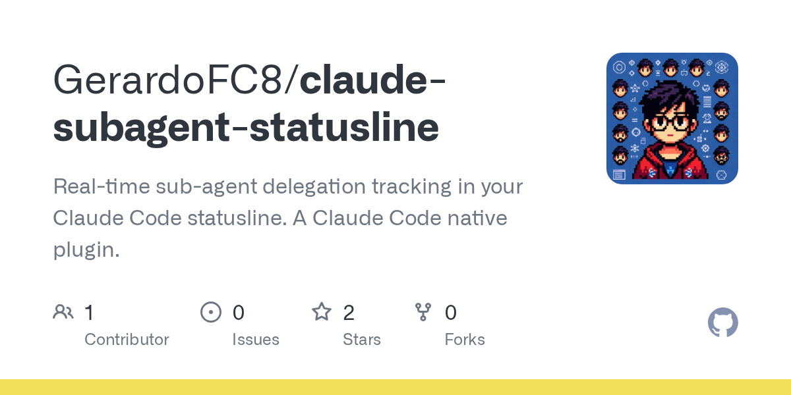</a>

- **ライセンス:** MIT
- **対象:** claude
- **説明:** サブエージェントのデリゲーション追跡に特化したClaude Codeステータスライン。実行中・完了・失敗のタスクカウンターをモデル、コスト、コンテキストウィンドウ、経過時間、5時間/7日レート制限とともに表示する。
- **備考:** Distributed as a Claude Code plugin via the upstream marketplace; install with `claude plugin marketplace add GerardoFC8/claude-subagent-statusline` then `claude plugin install`. Self-configures statusLine on SessionStart and writes a delegation history JSONL under ~/.claude/state/.
- **インストール:** 上流を参照

### `gordonbeeming-codex-statusline` — [codex-statusline (GordonBeeming)](https://github.com/GordonBeeming/codex-statusline)

- **ライセンス:** Unspecified（再配布不可。参照のみ）
- **対象:** codex
- **説明:** リポジトリ名、git ブランチ、モデル、AUD 建てのセッションコスト、5時間レート制限バー、コンテキストウィンドウ使用率を表示する 4 行構成の Codex statusline。作者の claude-statusline のレイアウトを踏襲している。
- **インストール:** 上流を参照

### `gregoryho-cc-pulseline` — [cc-pulseline](https://github.com/GregoryHo/cc-pulseline)

<a href="https://github.com/GregoryHo/cc-pulseline">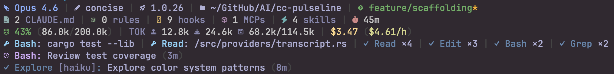</a>

- **ライセンス:** MIT
- **対象:** claude
- **説明:** 高性能なRust製Claude Code多行ステータスライン。インクリメンタルシーク型JSONLパース、ライブコンテキスト、コスト消費レート、ターゲット付きアクティブツール、実行中エージェント、Todoの進捗、セッション別トラッキングを備えた高い可観測性を提供する。
- **備考:** Distributed via npm (@cc-pulseline/cc-pulseline), cargo, and install.sh; configured through TOML at ~/.claude/pulseline/config.toml with project overrides. Six layouts and ten built-in themes.
- **インストール:** 上流を参照

### `hagan-claudia-statusline` — [claudia-statusline](https://github.com/hagan/claudia-statusline)

- **ライセンス:** MIT
- **対象:** claude
- **説明:** 永続的な統計追跡、Linux・macOS・Windows 向けビルド済みバイナリ、11 テーマを備えた Rust 製 Claude Code statusline。公式 Claude Code ドキュメントでも参照されています。
- **備考:** Upstream install is a `curl | bash` quick-install script that auto-configures settings.json. We don't auto-run remote scripts from `bin/statuslines.js configure` — invoke it directly per upstream README. Distinct from the inactive `taskx6004/claudia-statusline` fork.
- **インストール:** 上流を参照

### `haigle0127-ccstatusline-kimi` — [ccstatusline-kimi](https://github.com/haigle0127/ccstatusline-kimi)

- **ライセンス:** MIT
- **対象:** kimi
- **説明:** VSCodeのステータスバー拡張機能で、Claude Codeのセッションメトリクス（モデル、トークン、コスト、Gitブランチ、コンテキスト）をKimi（Moonshot AI）と統合してリアルタイムで表示します。ローカルのClaude Codeステートファイルを読み取り、エディタ下部バーに使用状況データを表示します。
- **インストール:** 上流を参照

### `hanbu97-tokenusage` — [tokenusage (hanbu97)](https://github.com/hanbu97/tokenusage)

<a href="https://github.com/hanbu97/tokenusage">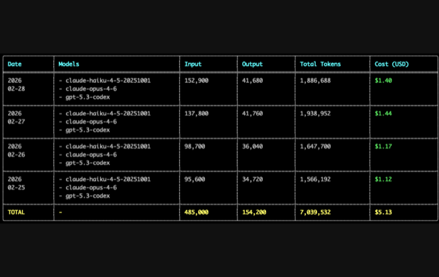</a>

- **ライセンス:** MIT
- **対象:** claude, codex
- **説明:** Claude Code と Codex 向けの高速ローカルトークン使用量トラッカー。`tu statusline` でコスト/トークンの1行サマリを出力。CLI・TUI・GUI モードも搭載。ccusage より 214 倍高速。
- **備考:** Primary install via npm (`npm install -g tokenusage`), also available on crates.io (`cargo install tokenusage --bin tu`) and PyPI (`pip install tokenusage`). Run `tu statusline` to emit a one-line token/cost summary suitable for use as a Claude Code statusLine command.
- **インストール:** `npx --ignore-scripts -y tokenusage@1.5.2`
- **注意:** パッケージはライフサイクルスクリプト（preinstall／postinstall／prepare）を宣言しています。`configure` は `--ignore-scripts` 付きで実行されます。

### `haunchen-claude-code-statusline` — [claude-code-statusline](https://github.com/haunchen/claude-code-statusline)

- **ライセンス:** MIT
- **対象:** claude
- **説明:** クロスプラットフォーム対応のClaude Codeステータスライン。Anthropicのピーク・オフピークレート制限ウィンドウ、コンテキスト使用量、セッションコスト、5時間・7日間レート制限を表示し、セッション計画を支援する。
- **備考:** PEAK-HOURS FEATURE NO LONGER WORKS: Anthropic removed peak-hour rate reduction on 2026-05-06; the peak/off-peak indicator is permanently inaccurate. The statusline otherwise works correctly — context usage, session cost, and rate-limit display are unaffected. Install via git clone + manual settings.json edit, or run the bundled install.sh / install.ps1.
- **インストール:** 上流を参照

### `hstojanovic-claude-vibeline` — [claude-vibeline](https://github.com/hstojanovic/claude-vibeline)

<a href="https://github.com/hstojanovic/claude-vibeline">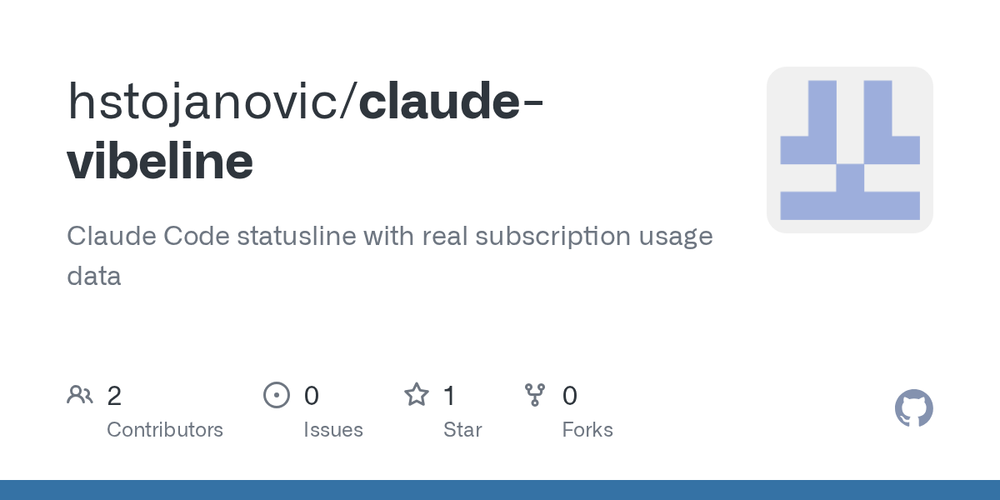</a>

- **ライセンス:** MIT
- **対象:** claude
- **説明:** AnthropicのOAuth APIから実際のサブスクリプション使用データを取得するPythonステータスライン — モデル別Opus/Sonnet制限、追加使用量、プロンプトキャッシュTTL、セッション/週次レート制限を表示。
- **備考:** Install via `uv tool install claude-vibeline`. Per-model and extra-usage sections require `--usage-api` plus at least one of `--opus`, `--sonnet`, or `--extra`; these fetch from an undocumented Anthropic OAuth endpoint — responses cached 60 s locally. Base sections (session limit, weekly limit, context window, prompt cache) are read from stdin JSON with no network call needed.
- **インストール:** 上流を参照
- **設定:** `node bin/statuslines.js configure hstojanovic-claude-vibeline --cli=<claude>`

### `ilia-pluzhnikov-claude-code-statusline` — [claude-code-statusline](https://github.com/ilia-pluzhnikov/claude-code-statusline)

<a href="https://github.com/ilia-pluzhnikov/claude-code-statusline">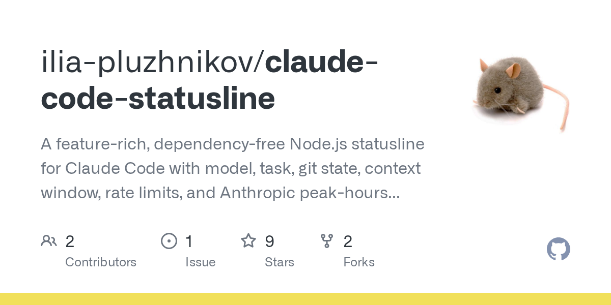</a>

- **ライセンス:** MIT
- **対象:** claude
- **説明:** モデル、アクティブタスク、Gitブランチ状態、コンテキストウィンドウ使用量、プロンプトキャッシュヒット率、5時間/7日レート制限、ピーク時間インジケーターをカラーコードで表示する高機能な単一ファイルNode.jsステータスライン。
- **備考:** No npm dependencies or build step required. The script reads Claude Code statusline JSON from stdin and writes one ANSI-coloured line to stdout. Requires Claude Code ≥2.1.97 for refreshInterval support.
- **インストール:** `git clone`（`bin/statuslines.js configure` で処理）
- **設定:** `node bin/statuslines.js configure ilia-pluzhnikov-claude-code-statusline --cli=<claude>`

### `intertechinc-claude-code-context-meter` — [claude-code-context-meter](https://github.com/IntertechInc/claude-code-context-meter)

- **ライセンス:** unknown（再配布不可。参照のみ）
- **対象:** claude
- **説明:** Claude Code用のBashステータスラインスクリプトで、コンテキストウィンドウの充填率、ターンごとのトークンデルタ、直近の成長スパークライン、およびアシスタントメッセージごとの5時間・7日間レートリミット使用状況を表示します。
- **インストール:** 上流を参照

### `jacsuper-codex-statusline-vscode` — [codex-statusline-vscode](https://github.com/jacsuper/codex-statusline-vscode)

<a href="https://github.com/jacsuper/codex-statusline-vscode">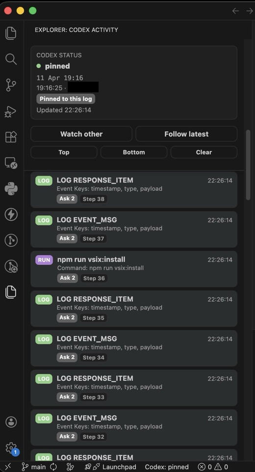</a>

- **ライセンス:** MIT
- **対象:** vscode
- **説明:** VS Code拡張機能。ローカルのCodexセッションJSONLロールアウトログを監視し、コンパクトなステータスバーアイテムとトークン使用量メーター付きのドッキング可能なアクティビティビューを表示する。
- **備考:** VS Code extension, not a terminal statusline. Watches Codex session JSONL.
- **インストール:** 上流を参照

### `joaquinvesapa-sub-agent-statusline` — [opencode-subagent-statusline](https://github.com/Joaquinvesapa/sub-agent-statusline)

- **ライセンス:** MIT
- **対象:** opencode
- **説明:** サブエージェントのアクティビティ・経過時間・トークン／コンテキスト使用量を表示する OpenCode TUI サイドバープラグイン（statusLine.command ではない）。
- **備考:** Configures via OpenCode's TUI config (~/.config/opencode/tui.json), not opencode.json. Add manually: {"$schema":"https://opencode.ai/tui.json","plugin":["opencode-subagent-statusline"]}. We don't auto-merge because that target file isn't supported by `bin/statuslines.js configure` yet.
- **インストール:** OpenCode がセッション開始時に `opencode-subagent-statusline@1.2.1` を npm からロードします（`opencode.json` の `plugin` 配列に追加）

### `kamranahmedse-claude-statusline` — [claude-statusline (Kamran Ahmed)](https://github.com/kamranahmedse/claude-statusline)

- **ライセンス:** MIT
- **対象:** claude
- **説明:** モデル・コンテキスト使用率・カレントディレクトリ・git ブランチ・セッションタイマー・エフォートレベル、および Anthropic API から取得したリアルタイムのレート制限バーを表示するミニマルな Claude Code statusline。
- **備考:** Run `npx @kamranahmedse/claude-statusline@1.0.6` once to install. The installer copies statusline.sh to ~/.claude/statusline.sh and patches ~/.claude/settings.json automatically. Requires jq, curl, and git on PATH. Uninstall with `npx @kamranahmedse/claude-statusline --uninstall`.
- **インストール:** `npx --ignore-scripts -y @kamranahmedse/claude-statusline@1.0.6`
- **設定:** `node bin/statuslines.js configure kamranahmedse-claude-statusline --cli=<claude>`

### `kenanbalija-islamic-statuses` — [Islamic Statuses for Claude Code](https://github.com/kenanbalija/claude-islamic-statuses)

- **ライセンス:** MIT
- **対象:** claude
- **説明:** Claude Codeの動作中にスピナーを表示し、サヒーフ・アル=ブハーリーとサヒーフ・ムスリムからの本物のハディースをローテーション表示するアニメーション付きステータスラインです。初期セットアップ後は完全オフラインで動作し、表示モードをカスタマイズできます。
- **インストール:** 上流を参照

### `kiheon0709-claude-codex-statusline` — [claude-codex-statusline](https://github.com/kiheon0709/claude-codex-statusline)

- **ライセンス:** MIT（再配布不可。参照のみ）
- **対象:** claude, codex
- **説明:** Claude CodeとCodex CLIのクォータを並べて表示するデュアルバーステータスライン。5時間・週次レート制限バー、コンテキストウィンドウ、PreToolUse/PostToolUseフックで追跡するアクティブサブエージェント数をリアルタイムに表示する。
- **備考:** Demoted from redistributable=true to redistributable=false on 2026-07-17: install.script is a curl|bash one-shot installer, which our `configure` command never actually executes (no curl-install branch), but the redistributable=true + curl-install combination misrepresented this as an auto-installable ('ok') entry. License is still MIT upstream; this is a policy-driven demotion pending a from-source (git clone) or checksum-pinned install recipe, not a license issue. See https://github.com/kiheon0709/claude-codex-statusline for upstream install instructions.
- **インストール:** 上流を参照
- **注意:** パッケージはライフサイクルスクリプト（preinstall／postinstall／prepare）を宣言しています。`configure` は `--ignore-scripts` 付きで実行されます。

### `kiriketsuki-gemini-statusline` — [gemini-statusline](https://github.com/Kiriketsuki/gemini-statusline)

- **ライセンス:** Unspecified（再配布不可。参照のみ）
- **対象:** gemini
- **説明:** モデル・ワークスペースコンテキスト・git ブランチ・GitHub Issue 件数・受信トレイ件数を表示する Gemini CLI 向け 2 行シェルプロンプトヘルパー。Gemini CLI にはネイティブ statusLine フックがないため、ユーザーのシェルプロンプトから実行します。
- **備考:** No LICENSE file at the canonical paths as of catalog verification on 2026-04-30; default copyright is all-rights-reserved, so we don't ship install recipes. Worth tracking as the first Gemini-targeted statusline-style helper. Upstream README acknowledges Gemini CLI lacks a native statusLine hook.
- **インストール:** 上流を参照

### `laveez-ccsl` — [ccsl](https://github.com/laveez/ccsl)

<a href="https://github.com/laveez/ccsl">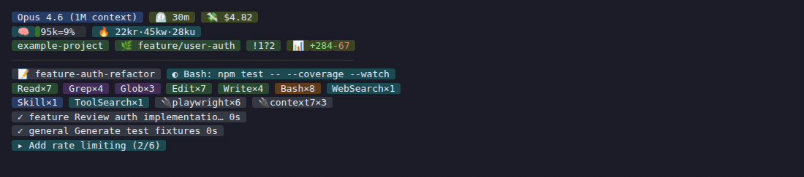</a>

- **ライセンス:** MIT
- **対象:** claude
- **説明:** モデル、コスト、コンテキスト使用量、Git状態、PRリンク、アクティブツール、サブエージェント、タスク進捗、オプションのAPIレート制限バーを表示する高密度カラーコードANSIステータスライン。
- **備考:** Run `ccsl setup` for an interactive configuration wizard. Usage rate-limit badge requires `features.usage: true` in ~/.claude/statusline-config.json; disabled by default for privacy.
- **インストール:** `npm i -g --ignore-scripts ccsl@0.3.1`
- **設定:** `node bin/statuslines.js configure laveez-ccsl --cli=<claude>`

### `leeguooooo-claude-code-usage-bar` — [claude-code-usage-bar](https://github.com/leeguooooo/claude-code-usage-bar)

<a href="https://github.com/leeguooooo/claude-code-usage-bar">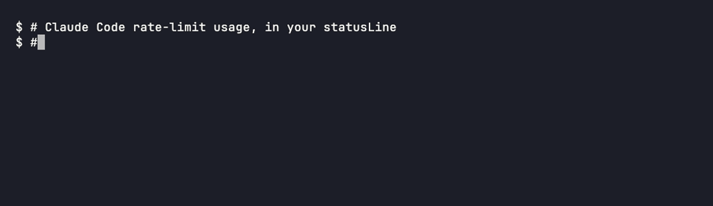</a>

- **ライセンス:** MIT
- **対象:** claude
- **説明:** トークン使用量、コスト、レート制限ウィンドウを3スタイル・9テーマで描画するPythonステータスライン(cs) — バックグラウンドデーモンが動作し、スラッシュコマンドで設定可能。
- **備考:** Distributed as a PyPI package (claude-statusbar); install via pip/pipx and run `cs --setup` per upstream README.
- **インストール:** 上流を参照

### `lightning7329-cc-statusline` — [cc-statusline](https://github.com/Lightning7329/cc-statusline)

<a href="https://github.com/Lightning7329/cc-statusline">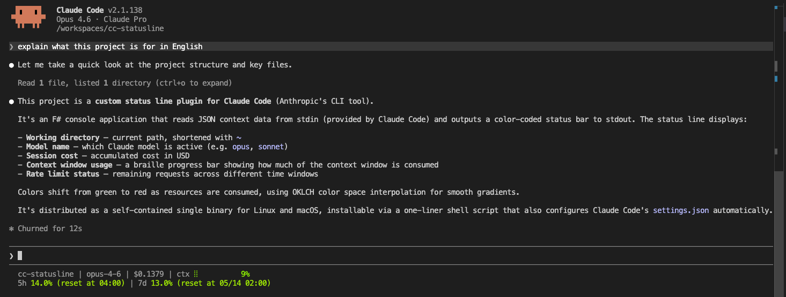</a>

- **ライセンス:** MIT
- **対象:** claude
- **説明:** カタログ唯一のF#ステータスライン — コンテキストウィンドウ、モデル、セッションコスト、レート制限ウィンドウをカラーコード付きブライユ点字プログレスバーで表示。
- **備考:** Distributed as a self-contained binary; install via the upstream one-liner which places the binary at ~/.claude/bin/statusline.
- **インストール:** 上流を参照
- **設定:** `node bin/statuslines.js configure lightning7329-cc-statusline --cli=<claude>`

### `lucasilverentand-claudeline` — [claudeline (Luca Silverentand)](https://github.com/lucasilverentand/claudeline)

- **ライセンス:** MIT
- **対象:** claude
- **説明:** npm パッケージ `claudeline` として配布され、組み込みテーマと `--install` フラグによる settings.json への自動インストールに対応した Claude Code statusline。
- **備考:** Distinct from fredrikaverpil/claudeline (Go binary) despite the shared name. The package's `--install` flag patches settings.json automatically; the configs.claude here is the same snippet that flag would write.
- **インストール:** `npx --ignore-scripts -y claudeline@1.11.0`
- **設定:** `node bin/statuslines.js configure lucasilverentand-claudeline --cli=<claude>`

### `markwilkening-opencode-status-line` — [opencode-status-line](https://github.com/markwilkening21/opencode-status-line)

- **ライセンス:** MIT
- **対象:** opencode
- **説明:** OpenCode CLI 向けの軽量・高速な statusline。
- **備考:** Verify the entry script name in the upstream repo before relying on the configured command.
- **インストール:** `git clone`（`bin/statuslines.js configure` で処理）
- **設定:** `node bin/statuslines.js configure markwilkening-opencode-status-line --cli=<opencode>`

### `maximocorrea1-dumbometer` — [Dumbometer](https://github.com/MaximoCorrea1/dumbometer)

- **ライセンス:** MIT
- **対象:** claude
- **説明:** Claude Codeのステータスラインゲージで、コンテキストウィンドウの充填レベルを追跡し、セッションの品質が劣化し始めると色分けされた「賢い→バカ」スケールで警告を表示します。依存関係ゼロで、トークンコストなしにNode.jsで動作します。
- **インストール:** 上流を参照

### `mengfanlu1-opendoor-statusline` — [OpenDoor StatusLine](https://github.com/MengFanLu1/opendoor-statusline)

- **ライセンス:** MIT
- **対象:** claude, codex, gemini
- **説明:** OpenDoor向けのClaude Codeステータスバーツールで、残高やAPI使用量をリアルタイムで表示するほか、モデル名・Gitブランチ・コンテキストウィンドウの使用状況も確認できます。Rustで書かれ、npm経由でクロスプラットフォームバイナリとして配布されます。
- **インストール:** 上流を参照

### `meros-claude-usage-statusline` — [claude-usage-statusline](https://github.com/meros/claude-usage-statusline)

<a href="https://github.com/meros/claude-usage-statusline">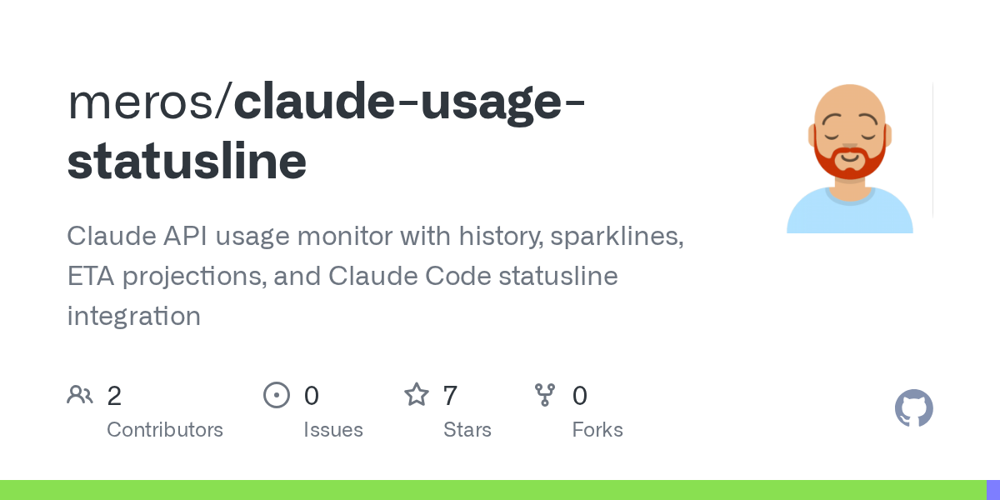</a>

- **ライセンス:** MIT
- **対象:** claude
- **説明:** Claude APIに5時間・7日間ウィンドウの使用量をポーリングし、2階層の履歴をローカルに保存。スパークラインとカラーコード付きプログレスバーをレンダリングし、スマートな日付/期間フォーマットでレート制限までのETAを予測する。
- **備考:** Installed via Nix flake (`nix profile install github:meros/claude-usage-statusline`) or via the bundled `install.sh` (requires jq, curl, awk). History is written to XDG_DATA_HOME (~/.local/share by default) in two tiers: 5-minute intervals for 24 h, hourly for 1 year. Supports single-line, multiline (column-aligned), and dashboard views.
- **インストール:** 上流を参照
- **注意:** パッケージはライフサイクルスクリプト（preinstall／postinstall／prepare）を宣言しています。`configure` は `--ignore-scripts` 付きで実行されます。
- **設定:** `node bin/statuslines.js configure meros-claude-usage-statusline --cli=<claude>`

### `mtschoen-schoen-claude-status` — [schoen-claude-status](https://github.com/mtschoen/schoen-claude-status)

<a href="https://github.com/mtschoen/schoen-claude-status">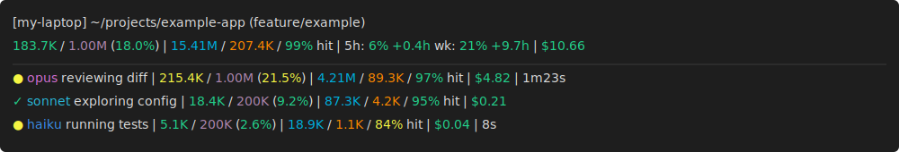</a>

- **ライセンス:** MIT
- **対象:** claude
- **説明:** セッション全体のキャッシュヒット率、コンテキスト使用量、5時間/週次レート制限ペース予測とコストを追跡する2行ステータスライン — bash + Python単一ファイル構成。
- **備考:** Requires Claude Code's rate_limits payload field; silently omits quota fields on proxy setups (LiteLLM, gateways). Weekly pace uses a trailing-168h JSONL burn rate cached at ~/.claude/.statusline-pace-cache.json.
- **インストール:** 上流を参照

### `navifra-sally-sysmon-plugin` — [sysmon](https://github.com/Navifra-Sally/sysmon-plugin)

- **ライセンス:** MIT
- **対象:** claude
- **説明:** CPU負荷・メモリ・ディスク・ネットワークの状態をステータスバーにリアルタイム表示し、/sysmonコマンドで読み取り専用の完全なシステム診断（ルーティング、DNS、ディスク使用量、プロセス、リスナー）を実行してClaudeが問題と対処法を要約するClaude Codeプラグイン。
- **インストール:** 上流を参照

### `ndave92-claude-code-status-line` — [claude-code-status-line (ndave92)](https://github.com/ndave92/claude-code-status-line)

- **ライセンス:** MIT
- **対象:** claude
- **説明:** ワークスペース情報・git ステータス・モデル名・コンテキスト使用量・worktree ヒント・クォータタイマー・オプションの API コストを表示する Rust 製 Claude Code statusline。
- **備考:** Recommended install is a self-installing slash command: download `.claude/commands/install-statusline.md` from the upstream repo, restart Claude Code, and run `/install-statusline`. The crate `claude-code-status-line` is not published on crates.io as of catalog verification on 2026-04-30.
- **インストール:** 上流を参照

### `noahbclarkson-noahs-claude-statusline` — [noahs-claude-statusline](https://github.com/noahbclarkson/noahs-claude-statusline)

<a href="https://github.com/noahbclarkson/noahs-claude-statusline">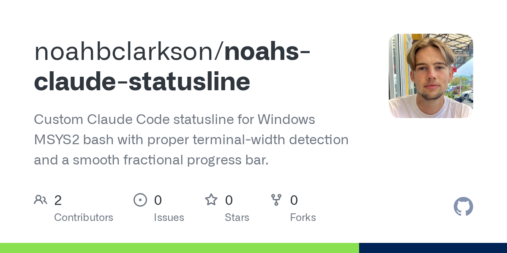</a>

- **ライセンス:** Unspecified（再配布不可。参照のみ）
- **対象:** claude
- **説明:** Windows MSYS2向けbashステータスライン。PowerShell AttachConsoleのプロセスツリー探索でターミナル幅を検出し、1/8セル精度の分数プログレスバーをレンダリングする。
- **備考:** platform: windows (Windows 10/11 + MSYS2 bash only — the AttachConsole/CONOUT$ width-probe is Windows-specific and not applicable on macOS or Linux). Requires PowerShell 5.1+, jq, and git on PATH. No LICENSE file in repo; redistributable is false until a license is added upstream.
- **インストール:** 上流を参照

### `o0000-cc-tempo` — [cc-tempo](https://github.com/O0000-code/cc-tempo)

<a href="https://github.com/O0000-code/cc-tempo">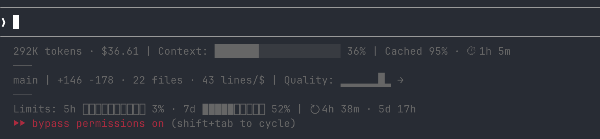</a>

- **ライセンス:** MIT
- **対象:** claude
- **説明:** トランスクリプトから実際の作業時間を計測し、サブエージェントの並列高速化比率を表示、トークンやコストではなくスパークラインでコードチャーン速度を追跡するClaude Codeステータスライン。
- **備考:** Install via upstream `git clone` + `./install.sh`; statusline command is `bash ~/.claude/statusline.sh`.
- **インストール:** 上流を参照

### `octane0411-open-vibe-island` — [Open Island](https://github.com/octane0411/open-vibe-island)

- **ライセンス:** GPL-3.0（再配布不可。参照のみ）
- **対象:** claude, codex, gemini, opencode
- **説明:** macOS のノッチ/メニューバーに常駐する SwiftUI + AppKit 製コンパニオンアプリ。AI コーディングエージェントのセッション状態や保留中の権限リクエストをリアルタイムで表示し、正しいターミナルや IDE にワンクリックで戻れる。Claude Code・Codex・Gemini CLI・OpenCode・Cursor・Kimi CLI・Qoder・Qwen Code・Factory・CodeBuddy に対応。macOS 14 以降専用。
- **備考:** GPL-3.0: not redistributable. macOS only. Install via signed DMG from GitHub Releases or `brew install --cask octane0411/tap/openisland`. Requires macOS 14+.
- **インストール:** 上流を参照

### `opencode-quota` — [opencode-quota](https://github.com/slkiser/opencode-quota)

- **ライセンス:** MIT
- **対象:** opencode
- **説明:** コンテキストウィンドウを汚染しない OpenCode のクォータおよびトークン使用量表示ツール。OpenCode Go・Cursor・GitHub Copilot などのプロバイダーをサポートします。
- **備考:** Follow upstream README for the current install path; project surface evolves quickly.
- **インストール:** 上流を参照

### `owloops-claude-powerline` — [claude-powerline](https://github.com/Owloops/claude-powerline)

- **ライセンス:** MIT
- **対象:** claude
- **説明:** リアルタイム使用量追跡・git 連携・テーマプリセットを備えた Vim スタイルの powerline Claude Code statusline。
- **インストール:** `npx --ignore-scripts -y @owloops/claude-powerline@1.28.0`
- **設定:** `node bin/statuslines.js configure owloops-claude-powerline --cli=<claude>`

### `padenot-foxtail` — [foxtail](https://github.com/padenot/foxtail)

- **ライセンス:** Apache-2.0
- **対象:** claude
- **説明:** Mozilla/Firefoxの開発者向けのClaude Codeステータスラインツールで、モデル、作業ディレクトリ、時刻、コンテキスト使用量、gitステータス、セッション統計、コスト、キャッシュ情報を整形出力します。RustとTOML設定で実装され、Claude CodeのstatusLineコマンドフックと統合されます。
- **インストール:** `cargo install undefined`

### `pcvelz-ccstatusline-usage` — [ccstatusline-usage](https://github.com/pcvelz/ccstatusline-usage)

<a href="https://github.com/pcvelz/ccstatusline-usage">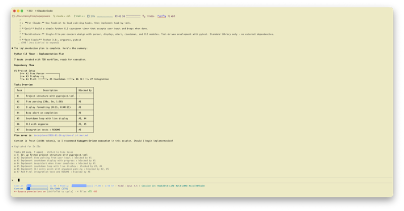</a>

- **ライセンス:** MIT
- **対象:** claude
- **説明:** ccstatusline のフォーク。Anthropic API からセッション・週次利用率バー、週次ペースインジケーター、リセットカウントダウン、ローカルモデル向けマルチプロバイダールーティングをリアルタイムで表示する使用量ウィジェットを追加。
- **インストール:** `npx --ignore-scripts -y ccstatusline-usage@2.4.10`
- **設定:** `node bin/statuslines.js configure pcvelz-ccstatusline-usage --cli=<claude>`

### `postmodum37-simple-claude-code-statusline` — [simple-claude-code-statusline](https://github.com/Postmodum37/simple-claude-code-statusline)

- **ライセンス:** MIT
- **対象:** claude
- **説明:** Go製のシンプルで改造しやすい2行Claude Codeステータスライン。1行目はモデル・ディレクトリ・ファイル数付きGitブランチ・ワークツリー・変更行数、2行目はコンテキストバー・5時間/7日レート制限・コスト・経過時間を表示する。
- **備考:** Ships as a Claude Code plugin via `/plugin marketplace add Postmodum37/simple-claude-code-statusline` or as pre-compiled Go binaries built with `make build`; designed to be forked and edited (colors and row layout live in `src/render.go`).
- **インストール:** 上流を参照

### `puddinging-prism-hud` — [prism-hud](https://github.com/puddinging/prism-hud)

<a href="https://github.com/puddinging/prism-hud">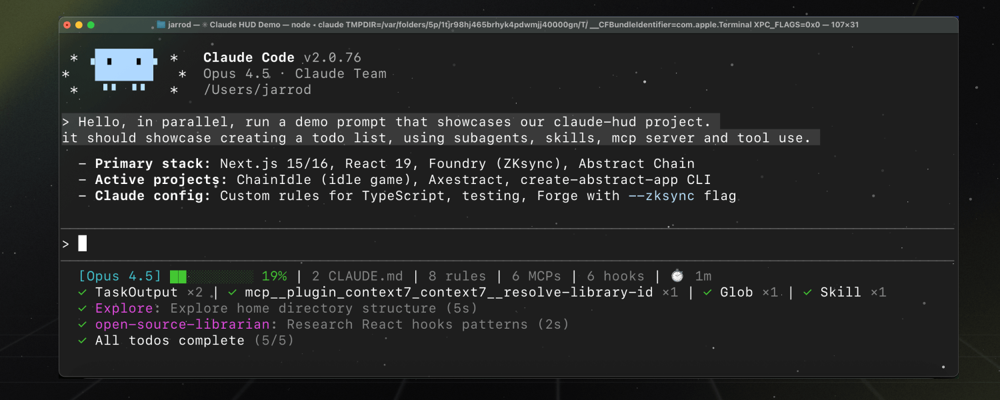</a>

- **ライセンス:** MIT
- **対象:** claude
- **説明:** jarrodwatts/claude-hudのフォークで、プログレスバーを位置ごとのグラデーションパレットに置き換え — 各ドットは緑（安全）から黄、赤（危険）まで固定色で、コンテキストとレート制限ウィンドウの充填レベルを一目で確認できる。
- **備考:** Fork of jarrodwatts/claude-hud (MIT). Engine, transcript parsing, and rate-limit handling are upstream's; this fork adds a 10-step gradient bar palette (per-position color), renames the plugin namespace to prism-hud, and moves config to ~/.claude/plugins/prism-hud/config.json. Don't install both — they target the same statusline slot.
- **インストール:** 上流を参照

### `raicony-claude-code-statusline` — [claude-code-statusline (RaiconY)](https://github.com/RaiconY/claude-code-statusline)

<a href="https://github.com/RaiconY/claude-code-statusline">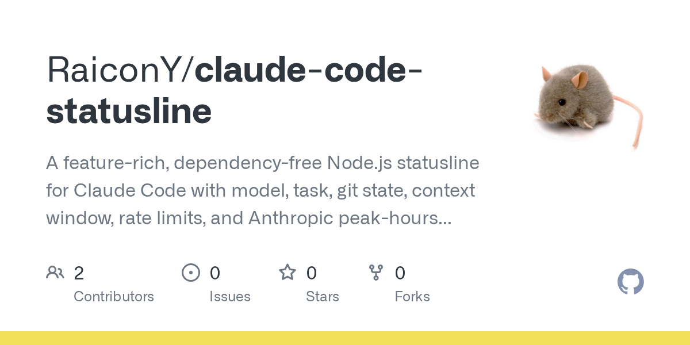</a>

- **ライセンス:** MIT
- **対象:** claude
- **説明:** 依存関係なしの単一ファイルNode.jsステータスライン — モデル、アクティブタスク、Git状態、コンテキスト使用量、TTL付きプロンプトキャッシュ状態、Anthropicの5時間/7日レート制限カウントダウンを表示。
- **備考:** Single-file statusline.js dropped at a user-chosen path (e.g. ~/.claude/hooks/statusline.js) and wired via settings.json statusLine.command. No npm package; clone or download from the repo. Requires Claude Code >= 2.1.97 for refreshInterval support.
- **インストール:** 上流を参照

### `ramtinj95-opencode-tokenscope` — [opencode-tokenscope](https://github.com/ramtinJ95/opencode-tokenscope)

- **ライセンス:** MIT
- **対象:** opencode
- **説明:** セッションのトークン使用量とコストを詳細な内訳とともに分析する OpenCode プラグイン（statusline ではない）。
- **備考:** Upstream is ramtinJ95/opencode-tokenscope; pantheon-org/opencode-tokenscope-plugin is a downstream fork that uses the same npm package.
- **インストール:** OpenCode がセッション開始時に `@ramtinj95/opencode-tokenscope@1.8.0` を npm からロードします（`opencode.json` の `plugin` 配列に追加）
- **設定:** `node bin/statuslines.js configure ramtinj95-opencode-tokenscope --cli=<opencode>`

### `ratelworks-token-horse` — [Token Horse](https://github.com/ratelworks/token-horse)

- **ライセンス:** MIT
- **対象:** claude
- **説明:** Claude CodeまたはCodex CLIセッションのトークン消費速度に応じて速く駆けるターミナル用ピクセル馬ペットで、セッションのJSONLトランスクリプトを読み取ってリアルタイムのトークンスループットを計測し、ステータスラインコマンドとして組み込めます。
- **インストール:** 上流を参照

### `rgomes87-codex-statusline` — [codex-statusline (rgomes87)](https://github.com/rgomes87/codex-statusline)

<a href="https://github.com/rgomes87/codex-statusline">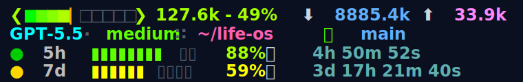</a>

- **ライセンス:** Unspecified（再配布不可。参照のみ）
- **対象:** codex
- **説明:** Codex CLI 向けのカラフルな 4 行構成の tmux ステータス領域。コンテキストウィンドウ、モデル、git ブランチ、そして秒単位のリセットカウントダウン付きの 5時間/7日レート制限ペーシングバーを表示する。
- **インストール:** 上流を参照

### `riveroflogic-claude-code-statusline` — [claude-code-statusline (RiverOfLogic)](https://github.com/RiverOfLogic/claude-code-statusline)

<a href="https://github.com/RiverOfLogic/claude-code-statusline">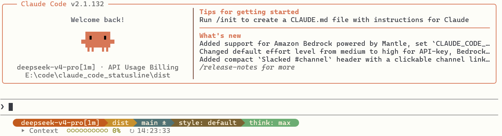</a>

- **ライセンス:** Unspecified（再配布不可。参照のみ）
- **対象:** claude
- **説明:** Claude Code 向けの powerline スタイルのレトロターミナル statusline。モデル、git ブランチ、出力スタイル、思考モード、暖色系アーストーンのしきい値で色分けされた 10 セルのコンテキストプログレスバー、そしてライブ時計を表示する。
- **備考:** README declares MIT but no LICENSE file is present in the repository; GitHub license API returns 404. Listed for reference only. Requires jq and a Nerd Font for glyph rendering; degrades to plain ASCII without one.
- **インストール:** 上流を参照
- **注意:** パッケージはライフサイクルスクリプト（preinstall／postinstall／prepare）を宣言しています。`configure` は `--ignore-scripts` 付きで実行されます。

### `robertogogoni-aifuel` — [aifuel](https://github.com/robertogogoni/aifuel)

- **ライセンス:** MIT
- **対象:** claude, codex, gemini
- **説明:** Go 製マルチプロバイダー AI 使用量モニター（Claude、Codex、Gemini、Copilot、Antigravity）。waybar モジュール、Chrome 拡張機能、Bubble Tea TUI、Admin API ダッシュボード、コンパクトな Claude Code ステータスラインにわたってレート制限・コスト・ピーク時間帯の分析を提供します。
- **備考:** Statusline is one surface among many: install via upstream `curl | bash` wizard, AUR `aifuel-bin`, or `go install`, then point Claude Code's statusLine.command at `aifuel statusline`.
- **インストール:** 上流を参照

### `ryukenshin546-a11y-claude-prompt-meter` — [Claude Prompt Meter](https://github.com/ryukenshin546-a11y/claude-prompt-meter)

- **ライセンス:** MIT
- **対象:** claude
- **説明:** ローカルログを読み取ってClaude Codeセッションのプロンプトごとのトークン使用量とUSDコストを追跡するVS Code拡張機能で、タイ語または英語で支出ヒートマップと設定可能な日次予算アラートを含むライブステータスバーメーターを表示します。
- **インストール:** 上流を参照

### `rz1989s-claude-code-statusline` — [claude-code-statusline (rz1989s)](https://github.com/rz1989s/claude-code-statusline)

- **ライセンス:** MIT
- **対象:** claude
- **説明:** Claude Code 向け Bash 製 statusline。最大 9 行に渡る 28 のアトミックコンポーネントで git 情報・コスト追跡・MCP ヘルス・ブロックリセットタイマー・イスラム礼拝時間・Catppuccin テーマを表示。
- **備考:** Install via curl|sh: `curl -sSfL https://raw.githubusercontent.com/rz1989s/claude-code-statusline/main/install.sh | bash`. The script downloads statusline.sh and 11 modular lib components into ~/.claude/statusline/ and patches ~/.claude/settings.json automatically. No admin privileges required. Also available via Homebrew: `brew tap rz1989s/tap && brew install claude-code-statusline`. Configure via ~/.claude/statusline/Config.toml (227 settings).
- **インストール:** 上流を参照
- **注意:** パッケージはライフサイクルスクリプト（preinstall／postinstall／prepare）を宣言しています。`configure` は `--ignore-scripts` 付きで実行されます。

### `shallow-dusty-horologium` — [horologium](https://github.com/Shallow-dusty/horologium)

<a href="https://github.com/Shallow-dusty/horologium">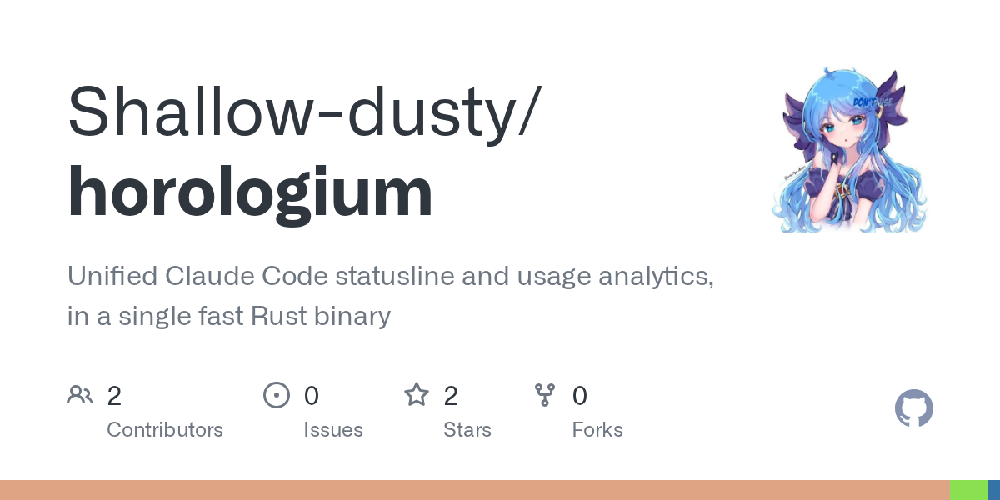</a>

- **ライセンス:** MIT
- **対象:** claude
- **説明:** サブミリ秒のClaude Codeステータスラインとccusage形式のJSONLログ解析を統合したRustバイナリ。トークン、コスト、Git、5時間/7日レート制限の表示と、日次・セッション・ブロック使用レポート生成を一つのツールで実現する。
- **備考:** Single Rust binary unifying statusline (`horologium status`) and usage analytics (`horologium stat daily|session|blocks`), replacing the ccstatusline + ccusage pair. Targets <20ms cold start; reads `rate_limits.five_hour`/`seven_day` directly from Claude Code v2.1.80+ stdin JSON. TOML config at `~/.config/horologium/config.toml` with `--powerline`, `--multiline`, `--hyperlinks` render flags. Upstream README shows `cargo install --path .` from a local clone; no published crate version pin yet.
- **インストール:** 上流を参照

### `sirmalloc-ccstatusline` — [ccstatusline](https://github.com/sirmalloc/ccstatusline)

- **ライセンス:** MIT
- **対象:** claude
- **説明:** Powerlineサポート、複数テーマ、リアルタイムのトークン/セッションメトリクス表示、インタラクティブなTUI設定インターフェースを備えた、Claude Code CLI向けの高度にカスタマイズ可能なステータスライン フォーマッター。
- **インストール:** 上流を参照

### `siropkin-budi-jetbrains` — [budi — JetBrains plugin](https://github.com/siropkin/budi-jetbrains)

<a href="https://github.com/siropkin/budi-jetbrains">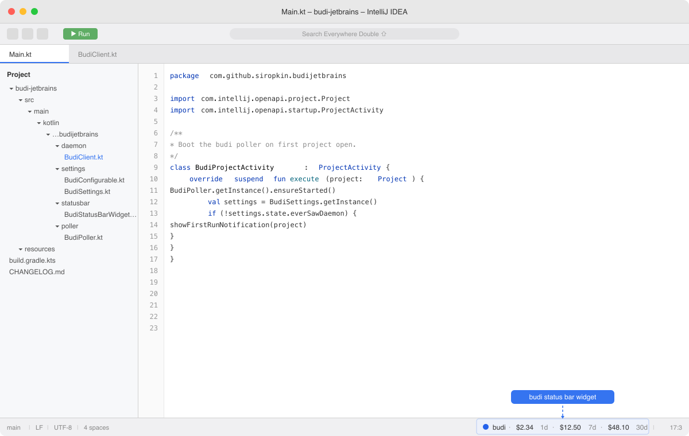</a>

- **ライセンス:** MIT
- **対象:** jetbrains
- **説明:** JetBrains IDEのステータスバーウィジェット。127.0.0.1:7878で動作するローカルbudiデーモンに問い合わせ、現在のIDE画面のAIコーディングコスト（1日/7日/30日）を表示する。
- **備考:** Requires the budi daemon; reads AI session data from local logs. JetBrains IDE status bar, not a terminal statusline.
- **インストール:** 上流を参照

### `sleighmaster99-claudecodestatusbar` — [ClaudeCodeStatusBar](https://github.com/SleighMaster99/ClaudeCodeStatusBar)

<a href="https://github.com/SleighMaster99/ClaudeCodeStatusBar">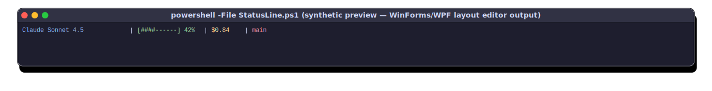</a>

- **ライセンス:** MIT
- **対象:** claude
- **説明:** Windows専用のWinForms GUIエディタ。Claude Codeの複数行ステータスラインをドラッグ＆ドロップで構築でき、PowerShellランタイム、使用量トラッキング、Git・コンテキスト・コストウィジェットを備える。
- **備考:** Windows-only — requires PowerShell 5+ and WinForms (.NET), which are built into Windows 10/11. Does not run on macOS or Linux. Launch Edit-StatusBar.vbs to open the GUI; click Save & Apply to write config.json and update ~/.claude/settings.json automatically.
- **インストール:** `git clone`（`bin/statuslines.js configure` で処理）
- **設定:** `node bin/statuslines.js configure sleighmaster99-claudecodestatusbar --cli=<claude>`

### `snackdriven-claude-statusline` — [claude-statusline](https://github.com/snackdriven/claude-statusline)

- **ライセンス:** unknown（再配布不可。参照のみ）
- **対象:** claude
- **説明:** Claude Code向けのマルチリージョン・ステータスライン・コンポーザーで、プロデューサースクリプトを並列実行し、TTLベースのリージョンキャッシュを管理し、優先度でソートしてターミナル幅内に色付きの行をレンダリングします。コンシエンス・ルールヒントシステムと、コンテキストウィンドウ使用状況やアクティブチケット、外部サービスとのオプション統合も備えています。
- **インストール:** 上流を参照

### `sotayamashita-claude-code-statusline` — [claude-code-statusline (Sam Yamashita)](https://github.com/sotayamashita/claude-code-statusline)

- **ライセンス:** MIT
- **対象:** claude
- **説明:** starship ライクな設定とモジュールベースの構成に対応した Rust 製 Claude Code statusline。
- **備考:** Upstream README references `cargo install claude-code-statusline-cli`, but that crate is not published on crates.io as of catalog verification on 2026-04-30. Build from source meanwhile: clone the repo, run `cargo build --release`, point statusLine.command at the resulting binary.
- **インストール:** 上流を参照

### `soulagent-claude-duck` — [claude-duck](https://github.com/soulagent/claude-duck)

- **ライセンス:** MIT
- **対象:** claude
- **説明:** Claude Codeのステータスラインで3行の池をアニメーション表示する水泳ASCIIアヒるを提供し、モデル名・セッション/週次使用量・コンテキスト・コスト・Gitブランチを虹色のバーで表示します。依存関係のないNode.jsスクリプトで、Claude Codeプラグインとしてインストールできます。
- **インストール:** 上流を参照

### `spences10-claude-statusline-powerline` — [claude-statusline-powerline](https://github.com/spences10/claude-statusline-powerline)

<a href="https://github.com/spences10/claude-statusline-powerline">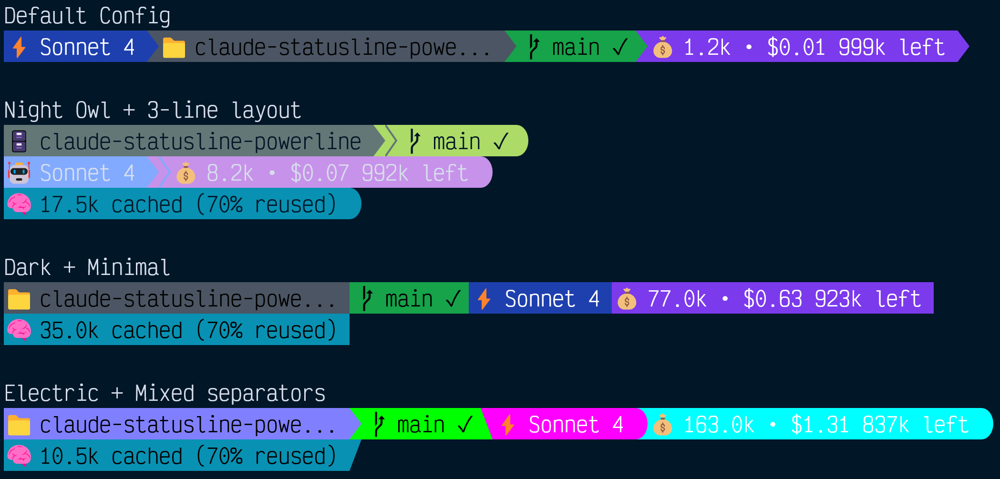</a>

- **ライセンス:** MIT
- **対象:** claude
- **説明:** Owloops の claude-powerline を拡張して構築された powerline スタイルの Claude Code statusline。ローカル SQLite バックエンドの使用状況分析データベースと、settings.json 向け IntelliSense（自動補完・ホバードキュメント・色検証）を備えた JSON 設定スキーマを追加している。
- **備考:** Package declares a postinstall script (dist/install.js) that auto-writes a default ~/.claude/claude-statusline-powerline.json and wires settings.json; our configure command uses --ignore-scripts to skip that write, so a config file may need to be created manually per the README's JSON schema. Maintains a local SQLite database at ~/.claude/statusline-usage.db for session/cost analytics.
- **インストール:** `npx --ignore-scripts -y claude-statusline-powerline@0.0.19`
- **注意:** パッケージはライフサイクルスクリプト（preinstall／postinstall／prepare）を宣言しています。`configure` は `--ignore-scripts` 付きで実行されます。
- **設定:** `node bin/statuslines.js configure spences10-claude-statusline-powerline --cli=<claude>`

### `squanchymnonm-claudecode-statusbar` — [ClaudeCodeStatusBar](https://github.com/squanchymnonm/ClaudeCodeStatusBar)

- **ライセンス:** MIT
- **対象:** claude
- **説明:** コンテキストウィンドウの使用状況、トークン数、セッション/週間レート制限をカラーコードアラート付きでリアルタイム表示するステータスラインを追加するClaude Codeプラグイン。実行中のサブエージェントとそのトークン消費速度を表示するライブサブエージェントパネルも含む。
- **インストール:** 上流を参照

### `srdarf-xclaudeusage` — [XClaudeUsage](https://github.com/SrDarf/XClaudeUsage)

- **ライセンス:** MIT
- **対象:** claude
- **説明:** Claude Codeのステータスライン用フックで、セッションごとのトークン使用量と5時間クォータをリアルタイムで追跡し、SQLiteを通じて並行ローカルセッションを集計、オプションでTursoクラウドを使ったデバイス間同期にも対応する。
- **インストール:** 上流を参照

### `tendo33-cursor-usage-tracker` — [Cursor Usage Tracker](https://github.com/Tendo33/cursor-usage-tracker)

<a href="https://github.com/Tendo33/cursor-usage-tracker">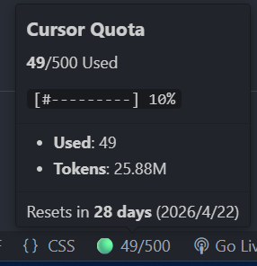</a>

- **ライセンス:** MIT
- **対象:** cursor
- **説明:** Cursor のリクエストクォータまたは USD クレジット使用量をエディタのステータスバーに表示する Cursor / VS Code 拡張機能。信号機式のしきい値表示、ホバー時の内訳表示に加え、Node の SQLite バインディングでは扱えない巨大な state.vscdb ファイル向けに Python の sqlite3 へのフォールバックを備える。
- **備考:** Distributed as a VSIX, not an npm/marketplace-automatable package here: build locally (`npm install && npm run compile && npm run package`) then install via VS Code/Cursor's "Extensions: Install from VSIX..." command, or run in development mode with F5. Reads local Cursor state (user ID, access token) from platform-specific storage paths and calls Cursor's usage endpoints (cursor.com/api/usage, api2.cursor.sh, cursor.com/api/auth/stripe) on a 5-minute refresh timer. This is the first Cursor-targeted entry in the catalog.
- **インストール:** 上流を参照

### `theobrigitte-claude-statusline` — [claude-statusline (TheoBrigitte)](https://github.com/TheoBrigitte/claude-statusline)

<a href="https://github.com/TheoBrigitte/claude-statusline">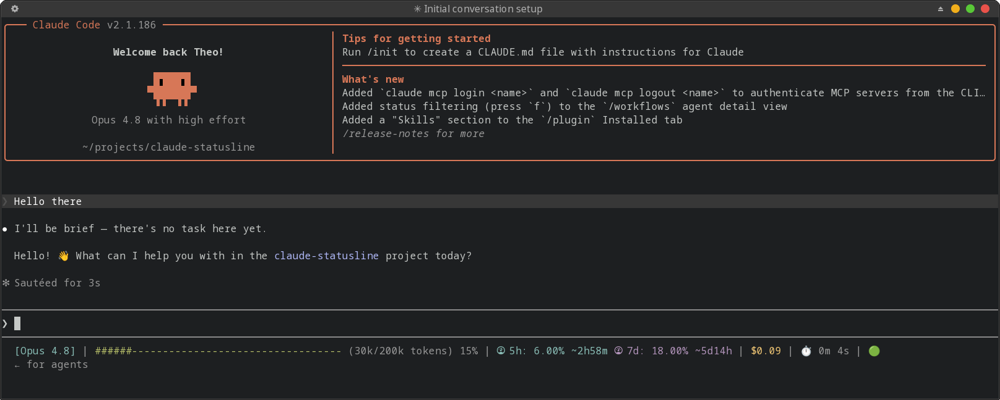</a>

- **ライセンス:** MIT
- **対象:** claude
- **説明:** Go 言語で静的コンパイルされた Claude Code 用 statusline。モジュールごとの色・記号・しきい値を TOML ファイルで設定でき、ターミナル幅に応じたレスポンシブレイアウトを持ち、約 19 マイクロ秒でレンダリングする。
- **備考:** No package-manager install path we automate: upstream ships a curl-downloaded static binary (`curl -o ~/.local/bin/claude-statusline <release-url>`, no shell pipe) or `go install github.com/TheoBrigitte/claude-statusline@latest`. Listed as install.type=manual; download the release binary onto PATH yourself, then the configs.claude snippet applies. Works with sensible defaults with no config file; optional ~/.config/claude-statusline.toml for module styling. Reports <0.019ms render time in upstream benchmarks. The optional rate-limit/status module polls status.claude.com with a 10-minute file-based cache; disable that module to run fully offline.
- **インストール:** 上流を参照
- **設定:** `node bin/statuslines.js configure theobrigitte-claude-statusline --cli=<claude>`

### `thisdot-context-statusline` — [@this-dot/claude-code-context-status-line](https://github.com/thisdot/claude-code-context-status-line)

<a href="https://github.com/thisdot/claude-code-context-status-line">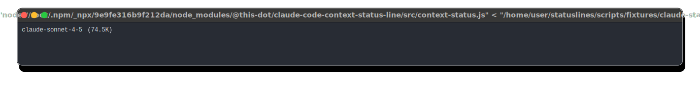</a>

- **ライセンス:** MIT
- **対象:** claude
- **説明:** セッション JSONL トランスクリプトを解析して入力・キャッシュ作成・キャッシュ読み取りトークンを集計し、正確なコンテキストウィンドウを表示する Claude Code statusline。
- **備考:** Last published 2025-09-27 (v0.2.2); originally tuned for AWS Bedrock-hosted models but works for any Claude Code session.
- **インストール:** `npx --ignore-scripts -y @this-dot/claude-code-context-status-line@0.2.2`
- **設定:** `node bin/statuslines.js configure thisdot-context-statusline --cli=<claude>`

### `tokscale` — [tokscale](https://github.com/junhoyeo/tokscale)

- **ライセンス:** MIT
- **対象:** claude, opencode, gemini, codex, amp, cursor, kimi
- **説明:** Claude Code・OpenCode・Codex・Gemini・Cursor・Amp・Kimi など多数の AI コーディングツールのローカルセッションデータを読み取り、LiteLLM から取得した価格情報でトークン使用量を追跡するクロス CLI 対応ツール。
- **備考:** Use as a data source for a custom statusline (e.g. `npx -y tokscale@latest --json`) rather than as the statusline itself.
- **インストール:** `npx --ignore-scripts -y tokscale@4.5.3`

### `victory-c-fitpet` — [FitPet](https://github.com/victory-c/fitpet)

- **ライセンス:** MIT
- **対象:** claude
- **説明:** Garminのフィットネスデータによってバイタリティが決まり、テスト成功やエラーなどのコーディングフックイベントに反応するバーチャルペットをステータスラインに表示するClaude Codeコンパニオン。ペットはGarmin MCPスキル経由で同期されたバイタリティ段階を通じて進化し、すべての反応はモデル呼び出しなしにローカルで処理される。
- **インストール:** 上流を参照

### `xicv-codexbar-hub` — [codexbar-hub](https://github.com/xicv/codexbar-hub)

- **ライセンス:** MIT
- **対象:** claude, codex, gemini
- **説明:** claude-hudセグメント、caffeinateインジケーター、CodexBarから取得したCodex/Claude使用量ペースバーをレンダリングするClaude Code用ステータスラインツール。ターミナルのステータスラインでAI使用量メトリクスとシステム状態をリアルタイムに表示するために設計されています。
- **インストール:** 上流を参照

### `xuedi-claude-statusline` — [xuedi/claude-statusline](https://github.com/xuedi/claude-statusline)

<a href="https://github.com/xuedi/claude-statusline">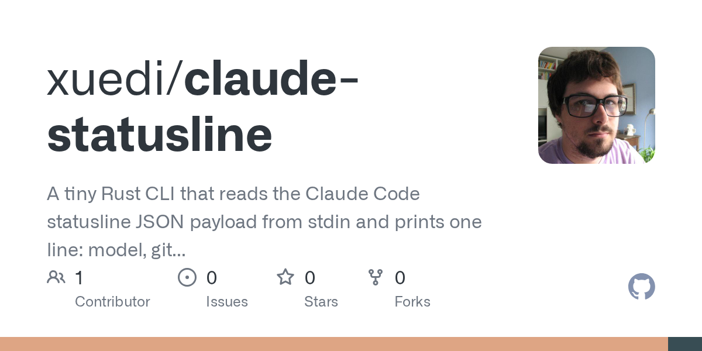</a>

- **ライセンス:** EUPL-1.2（再配布不可。参照のみ）
- **対象:** claude
- **説明:** Rust ネイティブの Claude Code statusline。モデル、git、トークン、effort、5時間/7日のレート制限を、20 セルの点字プログレスバーで表示する。約 500 行の安全な（unsafe 禁止の）コードで実装されている。
- **備考:** EUPL-1.2 is a copyleft license (OSI-approved but incompatible with the catalog redistribution allowlist of MIT/Apache-2.0/BSD/ISC/MPL-2.0). Listed for reference only; skipped by configure. Notable technical differentiator: 20-cell braille progress bar for token usage, built in safe Rust (~500 LOC). Reads credentials from ~/.claude/.credentials.json to fetch /api/oauth/usage when Claude Code does not supply rate-limit data in the payload; results cached under /tmp/claude/.
- **インストール:** 上流を参照

### `xyzcardiff-claude-code-statusline` — [claude-code-statusline](https://github.com/xyzcardiff/claude-code-statusline)

<a href="https://github.com/xyzcardiff/claude-code-statusline">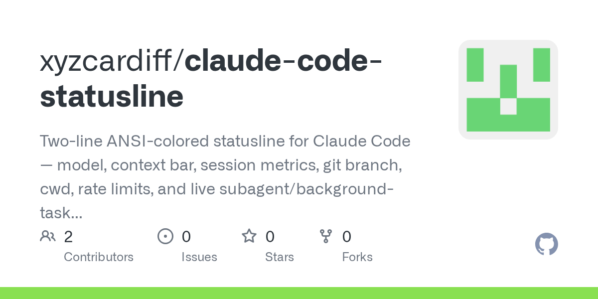</a>

- **ライセンス:** MIT
- **対象:** claude
- **説明:** ~/.claude/jobsからサブエージェント数とバックグラウンドタスクのプログレスバーをリアルタイム表示する2行のシェルステータスライン — エージェントやタスクがアクティブな時のみ2行目を表示。
- **備考:** Manual install: curl the script to ~/.claude/statusline-command.sh, then set statusLine.command in ~/.claude/settings.json. Requires jq. FX rate (USD→GBP) cached at ~/.claude/.fx-usd-gbp, refreshed in the background every 24 h.
- **インストール:** 上流を参照

### `young1lin-claude-token-monitor` — [claude-token-monitor](https://github.com/young1lin/claude-token-monitor)

- **ライセンス:** MIT
- **対象:** claude
- **説明:** Goで書かれたClaude Codeのステータスラインプラグインで、コンテキストトークンの使用状況、Anthropic Pro/Teamの5時間・7日間クォータカウントダウン、Z.ai/GLMコーディングプランのクォータをリアルタイム表示し、gitブランチや思考モード表示にも対応したシングルバイナリ。
- **インストール:** 上流を参照

### `zrawday-bmad-statusline` — [bmad-statusline](https://github.com/zRawday/bmad-statusline)

- **ライセンス:** MIT
- **対象:** claude
- **説明:** Claude Codeのライフサイクルフックを通じてアクティブなスキル、ストーリーの進捗、ステップの状態を自動検出し、BMADワークフローのアクティビティをClaude Codeでパッシブに追跡するccstatuslineウィジェットパックです。11個のカスタマイズ可能なウィジェットと134種類のワークフローをサポートするインタラクティブなTUIコンフィギュレーターを含みます。
- **インストール:** 上流を参照

### `zyx1121-claude-statusline` — [claude-statusline](https://github.com/zyx1121/claude-statusline)

- **ライセンス:** MIT
- **対象:** claude
- **説明:** Claude Code 向けのモジュール式ステータスラインプラグインで、モデル・コンテキスト・コスト・レート制限・git・再生中の曲・株価などの自己完結型ウィジェットをフェデレーテッドマーケットプレイス経由で設定可能なプロファイルに組み合わせられる。
- **インストール:** 上流を参照
